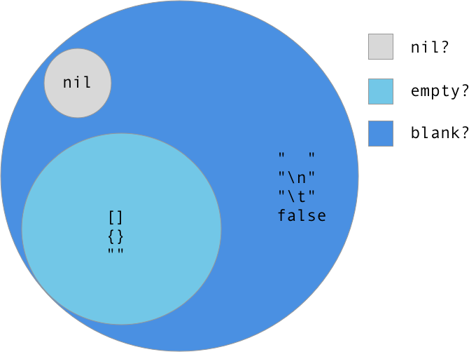

# #nil? #empty? #blank? #present?

Ruby 에는 존재 여부를 확인 할 때 위와 같은 네가지의 메소드를 사용합니다.

이 메소드들은 조금씩 차이점이 존재하는데 어떤 건지 알아봅시다.

<br>

## #nil?

`#nil?` 은 `Object` 클래스의 메소드입니다.

Ruby 의 모든 클래스는 `Object` 메소드를 상속 받기 때문에 `#nil?` 은 어떤 클래스에서도 사용할 수 있습니다.

`NilClass` 값에 대해서만 `true` 를 리턴하고 이 외에는 전부 `false` 를 리턴합니다.

```ruby
nil.nil?    # true

true.nil?   # false

5.nil?      # false

"".nil?     # false

[].nil?     # flase
```

<br>

## #empty?

`#empty?` 는 `string, array, hash, set` 에서 사용되는 메소드입니다.

자료구조나 문자열의 길이가 0 일 때 `true` 를 리턴합니다.

`nil` 처럼 `#empty?` 메소드가 정의되어 있지 않은 오브젝트에서 사용하면 `NoMethodError` 가 발생합니다.

```ruby
"".empty?           # true

" ".empty?          # false

"\t\n".empty?       # false

[].empty?           # true

{}.empty?           # true

Set.new.empty?      # true
```

<br>

## #blank?

`#blank?` 는 Rails 메소드이며 모든 오브젝트에서 사용 가능합니다.

문자열에서 사용할 경우 빈 문자열 뿐만 아니라 공백까지 전부 `true` 로 리턴합니다.

```ruby
"".blank?       # true

" ".blank?      # true

"\t\n".blank?   # true
```

<br>

`array, hash, set` 에서는 `#empty?` 와 동일하게 원소가 없는 경우에 `true` 를 리턴합니다.

```ruby
[].blank?       # true

{}.blank?       # true

Set.new.blank?  # true

[nil].blank?    # false

["", ""].blank? # false
```

<br>

`true, false, nil` 값에 대해서 각각 다음과 같이 리턴합니다.

```ruby
true.blank?     # false

false.blank?    # true

nil.blank?      # true
```

<br>

## #present?

`#present?` 는 `#blank?` 와 완전히 반대되며, 마찬가지로 Rails 메소드입니다.

<br>

# Table


<br>

# Diagram



<br>

# Reference

- [AppSignal - Differences Between #nil?, #empty?, #blank?, and #present?](https://blog.appsignal.com/2018/09/11/differences-between-nil-empty-blank-and-present.html)

- [Stack Overflow - How to understand nil vs. empty vs. blank in Ruby](https://stackoverflow.com/questions/885414/how-to-understand-nil-vs-empty-vs-blank-in-ruby)
