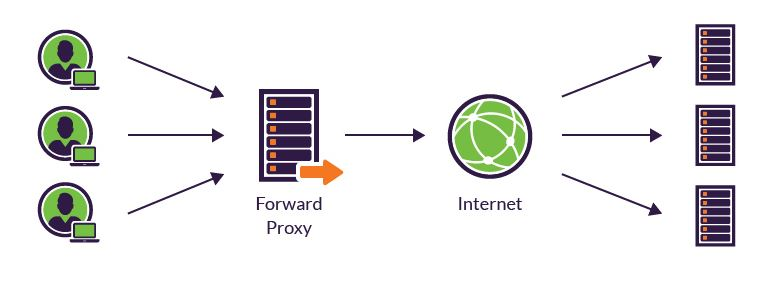

# Proxy

프록시 서버는 클라이언트가 자신을 통해서 다른 네트워크 서비스에 간접적으로 접속할 수 있게 해 주는 컴퓨터 시스템이나 응용 프로그램을 가리킨다.

서버와 클라이언트 사이에 중계기로서 대리로 통신을 수행하는 것을 가리켜 '프록시', 그 중계 기능을 하는 것을 프록시 서버라고 부른다.

프록시 서버 중 일부는 프록시 서버에 요청된 내용들을 캐시를 이용하여 저장해 둔다.

프록시는 크게 **Forward Proxy** 와 **Reverse Proxy** 로 나뉜다.

 

# Forward Proxy

클라이언트(사용자)가 인터넷에 직접 접근하는게 아니라 포워드 프록시 서버가 요청을 받고 인터넷에 연결하여 결과를 클라이언트에 전달 (forward) 해준다.

프록시 서버는 Cache 를 사용하여 자주 사용하는 데이터라면 요청을 보내지 않고 캐시에서 가져올 수 있기 때문에 성능 향상이 가능하다.

 

# Reverse Proxy

클라리언트가 인터넷에 데이터를 요청하면 리버스 프록시가 이 요청을 받아 내부 서버에서 데이터를 받은 후 클라이언트에 전달한다.

클라이언트는 내부 서버에 대한 정보를 알 필요 없이 리버스 프록시에만 요청하면 된다.

내부 서버 (WAS) 에 직접적으로 접근한다면 DB 에 접근이 가능하기 때문에 중간에 리버스 프록시를 두고 클라이언트와 내부 서버 사이의 통신을 담당한다.

또한 내부 서버에 대한 설정으로 로드 밸런싱(Load Balancing) 이나 서버 확장 등에 유리하다.

 

# 차이점

## 1. End Point
 
Forward Proxy 는 클라이언트가 요청하는 End Point 가 **실제 서버 도메인**이고 프록시는 둘 사이의 통신을 담당해준다.

Reverse Proxy 는 클라이언트가 요청하는 End Point 가 **프록시 서버의 도메인**이고 실제 서버의 정보는 알 수 없다.

 

## 2. 감춰지는 대상

Forward Proxy 는 **클라이언트가 감춰진다.**

요청 받는 서버는 포워드 프록시 서버를 통해서 요청을 받기 때문에 클라이언트의 정보를 알 수 없다.

Reverse Proxy 는 반대로 **서버가 감춰진다.**

클라이언트는 리버스 프록시 서버에게 요청하기 때문에 실제 서버의 정보를 알 수가 없다.

 

# Reference

- [사진 출처](https://www.imperva.com/)
