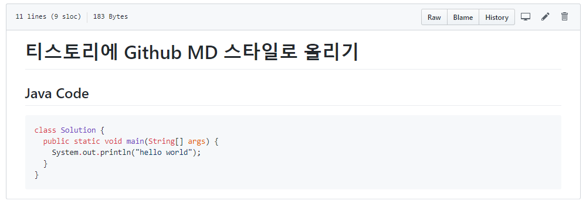
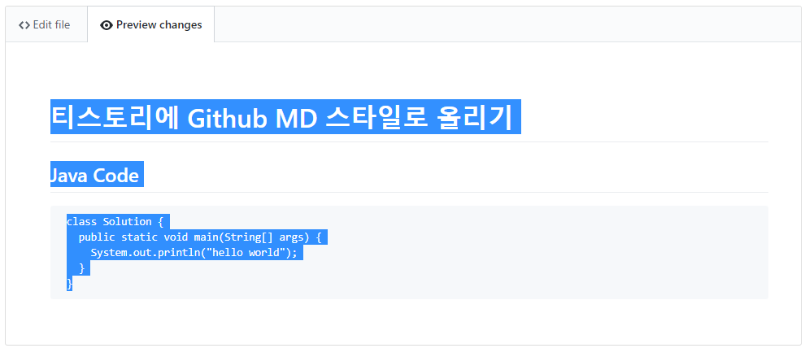
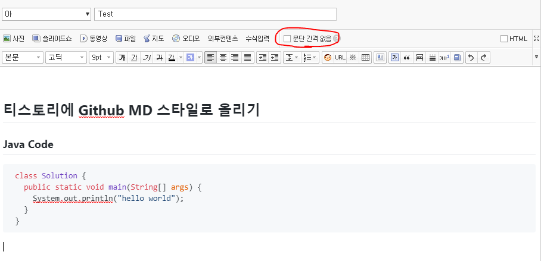
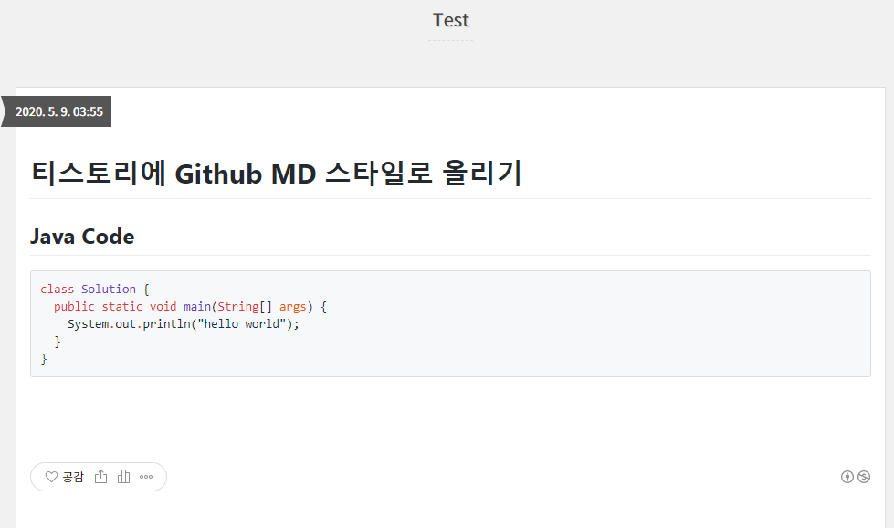

# 티스토리에 Github MD 스타일로 포스팅

공부한 내용을 티스토리 뿐만 아니라 Github 에도 올리기 시작하면서 Github MD 스타일과 티스토리 스타일을 통일하고 싶었습니다.

Github 에 글을 올리고 같은 내용을 티스토리에도 올리려면 이것저것 조금씩 수정해야될 일이 많아서 귀찮기 때문입니다.

아래 내용은 Github MD 스타일을 티스토리에 적용하는 방법이며 사용하는 스킨에 따라서 적용이 제대로 안될 수도 있습니다.

 

1. [Square 스킨 사용](#Square-스킨-사용)
2. [[새로운 글쓰기] 비활성화](#[새로운-글쓰기]-비활성화)
3. [Github MD 파일 작성](#Github-MD-파일-작성)
4. [Edit 기능으로 들어가서 Preview changes 탭의 내용을 복사](#Edit-기능으로-들어가서-Preview-changes-탭의-내용을-복사)
5. [글쓰기에서 복사 후 [문단 간격 없음] 체크 해제](#글쓰기에서-복사-후-[문단-간격-없음]-체크-해제)
6. [포스팅 후 내용 확인](#포스팅-후-내용-확인)

 

## Square 스킨 사용

다른 스킨에서는 제대로 적용이 안되어서 저는 Square 스킨을 사용합니다.

 

 

## [새로운 글쓰기] 비활성화

티스토리는 [새로운 글쓰기] 버전과 [구버전 글쓰기] 가 있습니다.

구버전 글쓰기를 하면 [ColorScript](https://colorscripter.com/) 를 이용해서 쉽게 코드를 삽입할 수 있고 인텔리제이나 vscode 의 코드를 그대로 복붙해도 하이라이팅이 그대로 유지됩니다.

Github MD 파일의 있는 코드블럭도 그대로 복붙이 되기 때문에 구버전 글쓰기를 사용하기 위해 새로운 글쓰기를 비활성화 합니다.

 

 

## Github MD 파일 작성

Github 에서 MD 파일을 작성합니다.

 

 

## Edit 기능으로 들어가서 Preview changes 탭의 내용을 복사

작성한 파일 내용을 그대로 복사하면 깃헙 링크 아이콘까지 같이 복사되기 때문에 보기에 이쁘지 않습니다.

파일 수정에 들어가서 __Preview changes__ 탭에서 전체 글을 쭈욱 복사합니다.

 

 

## 글쓰기에서 복사 후 [문단 간격 없음] 체크 해제

구버전 글쓰기 모드에서 그대로 복사해서 넣습니다.

[문단 간격 없음] 이 체크되어 있다면 해제해줍니다.

체크를 하지 않으면 줄 간격이 짧아져서 포맷이 망가집니다.

 

 

## 포스팅 후 내용 확인

