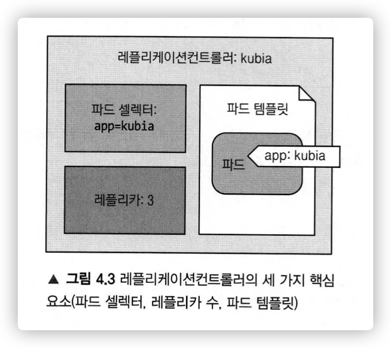

# 쿠버네티스 인 액션

- [책 정보](http://www.yes24.com/Product/Goods/89607047)

<br>

- [쿠버네티스 인 액션](#쿠버네티스-인-액션)
- [1장 쿠버네티스 소개](#1장-쿠버네티스-소개)
- [2장 도커와 쿠버네티스 첫걸음](#2장-도커와-쿠버네티스-첫걸음)
  - [2.1. Docker 명령어 수행 시 발생하는 일](#21-docker-명령어-수행-시-발생하는-일)
  - [2.2. 도커 이미지 버전](#22-도커-이미지-버전)
  - [2.3. 도커로 애플리케이션 실행](#23-도커로-애플리케이션-실행)
    - [2.3.1. 애플리케이션 파일 생성](#231-애플리케이션-파일-생성)
    - [2.3.2. Dockerfile 생성](#232-dockerfile-생성)
    - [2.3.3. 도커 이미지 빌드하여 컨테이너 이미지 생성](#233-도커-이미지-빌드하여-컨테이너-이미지-생성)
    - [2.3.4. 이미지 레이어란?](#234-이미지-레이어란)
    - [2.3.5. 컨테이너 이미지 실행](#235-컨테이너-이미지-실행)
    - [2.3.6. 실행중인 컨테이너 조회](#236-실행중인-컨테이너-조회)
    - [2.3.7. 컨테이너에 관한 자세한 정보 얻기](#237-컨테이너에-관한-자세한-정보-얻기)
    - [2.3.8. 실행중인 컨테이너 내부 탐색하기](#238-실행중인-컨테이너-내부-탐색하기)
    - [2.3.9. 컨테이너 중지와 삭제](#239-컨테이너-중지와-삭제)
    - [2.3.10. 이미지 레지스트리에 이미지 푸시](#2310-이미지-레지스트리에-이미지-푸시)
  - [2.4. 쿠버네티스 클러스터 설치](#24-쿠버네티스-클러스터-설치)
    - [2.4.1. GKE 환경 설정](#241-gke-환경-설정)
    - [2.4.2. 노드 세 개를 가진 쿠버네티스 클러스터 생성](#242-노드-세-개를-가진-쿠버네티스-클러스터-생성)
    - [2.4.3. 클러스터의 개념 이해하기](#243-클러스터의-개념-이해하기)
  - [2.5. 쿠버네티스에 애플리케이션 실행하기](#25-쿠버네티스에-애플리케이션-실행하기)
    - [2.3.1. Node.js 애플리케이션 구동하기](#231-nodejs-애플리케이션-구동하기)
    - [2.3.2. 파드 소개](#232-파드-소개)
    - [2.3.3. 파드 조회하기](#233-파드-조회하기)
    - [2.3.4. 백그라운드에서 일어난 동작](#234-백그라운드에서-일어난-동작)
    - [2.3.5. 웹 애플리케이션에 접근하기](#235-웹-애플리케이션에-접근하기)
  - [2.6. 파드, 서비스의 이해](#26-파드-서비스의-이해)
    - [2.6.1. 파드의 중요성](#261-파드의-중요성)
    - [2.6.2. 서비스의 필요성](#262-서비스의-필요성)
  - [2.7. 요약](#27-요약)
- [3장 파드: 쿠버네티스에서 컨테이너 실행](#3장-파드-쿠버네티스에서-컨테이너-실행)
  - [3.1. 파드 소개](#31-파드-소개)
    - [3.1.1 왜 컨테이너를 직접 사용하지 않고 파드에 넣어서 사용할까?](#311-왜-컨테이너를-직접-사용하지-않고-파드에-넣어서-사용할까)
    - [3.1.2. 파드 간 플랫 (flat) 네트워크](#312-파드-간-플랫-flat-네트워크)
    - [3.1.3. 파드에서 컨테이너의 적절한 구성](#313-파드에서-컨테이너의-적절한-구성)
  - [3.2. YAML 디스크립터로 파드 생성](#32-yaml-디스크립터로-파드-생성)
    - [3.2.1. 파드를 정의하는 간단한 YAML 정의 작성하기](#321-파드를-정의하는-간단한-yaml-정의-작성하기)
    - [3.2.2. 파드 생성하기](#322-파드-생성하기)
    - [3.2.3. 파드에 요청 보내기](#323-파드에-요청-보내기)
  - [3.3. 레이블을 이용한 파드 구성](#33-레이블을-이용한-파드-구성)
    - [3.3.1. 파드 생성할 때 레이블 지정](#331-파드-생성할-때-레이블-지정)
- [4장 레플리케이션과 그 밖의 컨트롤러: 관리되는 파드 배포](#4장-레플리케이션과-그-밖의-컨트롤러-관리되는-파드-배포)
  - [4.1. 파드를 안정적으로 유지하기](#41-파드를-안정적으로-유지하기)
    - [4.1.1. 라이브니스 프로브](#411-라이브니스-프로브)
    - [4.1.2. 라이브니스 프로브 실행](#412-라이브니스-프로브-실행)
    - [4.1.3. 라이브니스 프로브 설정 보기](#413-라이브니스-프로브-설정-보기)
    - [4.1.4. 효과적인 라이브니스 프로브 사용법](#414-효과적인-라이브니스-프로브-사용법)
  - [4.2. 레플리케이션 컨트롤러 소개](#42-레플리케이션-컨트롤러-소개)
    - [4.2.1. 레플리케이션 컨트롤러의 세가지 요소](#421-레플리케이션-컨트롤러의-세가지-요소)
    - [4.2.2. 레플리케이션 컨트롤러 생성](#422-레플리케이션-컨트롤러-생성)
    - [4.2.3. 레플리케이션 컨트롤러 삭제](#423-레플리케이션-컨트롤러-삭제)
  - [4.3. 레플리케이션 컨트롤러 대신 레플리카셋 사용하기](#43-레플리케이션-컨트롤러-대신-레플리카셋-사용하기)
    - [4.3.1. 레플리케이션 컨트롤러와 비교한 레플리카셋의 장점](#431-레플리케이션-컨트롤러와-비교한-레플리카셋의-장점)
    - [4.3.2. 레플리카셋 정의하기](#432-레플리카셋-정의하기)
    - [4.3.3. 레플리카셋의 셀렉터 설정](#433-레플리카셋의-셀렉터-설정)
    - [4.3.4. 레플리카셋 삭제](#434-레플리카셋-삭제)
  - [4.4. 데몬셋을 사용해 각 노드에서 정확히 한 개의 파드 실행하기](#44-데몬셋을-사용해-각-노드에서-정확히-한-개의-파드-실행하기)
    - [4.4.1. 데몬셋을 사용해 특정 노드에서만 파드 실행하기](#441-데몬셋을-사용해-특정-노드에서만-파드-실행하기)
    - [4.4.2. 데몬셋 YAML 생성](#442-데몬셋-yaml-생성)
  - [4.5. 완료 가능한 단일 태스크를 수행하는 파드 실행](#45-완료-가능한-단일-태스크를-수행하는-파드-실행)
    - [4.5.1. 잡 리소스 정의](#451-잡-리소스-정의)
    - [4.5.2. 잡 실행](#452-잡-실행)
    - [4.5.3. 완료된 잡 확인](#453-완료된-잡-확인)
    - [4.5.4. 잡에서 여러 파드 인스턴스 실행하기](#454-잡에서-여러-파드-인스턴스-실행하기)
    - [4.5.6. 잡 파드 타임아웃 설정](#456-잡-파드-타임아웃-설정)
  - [4.6. 잡을 주기적으로 실행하기](#46-잡을-주기적으로-실행하기)
    - [4.6.1. 크론잡 생성하기](#461-크론잡-생성하기)
- [5장 서비스: 클라이언트가 파드를 검색하고 통신할수 있게 함](#5장-서비스-클라이언트가-파드를-검색하고-통신할수-있게-함)
  - [5.1. 서비스 소개](#51-서비스-소개)
  - [5.2. 서비스 생성](#52-서비스-생성)
    - [5.2.1. YAML 디스크립터를 통한 서비스 생성](#521-yaml-디스크립터를-통한-서비스-생성)
    - [5.2.2. 클러스터 내에서 서비스 테스트](#522-클러스터-내에서-서비스-테스트)
    - [5.2.3. 동일한 서비스에서 여러 개의 포트 노출 (멀티 포트 서비스)](#523-동일한-서비스에서-여러-개의-포트-노출-멀티-포트-서비스)
    - [5.2.4. 이름이 지정된 포트 사용](#524-이름이-지정된-포트-사용)
  - [5.3. 서비스 검색](#53-서비스-검색)
    - [5.3.1. 환경변수를 통한 서비스 검색](#531-환경변수를-통한-서비스-검색)
    - [5.3.2. DNS 를 통한 서비스 검색](#532-dns-를-통한-서비스-검색)

<br>

# 1장 쿠버네티스 소개


- 모놀리식 애플리케이션은 구축이 쉬운 반면에 유지보수가 어렵고 확장성이 떨어짐
- MSA 는 각 요소를 분리해서 유지보수와 확장성에 유리하지만 하나의 시스템으로 구성하는 게 어려움
- 리눅스 컨테이너는 가상머신에 비해 훨씬 가볍고 하드웨어 활용도를 높일 수 있음
- 개발자는 쿠버네티스를 통해 별도의 시스템 관리자 없이도 애플리케이션을 배포, 유지할 수 있음

<br>

# 2장 도커와 쿠버네티스 첫걸음

## 2.1. Docker 명령어 수행 시 발생하는 일


- `docker run busybox echo "Hello world"` 를 실행했을 때 발생하는 일을 그림으로 나타냄
- `busybox` 뿐만 아니라 다른 이미지를 실행하는 것도 동일
- 다른 이미지를 실행할 때는 `echo` 명령어 같은것도 없기 때문에 오히려 더 간단
  - 실행할 명령어를 이미지 생성할 때 내부에 넣어서 같이 패키징 (오버라이드 가능)

<br>

## 2.2. 도커 이미지 버전

```sh
$ docker run <image>:<tag>
```

도커는 동일한 이미지와 이름에 여러 개의 버전을 가질 수 있습니다.

명시적으로 태그를 지정하지 않으면 `latest` 태그를 참조합니다.

<br>

## 2.3. 도커로 애플리케이션 실행

### 2.3.1. 애플리케이션 파일 생성

우선 실행하기 위한 간단한 애플리케이션 `app.js` 를 만듭니다.

```js
const http = require('http');
const os = require('os');

console.log("Kubia server starting...");

var handler = function(request, response) {
    console.log("Received request from " + request.connection.remoteAddress);
    response.writeHead(200);
    response.end("You've hit " + os.hostname() + "\n");
}

var www = http.createServer(handler);
www.listen(8080);
```

<br>

### 2.3.2. Dockerfile 생성

애플리케이션을 이미지로 패키징하기 위한 `Dockerfile` 파일을 생성합니다.

`Dockerfile` 은 `app.js` 와 동일한 디렉터리에 있어야 합니다.

```dockerfile
FROM node:7
ADD app.js /app.js
ENTRYPOINT ["node", "app.js"]
```

- `FROM`
  - 시작점이라고 하며 이미지 생성의 기반이 되는 기본 이미지입니다.
  - 여기서는 `node` 컨테이너 이미지의 태그 7 을 사용합니다.
  - 애플리케이션을 실행하기 위한 `node` 가 없으면 설치해줍니다
- `ADD`
  - 로컬 디렉터리의 `app.js` 파일을 이미지의 루트 디렉터리에 동일한 이름으로 추가합니다.
- `ENTRYPOINT`
  - 이미지를 실행했을 때 수행해야 할 명령어를 정의합니ㅏㄷ.

<br>

### 2.3.3. 도커 이미지 빌드하여 컨테이너 이미지 생성


- `docker build -t kubia .` 명령어를 실행하면 현재 디렉터리 (`./`) 에 있는 `Dockerfile` 을 사용하여 `kubia` 라는 이름의 컨테이너 이미지를 생성합니다.
- 빌드 디렉터리의 모든 파일이 데몬에 업로드 되기 때문에 쓸데없는 파일은 같은 위치에 두지 않는게 좋습니다.

<br>

### 2.3.4. 이미지 레이어란?


- 컨테이너 이미지는 하나의 큰 이미지로 되어 있는게 아니라 여러 개의 레이어로 구성되어 있습니다.
- 서로 다른 이미지가 여러 개의 레이어를 공유할 수 있기 때문에 이미지의 저장과 전송에 효과적입니다.
- 도커에서 이미지를 다운로드 할 때도 로컬에 없는 레이어만 받을 수 있습니다.

<br>

### 2.3.5. 컨테이너 이미지 실행

```sh
$ docker run --name kubia-container -p 8080:8080 -d kubia
```

- `--name <name>`
  - 컨테이너의 이름을 설정
  - 없으면 랜덤값으로 세팅
- `-p <local port>:<container port>`
  - 특정 포트로 연결
  - 로컬 머신의 8080 포트를 컨테이너 내부의 8080 포트와 매핑시킴
  - `http://localhost:8080` 으로 애플리케이션에 접근 가능
- `-d`
  - 백그라운드로 실행

<br>

### 2.3.6. 실행중인 컨테이너 조회

```sh
$ docker ps                                              
CONTAINER ID   IMAGE     COMMAND                  CREATED          STATUS          PORTS                    NAMES
298367027b87   kubia     "node app.js"            10 minutes ago   Up 10 minutes   0.0.0.0:8080->8080/tcp   kubia-container
```

- `-a` 옵션을 추가하면 실행중인 컨테이너 뿐만 아니라 종료된 컨테이너도 모두 조회할 수 있습니다.

<br>

### 2.3.7. 컨테이너에 관한 자세한 정보 얻기

```sh
# docker inspect <container-name>
$ docker inspect kubia-container
```

<br>

### 2.3.8. 실행중인 컨테이너 내부 탐색하기

```sh
$ docker exec -it kubia-container bash
```

- 이 명령어를 사용하면 실행중인 `kubia-container` 컨테이너 내부에서 `bash` 를 실행합니다.
- `-i`: 표준 입력(STDIN) 을 오픈 상태로 유지합니다. 셸에 명령어를 입력하기 위해 필요합니다.
- `t`: 의사 (PSEUDO) 터미널 (TTY) 을 할당합니다.
- `i` 옵션을 빼면 명령어를 입력할 수 없고, `t` 옵션을 빼면 명령어 프롬포트가 화면에 표시되지 않습니다.

<br>

### 2.3.9. 컨테이너 중지와 삭제

```sh
# 실행중인 컨테이너 중지
$ docker stop kubia-container

# 컨테이너 완전히 삭제
$ docker rm kubia-container
```

- `docker stop` 명령어로 컨테이너 실행을 중지하면 `docker ps -a` 명령어에서는 종료된 컨테이너로 출력됩니다.
- 중지된 컨테이너는 `docker start` 명령어로 다시 실행할 수 있습니다.
- 만약 컨테이너를 완전히 삭제하려면 `docker rm` 명령어를 사용해야 합니다.

<br>

### 2.3.10. 이미지 레지스트리에 이미지 푸시

지금까지 빌드한 이미지는 로컬 컴퓨터에서만 사용 가능합니다.

다른 곳에서도 사용하려면 외부 이미지 저장소에 이미지를 푸시해야 합니다.

대표적으로 [도커 허브](https://hub.docker.com/)가 있습니다.

도커 허브에 이미지를 푸시하기 위해서는 먼저 가입 후 로그인을 진행해야 합니다.

이미지를 푸시하기 전에 도커 허브의 규칙에 따라 이미지 태그를 다시 지정해야 합니다.

이미지를 푸시하고 나면 다른 머신에서도 해당 이미지를 사용할 수 있습니다.

```sh
# 도커 허브 로그인
$ docker login

# kubia 이미지를 woody/kubia 라는 이름으로 복사 (같은 이미지 ID 가짐)
$ docker tag kubia bcp0109/kubia

# 도커 허브에 이미지 푸시
$ docker push bcp0109/kubia

# 도커 이미지 삭제
$ docker rmi bcp0109/kubia

# 푸시한 이미지로 컨테이너를 실행하면 로컬에 없기 때문에 다운 받은 후 실행됨
$ docker run -p 8080:8080 -d bcp0109/kubia
```

<br>

## 2.4. 쿠버네티스 클러스터 설치

지금까지 컨테이너 이미지에 애플리케이션을 패키징하고 도커 허브를 통해 사용할 수 있게 됐습니다.

이걸 도커에서 직접 실행하는 대신 쿠버네티스 클러스터에 배포할 수 있습니다.

그전에 쿠버네티스 클러스터를 설치해야 합니다.

<br>

### 2.4.1. GKE 환경 설정

1. [QuickStart 가이드](https://cloud.google.com/kubernetes-engine/docs/quickstart)를 참고해서 "가입 - 프로젝트 생성 - 빌링 생성 - 쿠버네티스 엔진 API 활성" 순으로 진행합니다.
2. [구글 클라우드 SDK](https://cloud.google.com/sdk/docs/install) 를 다운로드하고 설치합니다. (`gcloud` 를 포함하고 있음)
3. `gcloud components install kubectl` 명령어로 `kubectl` 설치

<br>

### 2.4.2. 노드 세 개를 가진 쿠버네티스 클러스터 생성

```sh
# 노드 3개 생성
$ gcloud container clusters create kubia --num-nodes 3

# 생성한 노드들 조회
$ kubectl get nodes
NAME                                   STATUS   ROLES    AGE   VERSION
gke-kubia-default-pool-90ff6c74-4n8b   Ready    <none>   36s   v1.21.5-gke.1302
gke-kubia-default-pool-90ff6c74-h08l   Ready    <none>   36s   v1.21.5-gke.1302
gke-kubia-default-pool-90ff6c74-k0k4   Ready    <none>   36s   v1.21.5-gke.1302
```

<br>

### 2.4.3. 클러스터의 개념 이해하기


<br>

## 2.5. 쿠버네티스에 애플리케이션 실행하기

가장 간단한단 방법을 사용해서 쿠버네티스에 애플리케이션을 실행해봅니다.

보통은 배포 구성 요소를 기술한 JSON 이나 YAML 매니페스트를 준비해야합니다.

<br>

### 2.3.1. Node.js 애플리케이션 구동하기

이전에 도커 허브에 푸시한 이미지를 실행해본다.

```sh
# 도커 이미지를 실행하는 파드를 시작
$ kubectl create deployment --image=bcp0109/kubia kubia
deployment.apps/kubia created
```

- `--image`: 실행하고자 하는 컨테이너 이미지를 명시

<br>

### 2.3.2. 파드 소개


쿠버네티스는 개별 컨테이너를 직접 다루지 않고 함께 배치된 다수의 컨테이너라는 개념을 사용합니다.

이 컨테이너의 그룹을 **파드 (Pod)** 라고 합니다.

각 파드는 자체 IP, 호스트 이름, 프로세스 등이 있는 논리적으로 분리된 머신입니다.

애플리케이션은 단일 컨테이너로 실행되는 단일 프로세스일 수도 있고, 주 애플리케이션 프로세스 (서버) 와 부가적으로 도와주는 프로세스 (DB) 로 이루어질 수 있습니다.

같은 워커 노드에서 실행중이라 할지라도 다른 파드에 실행 중인 컨테이너는 다른 머신에서 실행 중인 것으로 나타납니다.

<br>

### 2.3.3. 파드 조회하기

컨테이너는 독립적인 쿠버네티스 오브젝트가 아니기 때문에 **개별 컨테이너를 조회할 수 없고 대신 파드를 조회**해야 합니다.

```sh
$ kubectl get pods
```

<br>

### 2.3.4. 백그라운드에서 일어난 동작


1. 우선 로컬에서 도커 허브에 이미지를 푸시하여 노드에서도 접근할 수 있게 해줍니다.
2. `kubectl` 명령어를 실행하면 쿠버네티스의 API 서버로 HTTP 요청을 전달하고 클러스터에 새로운 레플리케이션컨트롤러 오브젝트를 생성합니다.
3. 레플리케이션컨트롤러는 새 파드를 생성하고 워커 노드 중 하나에 스케줄링(할당) 됩니다.
4. 해당 워커 노드의 Kubelet 은 파드가 스케줄링 된 것을 보고 로컬에 없는 이미지를 Pull 하도록 도커에게 지시합니다.
5. 이미지를 다운로드 한 후 도커는 컨테이너를 생성 후 실행합니다.

<br>

### 2.3.5. 웹 애플리케이션에 접근하기

각 파드는 자체 IP 주소를 갖고 있지만 이 주소는 클러스터 내부에 있으며 외부에서 접근 불가능합니다.

외부에서 파드를 접근하기 위해선 서비스 오브젝트를 통해 노출해야 합니다.

```sh
# 서비스를 통해 포트를 노출
$ kubectl expose deployment kubia --type=LoadBalancer --port=8080 --name=kubia-http

service/kubia-http exposed
```

<br>

생성된 서비스는 명령어로 조회할 수 있습니다.

```sh
$ kubectl get svc
NAME         TYPE           CLUSTER-IP    EXTERNAL-IP   PORT(S)          AGE
kubernetes   ClusterIP      10.96.0.1     <none>        443/TCP          2d
kubia-http   LoadBalancer   10.96.13.36   <pending>     8080:32294/TCP   12s


$ kubectl get svc
NAME         TYPE           CLUSTER-IP    EXTERNAL-IP    PORT(S)          AGE
kubernetes   ClusterIP      10.96.0.1     <none>         443/TCP          2d
kubia-http   LoadBalancer   10.96.13.36   34.97.67.145   8080:32294/TCP   67s
```

처음에는 로드 밸런서를 생성하기 때문에 pending 상태였지만 나중에는 External IP 가 표시되는 걸 볼 수 있습니다.

이제 http://34.97.67.145:8080/ 주소로 어디서든 애플리케이션에 접근 가능합니다.


<br>

## 2.6. 파드, 서비스의 이해

### 2.6.1. 파드의 중요성

시스템의 가장 중요한 구성 요소는 파드입니다.

컨테이너 내부에는 Node.js 프로세스가 있고 포트 8080 에 바인딩 돼 HTTP 요청을 기다리고 있습니다.

파드는 자체의 고유한 사설 IP 와 호스트 이름을 갖습니다.

<br>

### 2.6.2. 서비스의 필요성

파드는 일시적입니다.

파드가 실행 중인 노드가 실패할 수도 있고, 누군가 파드를 삭제할 수도 있고, 비정상 노드에서 파드가 제거될 수도 있습니다.

이러면 기존 파드가 사라지고 새로운 IP 주소가 할당된 파드로 대체되는데, 이렇게 항상 변경되는 파드에 접근하기 위해 서비스가 그 역할을 대신해줍니다.

서비스는 정적 IP 를 할당 받고 변경되지 않기 때문에 내부에 존재하는 파드의 IP 를 알 필요 없이 외부에서는 서비스를 통해 통신할 수 있습니다.

<br>

## 2.7. 요약

컨테이너는 애플리케이션의 실행 단위입니다.

컨테이너가 모여서 파드가 됩니다.

파드가 모여서 노드가 됩니다.

노드가 모여서 클러스터가 됩니다.

파드에는 서비스를 사용해서 접근합니다.

<br>

# 3장 파드: 쿠버네티스에서 컨테이너 실행

- 파드의 생성, 실행, 정지
- 파드와 다른 리소스를 레이블로 조직화
- 특정 레이블을 가진 모든 파드에서 작업 수행
- 네임스페이스를 이용해 파드를 겹치지 않는 그룹으로 나누기
- 특정한 형식을 가진 워커 노드에 파드 배치

<br>

## 3.1. 파드 소개

파드는 쿠버네티스의 기본 빌딩 블록 (배포 단위) 입니다.

도커에 컨테이너가 있다면 쿠버네티스에는 파드가 있으며, 파드 내에는 컨테이너가 존재합니다.

파드는 여러 개의 컨테이너를 포함할 수 있지만 일반적으로 하나의 컨테이너만 포함하는 게 권장됩니다.

<br>

### 3.1.1 왜 컨테이너를 직접 사용하지 않고 파드에 넣어서 사용할까?

이 점에 대해서는 컨테이너의 목적에 대해서 알아야 합니다.

컨테이너는 단일 프로세스를 실행하는 것을 목적으로 설계됐습니다.

한 컨테이너에 여러 프로세스를 실행시키면 로그 관리나, 프로세스 상태 관리 등등 번거로운 점이 많습니다.

따라서 웬만한 경우에 프로세스와 컨테이너는 1:1 구조입니다.

그럼 이런 프로세스(컨테이너)를 묶어서 하나의 단위로 관리할수 있는 상위 구조가 필요한데 이게 바로 파드입니다.

서로 연관이 있는 컨테이너를 한 파드에 묶어서 같이 실행하고 격리된 상태로 유지할 수 있습니다.

<br>

### 3.1.2. 파드 간 플랫 (flat) 네트워크

파드 내의 컨테이너는 동일한 IP 주소와 포트 공간을 공유합니다.

쿠버네티스 클러스터의 모든 파드는 하나의 플랫한 공유 네트워크 주소 공간에 존재합니다.

모든 파드는 다른 파드의 IP 주소를 사용해 접근이 가능합니다.

**서로 통신하는 파드 사이에는 NAT (Network Address Translation) 이 존재하지 않으며 패킷을 교환할 때 상대 파드의 실제 IP 주소를 패킷 Destination IP 에 담는다.**


<br>

### 3.1.3. 파드에서 컨테이너의 적절한 구성

한 호스트에 모든 유형의 애플리케이션을 넣었던 이전과 달리 파드는 특정 애플리케이션만을 호스팅합니다.

파드는 상대적으로 가볍기 때문에 오버헤드 없이 원하는 만큼의 파드를 생성 가능합니다.

그래서 모든 애플리케이션을 하나의 파드에 넣지 않고 각각의 파드에 넣어서 전체적인 구성을 하는게 좋습니다.

파드 하나에 모든 애플리케이션을 넣으면 어떤 단점이 있을까?

- 스케일링 어려움
  - 프론트엔드와 백엔드를 파드 하나에 넣었다고 가정
  - 백엔드만 증설하고 싶은데 파드를 늘릴 때마다 프론트엔드까지 같이 증설됨
- 노드가 여러개일때 효율이 적음
  - 여러 노드를 사용할 때 파드 하나만 사용한다면 나머지 노드는 CPU 와 메모리 낭비가 됨

<br>

한 파드에서 여러 컨테이너를 사용하는 경우는?

- 컨테이너를 함께 실행해야 하는가? 혹은 서로 다른 호스트에서 실행 가능한가?
- 여러 컨테이너가 모여 하나의 구성 요소를 나타내는가? 개별적인 구성 요소인가?
- 컨테이너가 함께 스케일링 해야 하는가? 개별적으로 스케일링 되어야 하는가?


<br>

## 3.2. YAML 디스크립터로 파드 생성

2장에서는 `kubectl run` 으로 간단하게 리소스를 생성했지만 YAML 파일로 정의해두면 좀더 쉽게 생성할 수 있습니다.

파드를 구성하는 세가지 중요 요소

- Metada: 이름, 네임스페이스, 레이블 및 파드에 관한 기타 정보를 포함
- Spec: 파드 컨테이너, 볼륨, 기타 데이터 등 파드 자체에 관한 실제 명세를 가짐
- Status: 파드 상태, 각 컨테이너 설명과 상태, 파드 내부 IP, 기타 기본 정보 등 현재 실행 중인 파드에 관한 현재 정보를 포함

status 부분에는 특정 시간의 리소스 상태를 보여주는 읽기 전용의 런타임 데이터가 포함되어 있습니다.

새 파드를 만들 때 status 부분은 작성할 필요가 없습니다.

<br>

### 3.2.1. 파드를 정의하는 간단한 YAML 정의 작성하기

```yaml
# kubia-manual.yaml

apiVersion: v1  # 디스크립터는 쿠버네티스 API 버전 v1 을 준수함
kind: Pod       # 오브젝트 종류. 여기서는 파드
metadata:
  name: kubia-manual  # 파드 이름
spec:
  containers:
  - image: bcp0109/kubia  # 컨테이너 이미지
    name: kubia         # 컨테이너 이름
    ports:
    - containerPort: 8080 # 애플리케이션이 수신하는 포트
      protocol: TCP
```

사실 컨테이너 포트를 지정하지 않아도 `0.0.0.0` 주소에 열어둔 포트를 통해 다른 파드에서 접속 가능합니다.

하지만 명시적으로 지정해두면 클러스터를 사용하는 사람들이 포트를 빠르게 확인 가능합니다.

<br>

### 3.2.2. 파드 생성하기

`kubectl apply` 명령어로 파드를 생성할 수 있습니다.

<br>

### 3.2.3. 파드에 요청 보내기

2장에서는 `kubctl expose` 명령어를 사용해서 서비스를 통해 파드를 노출했습니다.

지금은 서비스를 거치지 않고 특정 파드에 요청하는 방법을 알아봅니다.

**포트 포워딩 (Port Forwarding)** 을 사용하면 특정 파드에 연결해줍니다.

`kubectl port-forward` 명령어로 사용할 수 있습니다.

```sh
# 포트 포워딩으로 8888 포트에 연결
$ kubectl port-forward kubia-manual 8888:8080
Forwarding from 127.0.0.1:8888 -> 8080
Forwarding from [::1]:8888 -> 8080

# 8888 포트에 요청하면 됨
$ curl localhost:8888
You've hit kubia-manual
```

<br>

## 3.3. 레이블을 이용한 파드 구성

파드의 수가 많아졌을 때 이를 특정 기준에 따라 그룹화하는 방법이 필요합니다.

**레이블 (labels)** 은 리소스에 첨부하는 키-값 쌍으로, **레이블 셀렉터 (label selector)** 를 사용해서 특정 리소스를 선택할 수 있습니다.


<br>

### 3.3.1. 파드 생성할 때 레이블 지정

```yaml
apiVersion: v1
kind: Pod
metadata:
  name: kubia-manual-v2
  labels:   # 레이블 두개를 파드에 붙임
    creation_method: manual 
    env: prod
spec:
  containers:
  - name: kubia
    image: bcp0109/kubia
    ports:
    - containerPort: 8080
      protocol: TCP
```

<br>

# 4장 레플리케이션과 그 밖의 컨트롤러: 관리되는 파드 배포

쿠버네티스에서 파드는 배포 가능한 기본 단위입니다.

파드를 수동으로 생성, 감독, 관리하는 방법을 배웠지만 실 환경에서는 사람이 일일히 할 수 없기 때문에 자동화 해야합니다.

이를 위해서 사용하는게 레플리케이션 컨트롤러 또는 디플로이먼트입니다.

<br>

## 4.1. 파드를 안정적으로 유지하기

쿠버네티스의 주요 이점은 컨테이너 목록을 제공하면 해당 컨테이너가 클러스터 어딘가에서 계속 실행되게 할 수 있다는 점입니다.

쿠버네티스는 애플리케이션에 이슈가 발생해서 갑자기 중지되거나 컨테이너가 죽더라도 자동으로 회복 합니다.

하지만 만능은 아니고 애플리케이션이 무한 루프나 데드락 때문에 응답이 안되는 경우에는 직접 애플리케이션의 상태를 체크해서 다시 시작해야 합니다.

<br>

### 4.1.1. 라이브니스 프로브

**라이브니스 프로브 (liveness probe)** 란 컨테이너가 살아있는지 확인하는 수단입니다.

파드의 스펙 (specification) 에 각 컨테이너의 라이브니스 프로브를 지정할 수 있습니다.

쿠버네티스는 주기적으로 프로브를 실행하고 프로브가 실패할 경우 컨테이너를 다시 시작합니다.

- **HTTP GET 프로브**: IP 주소, 포트, 경로에 HTTP GET 요청을 보내 실패하면 프로브 실패로 간주돼 컨테이너 다시 시작
- **TCP 소켓 프로브**: 컨테이너의 지정된 포트에 TCP 연결을 시도해서 판단
- **Exec 프로브**: 컨테이너 내의 임의 명령을 실행 후 명령의 종료 상태 코드를 확인. 상태 코드가 0 이면 성공

<br>

### 4.1.2. 라이브니스 프로브 실행

```yaml
apiVersion: v1
kind: Pod
metadata:
  name: kubia-liveness
spec:
  containers:
  - image: luksa/kubia-unhealthy  # 책에 나와있는 비정상 애플리케이션 이미지
    name: kubia
    livenessProbe:  # 라이브니스 프로브 설정
      httpGet:      # HTTP GET 프로브 설정
        path: /
        port: 8080
```

<br>

### 4.1.3. 라이브니스 프로브 설정 보기

```yaml
# kubectl describe po kubia-liveness

Containers.kubia.Liveness: http-get http://:8080/ delay=0s timeout=1s period=10s #success=1 #failure=3
```

- `delay=0s`: 컨테이너가 시작된 이후 바로 프로브도 시작됨
- `timeout=1s`: 컨테이너가 1초 안에 응답해야함
- `period=10s`: 프로브는 10초마다 수행됨
- `#failure=3`: 3번 연속 실패하면 컨테이너 재시작

위 설정값들은 기본값이며 필요에 따라 적절한 값으로 설정해줄 수 있습니다.

예를 들어 애플리케이션의 시작 시간이 필요하다면 `delay` 시간을 주어야 합니다.

<br>

### 4.1.4. 효과적인 라이브니스 프로브 사용법

운영 환경에서 실행 중인 파드는 안정성을 위해 반드시 라이브니스 프로브를 정의해야 합니다.

라이브니스 프로브를 사용할 때는 다음 규칙들을 기억합시다.

- 라이브니스 프로브는 애플리케이션만 확인하고 데이터베이스까지 영향을 받지 말아야 한다.
  - 데이터베이스에 문제가 생긴 경우 애플리케이션 컨테이너를 재시작 하는 건 해결방법이 될 수 없다.
- 라이브니스 프로브는 너무 많은 연산 리소스를 사용하면 안된다.
  - 완료하는데 너무 오래 걸리지 않아야 한다.
  - 비교적 자주 실행되며 1초 내에 완료되어야 한다.
  - `/health` 와 같은 헬스체크용 API 를 활용하는 것도 방법이다.
- 프로브 자체에 재시도 로직을 구현하지 마라
  - 프로브는 스스로 재시도를 여러 번 하기 때문에 프로브 자체에 재시도 로직을 구현하지 말아야 한다.

<br>

## 4.2. 레플리케이션 컨트롤러 소개

레플리케이션 컨트롤러는 쿠버네티스 리소스로서 파드가 항상 실행되도록 보장합니다.

어떤 이유에서든 파드가 사라지면 레플리케이션 컨트롤러는 사라진 파드를 감지해 교체 파드를 생성합니다.

실행 중인 파드 목록을 지속적으로 모니터링하고 특정 레이블 셀렉터의 파드 수가 일정 갯수가 되는지 항상 확인해서 파드가 더 적으면 새로 생성하고, 더 많으면 제거합니다.


<br>

### 4.2.1. 레플리케이션 컨트롤러의 세가지 요소

레플리케이션 컨트롤러에는 세 가지 필수 요소가 있습니다.

- 레이블 셀렉터 (label selector) : 레플리케이션 컨트롤러의 범위에 있는 파드를 결정
- 레플리카 수 (replica count) : 실행할 파드의 수 지정
- 파드 템플릿 (pod template) : 새로운 파드 레플리카를 만들 때 사용



레이블 셀렉터와 파드 템플릿을 변경해도 기존 파드에는 영향을 미치지 않습니다.

레이블 셀렉터를 변경하면 기존 파드가 레플리케이션 컨트롤러의 범위를 벗어나므로 애초에 관리 대상에서 벗어납니다.

레플리케이션 컨트롤러는 파드에 대해서만 신경 쓰지 내부 컨테이너까지는 관리하지 않기 때문에 이 값을 관리하는 게 파드 템플릿입니다.

<br>

### 4.2.2. 레플리케이션 컨트롤러 생성

```yaml
apiVersion: v1
kind: ReplicationController
metadata:
  name: kubia
spec:
  replicas: 3
  selector:
    app: kubia
  template:
    metadata:
      labels:
        app: kubia
    spec:
      containers:
      - name: kubia
        image: bcp0109/kubia
        ports:
        - containerPort: 8080
```

`app=kubia` 와 일치하는 파드 인스턴스 세개를 유지하도록 하는 `kubia` 라는 이름의 레플리케이션 컨트롤러를 생성하는 디스크립터입니다.

템플릿의 파드 레이블은 레플리케이션 컨트롤러의 레이블 셀렉터와 일치해야 합니다.

만약 둘이 다르다면 파드를 생성해도 셀렉터와 일치하지 않기 때문에 파드를 무한정 생성할 수도 있습니다.

레플리케이션 컨트롤러를 사용한다면 `replicas` 를 조절하는 것만으로 쉽게 파드를 늘리거나 줄일 수 있습니다.

<br>

### 4.2.3. 레플리케이션 컨트롤러 삭제

`kubectl delete` 로 레플리케이션 컨트롤러를 삭제하면 파드도 삭제됩니다.

만약 파드만 살려두고 싶다면 `--cascade=false` 옵션을 추가해서 관리되지 않은 파드 상태로 살려둘 수 있습니다.

<br>

## 4.3. 레플리케이션 컨트롤러 대신 레플리카셋 사용하기

쿠버네티스 초기에는 레플리케이션 컨트롤러밖에 없었지만 이후에는 레플리카셋 (ReplicaSet) 이라는 유사한 리소스가 등장했습니다.

레플리카셋은 추후에 레플리케이션 컨트롤러를 완전히 대체하게 될 거지만, 책에서는 그래도 처음부터 차근차근 알아가는게 좋다고 생각해서 레플리케이션 컨트롤러를 사용했다고 합니다.

<br>

### 4.3.1. 레플리케이션 컨트롤러와 비교한 레플리카셋의 장점

레플리카셋은 레플리케이션 컨트롤러에 비해 좀더 풍부한 표현식을 사용하는 파드 셀렉터를 가집니다.

- 레플리케이션 컨트롤러
  - 특정 레이블이 존재하는 파드만 매칭 가능
  - 서로 다른 레이블의 파드를 동시에 매칭 불가능

- 레플리카셋
  - 특정 레이블이 없는 파드 선택 가능
  - 레이블 value 에 관계 없이 레이블 key 만으로도 매칭 가능 (`env=*` 처럼 생각하면 됨)
  - 서로 다른 두개의 레이블 (예를 들면 `env=prod` 와 `env=dev`) 을 동시에 매칭 가능

<br>

### 4.3.2. 레플리카셋 정의하기

```yaml
apiVersion: apps/v1
kind: ReplicaSet
metadata:
  name: kubia
spec:
  replicas: 3
  selector:
    matchLabels:
      app: kubia
  template:
    metadata:
      labels:
        app: kubia
    spec:
      containers:
      - name: kubia
        image: bcp0109/kubia
```

레플리케이션 컨트롤러와 큰 차이점은 없습니다.

다른점이 있다면 셀렉터에서 레플리케이션 컨트롤러는 바로 레이블을 나열했지만 레플리카셋은 `matchLabels` 라는 뎁스가 하나 더 존재합니다.

`kubectl apply` 명령어로 레플리카셋을 실행해도 `app=kubia` 셀렉터와 매칭되는 세 개의 파드가 이미 실행중이라서 새 파드가 생성되지는 않습니다.

기존 세개의 파드를 자신의 관리 하에 둡니다.

<br>

### 4.3.3. 레플리카셋의 셀렉터 설정

```yaml
apiVersion: apps/v1
kind: ReplicaSet
metadata:
  name: kubia
spec:
  replicas: 3
  selector:
    matchExpressions:
      - key: app  # 키가 app 인 레이블을 포함
        operator: In
        values:
         - kubiaff
  template:
    metadata:
      labels:
        app: kubia
    spec:
      containers:
      - name: kubia
        image: bcp0109/kubia
```

위 예제와 같이 `key`, `operator`, `values` 를 설정해줄 수 있습니다.

- `In`: 레이블의 값이 지정된 값 중 하나와 일치해야 함
- `NotIn`: 레이블의 값이 지정된 값과 일치하지 않아야 함
- `Exists`: 파드는 지정된 키를 가진 레이블이 포함되어야 함 (값은 상관없음). 이 연산자를 사용할 때는 value 필드를 지정하지 않음
- `DoesNotExist`: 파드에 지정된 키를 레이블이 포함되어 있지 않아야 함

여러 표현식을 지정하는 경우 파드와 매칭하기 위해선 모든 표현식이 True 여야 합니다.

<br>

### 4.3.4. 레플리카셋 삭제

```sh
# 레플리카셋을 삭제합니다.
$ kubectl delete rs kubia
```

레플리케이션 컨트롤러와 마찬가지로 레플리카셋도 

<br>

## 4.4. 데몬셋을 사용해 각 노드에서 정확히 한 개의 파드 실행하기

레플리카셋은 쿠버네티스 클러스터 내 어딘가에 지정된 수만큼의 파드를 실행하는 데 사용됩니다.

그러나 로그 수집기나 모니터링 툴처럼 클러스터의 모든 노드에, 노드당 하나의 파드만 실행되길 원하는 경우가 존재합니다.

모든 클러스터 **노드마다 파드를 하나만 실행하려면 데몬셋 (DaemonSet)** 오브젝트를 생성해야 합니다.

데몬셋은 생성하는 파드에 이미 타깃 노드가 지정되어 있습니다.

레플리카셋은 일정 갯수의 파드를 계속 유지하지만 데몬셋은 노드마다 파드가 생성되기 때문에 새로운 노드가 추가되면 파드를 배포합니다.

만약 노드가 다운되어도 다른 곳에 파드를 새로 생성하지 않습니다.


<br>

### 4.4.1. 데몬셋을 사용해 특정 노드에서만 파드 실행하기

데몬셋의 파드 템플릿 `node-Selector` 속성을 지정하면 특정 노드에만 파드를 생성할 수 있습니다.

예를 들어 SSD 를 갖는 노드에서 실행되어야 하는 ssd-monitor 라는 데몬이 있습니다.

SSD 를 갖는 노드는 `disk=ssd` 라는 레이블이 존재하고 데몬셋의 노드 셀렉터에서 해당 레이블을 가진 노드에만 파드를 생성하게 설정 가능합니다.


<br>

### 4.4.2. 데몬셋 YAML 생성

```yaml
apiVersion: apps/v1
kind: DaemonSet
metadata:
  name: ssd-monitor
spec:
  selector:
    matchLabels:
      app: ssd-monitor
  template:
    metadata:
      labels:
        app: ssd-monitor
    spec:
      nodeSelector: # 파드 템플릿은 disk=ssd 레이블 노드를 선택해서 생성됨
        disk: ssd
      containers:
      - name: main
        image: luksa/ssd-monitor
```

위 디스크립터를 실행하면 데몬셋이 실행됩니다.

하지만 `disk=ssd` 레이블을 가진 노드가 없다면 파드가 생성되지 않기 때문에 기존 노드에서 레이블을 변경해줘야 합니다.

레이블에 `disk=ssd` 를 추가하면 해당 노드에 파드가 생성되고 레이블을 제거하면 실행 중이던 파드가 제거됩니다.

<br>

## 4.5. 완료 가능한 단일 태스크를 수행하는 파드 실행

레플리카셋, 데몬셋은 지속적으로 유지되는 태스크를 실행하지만 완료 후에 종료되는 태스크 또한 필요합니다.

**한번만 실행되고 종료되는 태스크를 잡 (Job)** 이라고 합니다.

잡 또한 레플리카셋, 데몬셋과 마찬가지로 해당 태스크 (파드) 가 성공적으로 완료될 때까지 관리할 수 있습니다.

아래 그림처럼 노드1 에서 실행중이던 파드 A, B, C 가 있을 때 갑작스런 장애로 노드 1이 사라진다면, 또다른 노드2 에서 파드 B, C 는 새로 생성됩니다.


<br>

### 4.5.1. 잡 리소스 정의

```yaml
apiVersion: batch/v1
kind: Job
metadata:
  name: batch-job
spec:
  template:
    metadata:
      labels: # 파드 셀렉터를 지정하지 않음 (파드 템플릿의 레이블을 기반으로 만들어짐)
        app: batch-job
    spec:
      restartPolicy: OnFailure  # 잡은 기본 재시작 정책 (Always) 를 사용할 수 없음
      containers:
      - name: main
        image: luksa/batch-job
```

위 디스크립터에서 사용되는 `luksa/batch-job` 이미지는 120초 동안 실행된 후 종료되는 프로세스 이미지입니다.

파드 스펙의 `restartPolicy` 은 기본값이 Always 이지만 잡 파드는 무한정 실행하지 않으므로 기본 정책을 사용할 수 없습니다.

그래서 onFailure 또는 Never 로 명시적으로 설정해야 합니다.

<br>

### 4.5.2. 잡 실행

```sh
# 잡 디스크립터 실행
$ kubectl apply -f batch-job.yaml
job.batch/batch-job created

# 잡 확인
$ kubectl get jobs
NAME        COMPLETIONS   DURATION   AGE
batch-job   0/1           3s         3s

# 잡으로 실행된 파드 확인
$ kubectl get po
NAME                     READY   STATUS    RESTARTS   AGE
batch-job-b9zf9          1/1     Running   0          37s
```

<br>

### 4.5.3. 완료된 잡 확인

위 이미지는 120초 후에 종료되기 때문에 완료된 상태의 잡과 파드를 확인할 수 있습니다.

파드가 완료된 후에 삭제되지 않는 이유는 해당 파드의 로그를 확인할 수 있게 하기 위해서입니다.

```sh
# 120 초 후에는 완료 상태의 잡을 확인 가능
$ kubectl get jobs
NAME        COMPLETIONS   DURATION   AGE
batch-job   1/1           2m8s       2m44s

# 120 초 후에는 완료 상태의 파드를 확인 가능
$ kubectl get po
NAME                     READY   STATUS      RESTARTS   AGE
batch-job-b9zf9          0/1     Completed   0          2m13s

# 종료된 파드 로그 확인
$ kubectl logs batch-job-b9zf9
Sun Jan  2 03:59:30 UTC 2022 Batch job starting
Sun Jan  2 04:01:30 UTC 2022 Finished succesfully
```

<br>

### 4.5.4. 잡에서 여러 파드 인스턴스 실행하기

잡은 두 개 이상의 파드 인스턴스를 생성해서 병렬 또는 순차적으로 실행하게 할 수 있습니다.

파드 스펙에 다음 속성을 추가하면 됩니다.

- `completions`: 총 몇 개의 파드를 수행할 지
- `parallelism`: 동시에 몇 개의 파드를 수행할 지

예를 들어 `completions: 10` 이고 `parallelism: 2` 라면 두 개의 파드씩 동시에 총 5번 (10개) 수행될 겁니다.

이 값들은 레플리카셋과 마찬가지로 `kubectl scale` 명령어로 변경 가능합니다.

<br>

### 4.5.6. 잡 파드 타임아웃 설정

`activeDeadlineSeconds` 속성을 추가해서 파드의 실행 시간을 제한할 수 있습니다.

설정된 시간까지 잡이 완료되지 않으면 시스템을 종료하고 잡을 실패 처리합니다.

<br>

## 4.6. 잡을 주기적으로 실행하기

리눅스 운영체제에서 일정 시간마다 반복되는 작업을 크론 (cron) 작업이라고 합니다.

쿠버네티스에서도 크론잡 (CronJob) 을 지원합니다.

사용법은 일반적인 크론 형식과 동일합니다.

<br>

### 4.6.1. 크론잡 생성하기

```yaml
apiVersion: batch/v1
kind: CronJob
metadata:
  name: batch-job-every-fifteen-minutes
spec:
  schedule: "0,15,30,45 * * * *"  # 매일, 매시간, 0, 15, 30, 45 분에 실행
  jobTemplate:  # 크론잡이 생성하는 리소스 템플릿
    spec:
      template:
        metadata:
          labels:
            app: periodic-batch-job
        spec:
          restartPolicy: OnFailure
          containers:
          - name: main
            image: luksa/batch-job
```

크론잡은 왼쪽에서 오른쪽으로 `분 시 일 월 요일` 을 나타냅니다.

`*` 으로 지정하면 매분, 매시간, 매일 실행한다고 생각하면 됩니다.

예시

- `0,30 * 1 * *`: 매달 첫째날에 30분마다 실행
- `0 3 * * 0`: 일요일 3AM 마다 실행 (마지막 0 은 일요일을 의미)

<br>

# 5장 서비스: 클라이언트가 파드를 검색하고 통신할수 있게 함

4장에서는 파드에 대해 알아보고 파드를 계속 실행하기 위한 수단 (레플리카셋 등등) 에 대해서 학습했습니다.

대부분의 파드는 요청을 받는 애플리케이션인데 클라이언트는 파드에 직접적으로 요청한다면 다음과 같은 문제가 있습니다.

- 쿠버네티스는 파드를 생성할 때 IP 주소를 할당하기 때문에 클라이언트가 미리 파드의 IP 주소를 알 수 없습니다.
- 수평 스케일링을 하면 여러 파드에서 같은 애플리케이션을 제공하기 때문에 특정 파드에 대해 요청하지 말고 단일 IP 로 요청 가능해야 합니다.

위와 같은 이유 때문에 쿠버네티스는 서비스 (Service) 라는 리소스를 제공합니다.

<br>

## 5.1. 서비스 소개

서비스는 동일한 애플리케이션을 제공하는 파드 그룹과 클라이언트를 연결해주는 게이트웨이 역할을 합니다.

서비스는 존재하는 동안 IP 주소와 포트가 바뀌지 않습니다.

클라이언트는 서비스의 IP 와 포트로 요청하고 서비스는 각 파드에 알아서 요청을 분배해줍니다.

그래서 클라이언트는 계속 변경되는 (생성 및 삭제) 파드의 IP 와 포트를 몰라도 지속적으로 요청 가능합니다.


<br>

## 5.2. 서비스 생성

서비스에 연결된 파드들은 어떻게 알 수 있을까?

지금까지 사용한 방법과 동일하게 레이블 셀렉터 (Label Selector) 를 사용합니다.


<br>

### 5.2.1. YAML 디스크립터를 통한 서비스 생성

```yaml
apiVersion: v1
kind: Service
metadata:
  name: kubia
spec:
  ports:
  - port: 80  # 서비스가 사용할 포트
    targetPort: 8080  # 서비스가 포워드할 컨테이너 포트
  selector: 
    app: kubia  # app=kubia 레이블이 있는 모든 파드가 서비스에 포함됨
```

포트 80 의 연결을 허용하고 각 연결을 `app=kubia` 레이블 셀렉터와 일치하는 파드의 포트 8080 으로 라우팅합니다.

<br>

```sh
# 서비스 생성
$ kubectl apply -f kubia-svc.yaml
service/kubia created

# 서비스 조회
$ kubectl get svc
NAME         TYPE        CLUSTER-IP   EXTERNAL-IP   PORT(S)   AGE
kubernetes   ClusterIP   10.96.0.1    <none>        443/TCP   35d
kubia        ClusterIP   10.96.6.96   <none>        80/TCP    4s
```

<br>

### 5.2.2. 클러스터 내에서 서비스 테스트

클러스터 내에서 서비스로 요청 보내는 방법은 총 세가지가 있습니다.

이 중에서 마지막 방법만 알아봅니다.

1. 서비스의 클러스터 IP 로 요청을 보내고 응답 로그를 남기는 파드를 생성해서 확인
2. 쿠버네티스 노드로 `ssh` 접속 후 `curl` 명령
3. `kubectl exec` 명령어로 기존 파드에서 `curl` 명령어 실행

<br>

```sh
# kubia-5fdd95f6fd-bpxmt 는 app=kubia 인 파드
$ kubectl exec kubia-5fdd95f6fd-bpxmt -- curl -s http://10.96.6.96
You've hit kubia-5fdd95f6fd-bpxmt
```

`--` (더블 대시) 는 명령어 옵션의 끝을 의미합니다.

파드 내에서 실행할 명령어의 옵션과 헷갈리지 않으려면 더블 대시를 이용해 반드시 `kubectl exec` 명령어의 끝을 나타내고 이후 명령어를 입력해야합니다.

위 명령어는 지정한 파드의 컨테이너에서 서비스의 IP 로 요청을 보내는 겁니다.

서비스는 연결된 임의의 파드에게 요청을 전달하는데, 저는 하나의 파드만 떠있어서 같은 파드로 다시 요청이 돌아왔습니다.

만약 **동일한 클라이언트 IP 에서 오는 요청을 전부 같은 파드로** 보내고 싶다면 `spec.sessionAffinity: ClientIP` 옵션을 디스크립터에 추가하면 됩니다.

<br>

### 5.2.3. 동일한 서비스에서 여러 개의 포트 노출 (멀티 포트 서비스)

서비스는 여러 포트를 지원 가능합니다.

예를 들어 8080, 8443 포트인 파드 두개가 존재합니다.

하나의 서비스로 80 -> 8080 파드, 443 -> 8443 파드 이렇게 요청 전달 가능합니다.

```yml
apiVersion: v1
kind: Service
metadata:
  name: kubia
spec:
  ports:  # name 은 단순히 네이밍
  - name: http  # 포트 80 으로 들어온 요청은 8080 으로 전달
    port: 80
    targetPort: 8080
  - name: https # 포트 443 으로 들어온 요청은 8443 으로 전달 
    port: 443
    targetPort: 8443
  selector: # 레이블 셀렉터는 서비스 전체에 적용돼서 개별 구성 불가능
    app: kubia
```

<br>

### 5.2.4. 이름이 지정된 포트 사용

지금까지는 `targetPort` 에 파드의 포트를 직접 입력했는데, 이름만 지정해서 전달할 수도 있습니다.

하지만 이런 경우에는 파드 정의에 포트 이름이 미리 세팅되어 있어야 합니다.

<br>

파드를 정의할 때 포트 이름을 지정해둡니다.

```yaml
kind: Pod
spec:
  containers:
  - name: kubia
    ports:  # 포트 별로 이름을 지정합니다.
    - name: http
      containerPort: 8080
    - name: https
      containerPort: 8443
```

<br>

서비스의 스펙에서 `targetPort` 에 포트 이름을 지정합니다.

```yaml
apiVersion: v1
kind: Service
metadata:
  name: kubia
spec:
  ports:  # name 은 단순히 네이밍
  - name: http  # 포트 80 으로 들어온 요청은 http 이름으로 전달
    port: 80
    targetPort: http
  - name: https # 포트 443 으로 들어온 요청은 https 이름으로 전달 
    port: 443
    targetPort: https
```

<br>

## 5.3. 서비스 검색

클라이언트가 서비스의 IP 와 포트를 알아내는 방법에는 여러 가지가 존재합니다.

<br>

### 5.3.1. 환경변수를 통한 서비스 검색

파드에는 각 서비스를 가리키는 환경변수 세트가 존재합니다.

이 환경변수는 서비스가 먼저 생성된 후에 파드를 생성해야 세팅 됩니다.

환경변수를 확인하기 위해 먼저 서비스를 실행한 후 파드를 삭제합니다.

만약 레플리카셋으로 관리되고 있다면 새 파드가 생성될거고 아니라면 파드를 하나 실행해줍니다.

<br>

```sh
# 비교를 위해 서비스 조회
$ kubectl get svc
NAME         TYPE        CLUSTER-IP   EXTERNAL-IP   PORT(S)   AGE
kubernetes   ClusterIP   10.96.0.1    <none>        443/TCP   36d
kubia        ClusterIP   10.96.6.96   <none>        80/TCP    66m

# 파드의 환경변수 확인
$ kubectl exec kubia-5fdd95f6fd-pgwd7 -- env

PATH=/usr/local/sbin:/usr/local/bin:/usr/sbin:/usr/bin:/sbin:/bin
HOSTNAME=kubia-5fdd95f6fd-pgwd7
NPM_CONFIG_LOGLEVEL=info
NODE_VERSION=7.10.1
YARN_VERSION=0.24.4
KUBIA_SERVICE_HOST=10.96.6.96 # kubia 서비스의 클러스터 IP
KUBIA_SERVICE_PORT=80         # kubia 서비스의 포트
KUBERNETES_PORT_443_TCP_PROTO=tcp
KUBERNETES_SERVICE_HOST=10.96.0.1
KUBERNETES_PORT=tcp://10.96.0.1:443
KUBIA_PORT_80_TCP_ADDR=10.96.6.96
KUBERNETES_SERVICE_PORT_HTTPS=443
KUBERNETES_PORT_443_TCP_ADDR=10.96.0.1
KUBERNETES_SERVICE_PORT=443
KUBERNETES_PORT_443_TCP=tcp://10.96.0.1:443
KUBERNETES_PORT_443_TCP_PORT=443
KUBIA_PORT=tcp://10.96.6.96:80
KUBIA_PORT_80_TCP=tcp://10.96.6.96:80
KUBIA_PORT_80_TCP_PROTO=tcp
KUBIA_PORT_80_TCP_PORT=80
HOME=/root
```

서비스가 현재 기본으로 떠있는 `kubernetes` 와 우리가 아까 띄운 `kubia` 이렇게 두 개가 있습니다.

우리가 띄운 서비스의 정보를 알려면 `KUBIA_SERVICE_HOST` 와 `KUBIA_SERVICE_PORT` 정보를 확인하면 됩니다.

<br>

### 5.3.2. DNS 를 통한 서비스 검색

217p