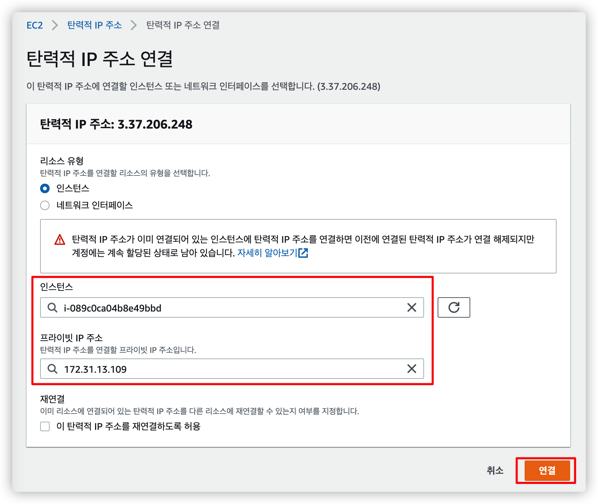

# AWS EC2 생성

<br>

# 1. EC2 인스턴스 생성

AWS 에서 EC2 생성하는 법을 알아봅니다.

우선 [AWS 홈페이지](https://aws.amazon.com) 에 접속해서 계정을 생성 후 콘솔에 로그인 된 상태여야 합니다.

2022년 1월 16일 기준으로 작성되었으며 이후에 홈페이지 인터페이스가 변경될 수 있습니다.

<br>

## 1.1. AWS Region 설정


우선 위치를 서울로 설정합니다.

만약 대한민국이 아닌 다른 나라에 서비스 하려면 그 도시를 선택해도 됩니다.

<br>

## 1.2. EC2 메뉴로 이동


처음에 대시보드가 나올텐데 만약 EC2 서비스를 찾기 힘들다면 검색해서 들어갑니다.

<br>

## 1.3. 새 인스턴스 생성


인스턴스 메뉴로 들어가 인스턴스 시작 버튼을 클릭합니다.

<br>

## 1.4. Amazon MAchine Image(AMI) 선택


어떤 서버로 구성할지 선택하는 겁니다.

여러 종류가 있어서 원하는 걸 선택하면 되고, 저는 프리 티어에 Ubuntu LTS 버전을 선택했습니다.

<br>

## 1.5. 인스턴스 유형 성택


프리티어는 사실 선택권이 없습니다.

스펙이 좋을수록 과금이 더 많이 되기 때문에 처음부터 좋은걸 고르기보다는 작게 시작했다가 스케일업 해나가는 걸 추천드립니다.

인스턴스 유형 선택 후 세부 구성은 아직 설정할게 없으므로 "4. 스토리지 추가" 로 넘어갑니다.

<br>

## 1.6. 스토리지 추가


프리티어는 최대 30 까지 지원하기 때문에 해당 부분만 변경해줍니다.

볼륨 유형은 범용 SSD 로 선택해야 합니다.

만약 Provisioned IOPS SSD (프로비저닝된 IOPS SSD) 를 선택한다면 사용하지 않아도 활성화한 기간만큼 계속 비용이 발생하게 됩니다.

스토리지까지 설정했다면 이후에 있는 태그와 보안 그룹은 아직 설정하지 않아도 되기 때문에 "검토 및 시작" 을 선택합니다.

<br>

## 1.7. 키 페어 생성


SSH 접속을 위해선 키를 생성해야 합니다.

키 이름을 정한 후 "키 페어 다운로드" 를 눌러 내 로컬 PC 에 저장합니다.

한번 다운받은 후에는 재다운 받을 수 없기 때문에 안전한 곳에 저장해두면 됩니다.

<br>

## 1.8. 인스턴스 생성 완료


처음 화면으로 돌아오면 이렇게 인스턴스가 생성된 것을 확인할 수 있습니다.

이제 **탄력적 IP 와 보안 그룹**을 추가하기 위해 인스턴스 ID 를 클릭합니다.

<br>

# 2. 탄력적 IP (Elastic IP)

AWS EC2 인스턴스는 서버를 중지하고 다시 실행시키면 퍼블릭 IP 가 변경되기 때문에 클라이언트가 사용할 수 있는 변하지 않는 IP 가 필요합니다.

탄력적 IP (Elastic IP) 란 외부에서 인스턴스에 접근 가능한 고정 IP 입니다.

탄력적 IP 는 만들어놓고 사용하지 않더라도 과금이 되기 때문에 필요한 만큼만 생성하는 것이 중요합니다.

자세한 설명은 [AWS Docs - 탄력적 IP](https://docs.aws.amazon.com/ko_kr/AWSEC2/latest/UserGuide/elastic-ip-addresses-eip.html) 에서 확인하실 수 있습니다.

<br>

우선, 진짜 퍼블릭 IP 가 변경하는지 한번 확인해봅시다.

현재 생성된 인스턴스의 정보입니다.

퍼블릭 IP 로 `3.35.238.69` 가 할당된 것을 확인할 수 있습니다.


<br>

인스턴스를 중지 (삭제x) 시켰다가 다시 실행시켜보았습니다.

인스턴스 ID, 프라이빗 IP 와 같은 정보는 동일한데 퍼블릭 IP 가 `13.125.3.218` 로 변경된 것을 볼 수 있습니다.

이렇게 퍼블릭 IP 는 변경될 가능성이 있기 때문에 탄력적 IP 를 할당해주어야 합니다.


<br>

## 2.1. 탄력적 IP 메뉴 접근


메뉴에서 탄력적 IP 를 찾아서 들어갑니다.

아직 아무것도 할당받은 게 없기 때문에 새로운 IP 를 추가합니다.

<br>

## 2.2. 새로운 탄력적 IP 할당


딱히 변경할 건 없고 바로 할당을 선택해서 만들어줍시다.

<br>

## 2.3. 탄력적 IP 주소 선택


방금 생성한 탄력적 IP 를 선택해서 연결을 시도합니다.

<br>

## 2.4. 인스턴스 선택 및 연결



설정 화면에 들어가면 현재 내 인스턴스 목록을 선택할 수 있고 연결된 프라이빗 IP 까지 선택 가능합니다.

<br>

## 2.5. 인스턴스 정보 확인


탄력적 IP 를 연결하고 다시 인스턴스 정보를 확인해보면 IP 가 할당된 것을 볼 수 있습니다.

퍼블릭 IP 주소도 기존 값에서 탄력적 IP 주소로 자동으로 변경되었습니다.

캡쳐 화면에선 모자이크 때문에 가려져 있지만 두 IP 는 현재 같은 값입니다.

<br>

# 3. SSH 클라이언트로 서버 접속


이제 내가 만든 EC2 인스턴스에 접속해봅니다.

인스턴스 정보에서 "연결" 버튼을 클릭하면 인스턴스에 연결 가능한 여러가지 방법을 알려줍니다.

여기서 "SSH 클라이언트" 로 접속하는 방법을 알아봅니다.


<br>

## 3.1. 터미널 실행 후 키 페어 파일 위치로 이동

터미널을 실행해서 이전에 다운 받은 키 페어 파일 위치로 이동합니다.

저는 다운로드 받은 후 따로 옮기지 않았기 때문에 Downloads 디렉토리에 들어갔습니다.

키 파일이 없으면 접속할 수 없고 다시 다운받을 수도 없기 때문에 잘 관리해야 합니다.


<br>

## 3.2. 키 파일 권한 변경

```sh
$ chmod 400 my-key.pem
```

키 파일의 권한을 변경해줍니다.

<br>

## 3.3. ssh 접속

가이드에 있는 대로 퍼블릭 DNS 또는 퍼블릭 IP 를 사용해서 인스턴스에 접속할 수 있습니다.

```sh
# 퍼블릭 DNS 로 접속
$ ssh -i "my-key.pem" ubuntu@ec2-3-37-206-248.ap-northeast-2.compute.amazonaws.com

# 퍼블릭 IP 로 접속
$ ssh -i "my-key.pem" ubuntu@3.37.206.248
```


<br>

## 3.4. 호스트 등록해서 간편하게 접속

이제 우리는 SSH 로 EC2 인스턴스 서버에 접속할 수 있습니다.

하지만 위에서 본 것처럼 매번 `ssh -i [키 페어 파일] [ubuntu]@[탄력적 IP]` 를 입력해야 합니다.

일일히 기억하기도 귀찮고 타이핑도 번거롭기 때문에 호스트로 등록해서 쉽게 접속할 수 있도록 변경해봅시다.

<br>

### 3.4.1. ~/.ssh 디렉터리로 키 페어 파일 복사

우선 키 페어 파일을 `~/.ssh/` 로 복사합니다.

```sh
$ cp my-key.pem ~/.ssh/
```

<br>

### 3.4.2. 키 페어 파일 권한 변경

키 페어 파일의 권한을 변경합니다.

```sh
$ chmod 600 my-key.pem
```


<br>

### 3.4.3. ~/.ssh/config 파일 생성

`~/.ssh/` 디렉터리에 `config` 파일을 생성해서 다음과 같이 입력합니다.

이미 파일이 존재한다면 맨 아래에 입력하면 됩니다.

User 는 우분투를 선택했다면 ubuntu 고 그 외에는 전부 ec2-user 일겁니다.

```sh
$ vi ~/.ssh/config

# 아래는 파일 내용
# ssh -i [키 페어 파일] [유저 이름]@[탄력적 IP]
Host [원하는 호스트 이름]
User [유저 이름]
HostName [탄력적 IP]
IdentityFile [키 페어 파일 위치]
```

<br>

위 형식에 따라 저는 다음과 같이 작성했습니다.


<br>

### 3.4.4. 설정한 Host 이름으로 접속

이제 키 페어 파일이 없는 곳에서도 간단한 별칭으로 SSH 접속이 가능합니다.


<br>

# 4. 보안 그룹 설정

보안 그룹은 AWS 에서 제공하는 방화벽 모음입니다.

서비스를 제공하는 애플리케이션이라면 상관 없지만 RDS 처럼 외부에서 함부로 접근하면 안되는 인스턴스는 허용된 IP 에서만 접근하도록 설정이 필요합니다.

- 인바운드 (Inbound)
  - 외부에서 EC2 인스턴스로 들어오는 걸 허용
- 아웃바운드 (Outbound)
  - EC2 인스턴스 내부에서 외부로 보내는걸 허용

<br>

## 4.1. 현재 보안 그룹 확인


인스턴스 정보의 보안 탭에서 현재 설정된 보안 그룹을 확인할 수 있습니다.

처음 인스턴스를 생성할 때 아무런 보안 그룹을 설정하지 않았기 때문에 default 값만 들어가있습니다.

인바운드 규칙 해석해보면 22번 포트의 모든 IP 에 대해서 TCP 연결을 허용한다는 의미입니다.

SSH 접속을 위해 22번 포트는 기본으로 설정해준 것 같네요.

이제 새로운 보안 그룹을 만들어 봅시다.

<br>

## 4.2. 보안 그룹 ID 리스트 확인


인스턴스에서 보안 그룹 ID 를 보고 들어갈 수도 있지만 메뉴에서 직접 들어가면 이렇게 보안 그룹 ID 리스트를 볼 수 있습니다.

보안 그룹은 인스턴스와 별개로 존재하기 때문에 한번 만들어두면 새 인스턴스를 생성해도 한번에 적용할 수 있습니다.

우측 상단의 "보안 그룹 생성" 버튼을 눌러서 새 보안 그룹을 만들어봅시다.

<br>

## 4.3. 보안 그룹 생성


먼저 보안 그룹의 이름과 설명을 추가하고 인바운드 규칙과 아웃바운드 규칙을 편집합니다.

<br>

## 4.4. 인바운드 규칙


인바운드는 외부에서 EC2 로 요청할 때 허용할 IP 대역을 설정할 수 있습니다.

원하는 규칙을 추가하려면 "규칙 추가" 버튼을 누릅니다.

유형을 먼저 선택하면 자동으로 그에 맞는 프로토콜과 포트 범위가 고정됩니다.

웬만한 유형들이 이미 존재하기 때문에 편하게 설정할 수 있습니다.

우선 로컬 PC 에서 서버에 접속할 수 있게 SSH 를 추가하고 소스를 내 IP 로 추가합니다.

"소스" 를 선택하면 우측에 알아서 IP 가 추가되며, 특정 IP 나 대역을 넣으려면 "사용자 지정" 으로 추가할 수 있습니다.

만약 여러 사람이 함께 작업하는 프로젝트라면 각각의 로컬 PC IP 를 전부 추가해줘야 합니다.

SSH, HTTP, HTTPS 와 같은 기본 포트들을 열고 스프링 부트 프로젝트에서 사용하는 8080 포트까지 사용자 지정으로 추가해줍니다.

<br>

## 4.5. 아웃바운드 규칙

아웃바운드 규칙은 딱히 설정할 필요 없기 때문에 "모든 트래픽" 그대로 둡니다.

<br>

## 4.6. 인스턴스에서 보안 그룹 변경


다시 인스턴스로 돌아와서 "보안 그룹 변경" 버튼을 눌러줍니다.

<br>


방금 생성한 MySecurityGroup 을 추가해줍니다.

보안 그룹은 여러 개를 동시에 설정할 수 있기 때문에 기존에 설정된 launch-wizard-1 보안 그룹은 제거해줍니다.

<br>

## 4.7. 변경된 보안 그룹 확인


다시 인스턴스 설정을 보면 보안 그룹이 적용된 것을 볼 수 있습니다.

만약 제대로 보이지 않는다면 새로고침을 한번 해주세요.

<br>

# 5. RDS 인스턴스 생성

이번에는 EC2 서버에 DB 연동을 하기 위한 RDS 인스턴스를 생성해봅니다.

<br>

## 5.1. RDS 메뉴로 이동


EC2 와 마찬가지로 검색하면 쉽게 찾을 수 있습니다.

<br>

## 5.2. 데이터베이스 생성


대시보드에서 선택해도 되고 아니면 이렇게 메뉴에 진입해서 직접 데이터베이스 생성을 눌러도 됩니다.

<br>

## 5.3. DB 종류 선택


저는 MySQL 을 선택했습니다.

<br>

## 5.4. DB 설정 입력


데이터베이스 이름, 마스터 이름, 비밀번호를 입력합니다.

실제 DB 에 접근할 때 사용할 정보이므로 신중하게 입력해야 합니다.

<br>

## 5.5. 스토리지 설정


사실 프리 티어일 때는 선택권이 거의 없습니다.

그냥 대부분 기본 설정을 사용하면 되는데 "스토리지 자동 조정" 저 부분 체크만 해제해주시면 됩니다.

안그러면 개발을 진행하다 임계값이 초과되면 자동으로 스토리지가 늘어나서 과금될 가능성이 있습니다.

<br>

### 5.6. 보안 그룹 설정


EC2 와 마찬가지로 보안 그룹을 설정하거나 새로 생성할 수 있습니다.

기존에 사용 중인게 있다면 "기존 항목 선택" 을 누르고 보안 그룹을 추가하면 됩니다.

여기서는 "새로 생성" 으로 해보겠습니다.

<br>

### 5.7. 추가 구성


추가 구성에서 데이터베이스 이름을 적고 자동 백업을 비활성화 합니다.

어차피 개발용이라 데이터가 중요하지 않아서 자동 백업을 비활성화 했지만, 만약 지워져도 복구해야 하는 데이터라면 당연히 백업을 활성화 해야 합니다.

여기까지 진행했으면 "데이터베이스 생성" 을 눌러서 생성을 완료합니다.

생성 완료까지는 시간이 좀 걸립니다.

<br>

# 6. RDS 보안 그룹 설정

RDS 인스턴스를 생성할 때 보안 그룹도 새로 생성했습니다.

데이터베이스는 서버에서 접근 가능해야 하기 때문에 보안 그룹 설정이 추가로 필요합니다.

여기서 서버란 곧 "EC2 인스턴스의 탄력적 IP" 를 의미합니다.

탄력적 IP 를 직접 넣는 대신 손쉽게 설정할 수 있는 방법이 있습니다.

<br>

## 6.1. 현재 보안 그룹 확인


RDS 인스턴스 정보로 들어가면 보안 그룹 규칙을 확인할 수 있습니다.

친절하게 제가 접속할 수 있게 로컬 IP 만 인바운드 규칙에 추가해두었네요.

아웃바운드는 마찬가지로 모든 트래픽에 대해 열어두었습니다.

RDS 보안 그룹은 EC2 보안 그룹이랑 별개가 아니라 같이 관리됩니다.

따라서, 보안 그룹을 편집하려면 EC2 대시보드로 이동하거나 저 보안 그룹 이름을 클릭해서 페이지를 열어야 합니다.

<br>

## 6.2. 보안 그룹 리스트에서 EC2 보안 그룹 ID 복사


EC2 대시보드의 보안 그룹 메뉴로 이동하면 이렇게 확인 가능하고 편집 가능합니다.

이전에 만들었던 MySecurityGroup 도 보이는데 보안 그룹 ID 를 복사해줍니다.

<br>

## 6.3. 인바운드 규칙에 EC2 보안 그룹 ID 입력


통신 유형을 MYSQL/Aurora 로 선택하고 사용자 지정으로 EC2 보안 그룹의 ID 를 추가하고 저장합니다.

<br>

# 7. RDS 접속 테스트

보안 그룹 설정까지 했다면 실제로 연결이 잘 되는지 다음 두 가지를 테스트 해봅시다.

- 로컬 PC 에서 접속
- EC2 인스턴스 서버에서 접속

<br>

## 7.1. 엔드포인트와 포트 확인


RDS 인스턴스 정보에서 엔드포인트와 포트를 확인합니다.

<br>

## 7.2. 로컬 PC (Sequel Ace) 에서 접속

Database GUI 툴은 여러 가지가 있으므로 각자 편한걸로 접근하시면 됩니다.

저는 Sequel Ace 에서 접속을 시도해보겠습니다.


- Host: RDS 엔드포인트
- Username: RDS 생성 시 입력했던 정보
- Password: RDS 생성 시 입력했던 정보

이렇게 세가지만 입력 후 Connect 를 누르면 접속 가능합니다.

<br>


RDS 생성 시에 지정했던 초기 데이터베이스 이름도 확인할 수 있네요.

<br>

## 7.3. EC2 에서 접속

먼저 EC2 에 접속해줍니다.

우선 MySQL 을 먼저 설치해줘야 합니다.

```sh
# Ubuntu 에서 MySQL 설치
$ sudo apt-get update
$ sudo apt-get install mysql-server
```

<br>

그리고 mysql 명령어로 접속을 시도합니다.

권한 문제가 있으면 sudo 로 재시도 합니다.

```sh
# mysql -u [유저이름] -p --host [엔드포인트]
$ mysql -u admin -p --host my-rds-instance.ciweuig9oiko.ap-northeast-2.rds.amazonaws.com
```

<br>

접속이 잘 된것을 확인할 수 있습니다.


<br>

# 8. RDS 파라미터 그룹 설정

RDS 는 다음 세가지 설정을 필수로 해줘야 합니다.

- Time Zone
- Character Set
- Max Connection

먼저 파라미터 그룹 메뉴를 찾아 이동합니다.


<br>

## 8.1. 파라미터 그룹 생성


파라미터 그룹 패밀리는 RDS DB 와 맞춰서 선택하고 이름과 설명만 입력해서 생성합니다.

생성한 파라미터 그룹을 클릭해서 파라미터 편집을 누릅니다.

<br>

## 8.2. Time Zone


타임존을 Asia/Seoul 로 변경합니다.

<br>

## 8.3. Character Set


character_set 으로 검색해서 나온 6 개의 값을 전부 `utf8mb4` 로 변경해줍니다.

원래는 `utf8` 을 많이 사용했으나 `utf8mb4` 가 이모지까지 지원하기 때문에 더 많이 사용되는 추세입니다.

<br>


collation 으로 검색해서 나온 값들도 전부 `utf8mb4_general_ci` 로 변경해줍니다.

<br>

## 8.4. Max Connection


마지막으로 max_connections 을 수정해줍니다.

이 값은 원래 RDS 인스턴스 사양에 의해 결정됩니다.

<br>

## 8.5. 변경사항 정리


<br>

## 8.6. RDS 파라미터 그룹 변경

RDS 인스턴스로 이동해서 "수정" 버튼을 클릭합니다.

그리고 "추가 구성" 탭으로 이동해서 DB 파라미터 그룹을 변경해줍니다.


<br>


<br>

# 9. EC2 인스턴스에 Spring Boot 서버 띄우기

배포 시스템 이런거 생략하고 진짜 단순하게 서버 띄우는 것만 확인해봅니다.

가장 간단한 방법은 두가지가 있는데 1번으로 진행하겠습니다.

1. jar 파일을 빌드하여 EC2 복사 후 실행
2. EC2 에서 프로젝트 git clone 후 실행

<br>

## 9.1. JDK 설치

```sh
# EC2 인스턴스
$ sudo apt-get update
$ sudo apt-get install openjdk-11-jdk
```

`java -version` 으로 명령어로 설치 여부를 확인할 수 있습니다.

<br>

## 9.2. Spring Boot 프로젝트 빌드

```sh
# 프로젝트 파일로 이동 후
$ gradle clean build

BUILD SUCCESSFUL in 5s
17 actionable tasks: 10 executed, 7 up-to-date


# 빌드 파일 복사
$ scp ./build/libs/api-0.0.1-SNAPSHOT.jar [호스트 이름]:/home/ubuntu
```

프로젝트를 빌드하면 `./build/libs` 디렉토리에 jar 파일이 생성됩니다.

해당 파일을 EC2 서버로 복사합니다.

호스트 이름에는 `ubuntu@[퍼블릭 IP]` 또는 `ubuntu@[퍼블릭 DNS]` 가 들어가야 하는데 만약 `~/.ssh/config` 에 호스트 이름을 등록해두었다면 간소화된 이름을 사용할 수 있습니다.

퍼블릭 IP (탄력적 IP) 또는 퍼블릭 DNS 를 그대로 사용한다면 키 페어 파일 (.pem) 이 명령어를 사용하는 위치에 존재해야 합니다.

<br>

## 9.3. EC2 인스턴스에서 실행

```sh
# EC2 인스턴스
$ nohup java -jar api-0.0.1-SNAPSHOT.jar &
```

`nohup` 명령어를 사용하면 로그를 `nohup.out` 파일에 남길 수 있습니다.

<br>

## 9.4. 퍼블릭 IP 또는 DNS 로 접근 확인

http://[탄력적 IP]:8080 으로 접속하면 정상적으로 서버에 연결이 되는 걸 볼 수 있습니다.