# Github Actions CD: AWS EC2 에 Spring Boot 배포하기

# Overview

애플리케이션을 개발하면 외부에서도 접근 가능하도록 클라우드 환경에 배포합니다.

이전에 포스팅 했던 [AWS 1편](https://bcp0109.tistory.com/356)에서는 마지막에 `scp` 명령어로 로컬에 존재하는 빌드 파일을 EC2 인스턴스로 복사한 후 ssh 로 접속해서 실행시켰습니다.

하지만 매 배포마다 이렇게 하면 굉장히 번거롭고 실수할 가능성도 높아집니다.

그래서 이런 수작업을 자동화하는 여러 가지 툴과 기법들이 등장했고 Github Actions 도 그 중 하나입니다.

Github Actions 에 대해서는 [지난 포스팅](https://bcp0109.tistory.com/362) 에서 한번 다룬 적이 있습니다.

이번에는 Github Actions 를 사용해서 AWS EC2 에 자동으로 배포하는 과정을 알아봅니다.

<br>

# 1. 배포 방법

`main` 브랜치에 Push 하면 자동으로 EC2 까지 배포되는 Workflow 를 만들어봅시다.

먼저 Workflow 를 작성하기 전에 어떤 방식으로 EC2 까지 배포가 이루어지는 지 전체적인 플로우를 알아야 합니다.

Github Actions 를 확인하면 CI 과정에서 했던 것처럼 `aws.yml` 이라는 기본 Workflow 를 제공합니다.

배포하는 방법은 여러 가지 있겠지만 AWS 의 경우 큰 흐름은 하나입니다.

**소스 코드를 압축하여 AWS 스토리지에 저장 후 서버에 전달해서 실행한다**

그리고 AWS 에서 공식적으로 가이드하는 방법은 크게 두 가지가 있습니다.

1. AWS S3 빌드파일 압축해서 업로드 -> AWS EC2 배포 (CodeDeploy 활용)
2. AWS ECR 에 도커 이미지 업로드 -> AWS ECS 배포 (Task Definition 활용)

<br>

## 1.1. 어떤 차이가 있을까?

우리는 EC2 인스턴스에 배포해야 하기 때문에 1번 방법을 사용합니다.

Github Actions 에서 제공하는 AWS Workflow 는 2번 방법을 안내하고 있어서 차이점을 먼저 알아봤습니다.

AWS ECR 은 Docker Image 를 저장하는 레지스트리고 AWS ECS 일종의 도커 컨테이너 서비스입니다.

AWS ECS 는 미리 정의한 Task Definition 을 기반으로 클러스터에 인스턴스를 생성하고 ECR 에 저장된 도커 이미지를 배포하는 등 인스턴스를 관리하며 스케일 인/아웃을 지원합니다.

여러 서버 인스턴스를 관리하기 위해선 더 편할 수 있으나 우리는 이미 존재하는 EC2 인스턴스에 배포하는 걸 목적으로 하기 때문에 1번 방법을 사용합니다.

<br>

## 1.2. 배포 과정

큰 흐름을 요약하면 다음과 같습니다.

1. Github Actions 에서 코드 빌드 (테스트는 CI 에서 했다고 검증했다고 판단하여 생략)
2. AWS 인증
3. 코드 압축해서 AWS S3 에 업로드
4. AWS CodeDeploy 실행하여 S3 에 있는 코드 EC2 에 배포

<br>

# 2. EC2 설정 추가

[AWS EC2 편](https://bcp0109.tistory.com/356) 에서 생성한 인스턴스를 기준으로 아래 작업들을 추가로 진행합니다.

1. Tag 추가 (CodeDeploy 에서 어떤 인스턴스에 실행할 지 구분하는 값)
2. IAM 역할 등록
3. EC2 서버에 CodeDeploy Agent 설치

<br>

## 2.1. Tag 추가

CodeDeploy 를 생성할 때 어떤 인스턴스에서 수행할 지 구분하는 값으로 태그를 사용하기 때문에 추가가 필요합니다.

기존에 인스턴스 생성할 때 태그까지 같이 생성했다면 이 과정은 생략해도 괜찮습니다.

<br>

### 2.1.1. EC2 설정에서 태그 관리 선택

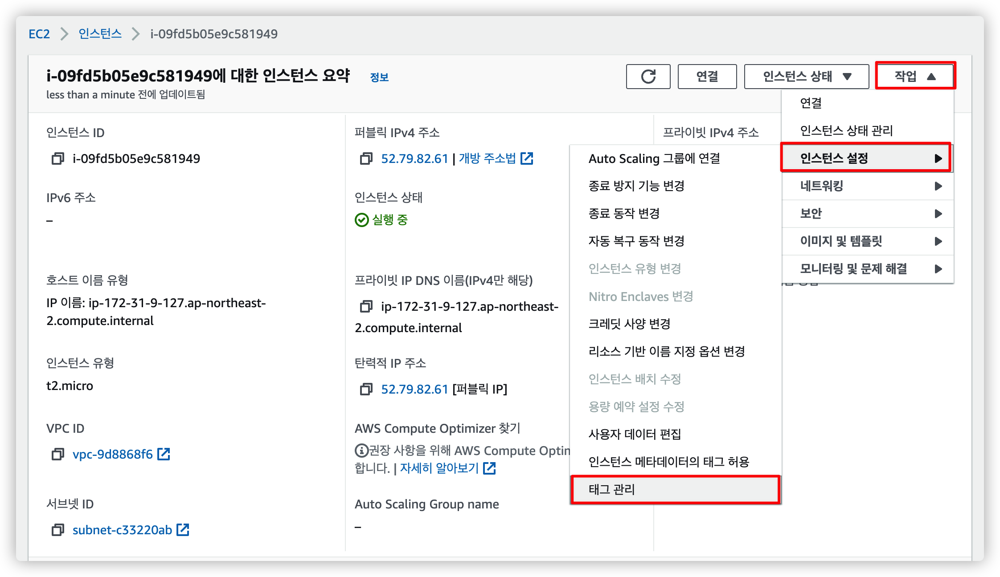

EC2 인스턴스 정보에 들어가 태그 관리를 선택합니다.

<br>

### 2.1.2. 태그 추가

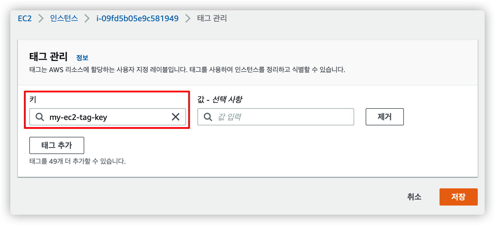

원하는 키 값을 입력하고 저장을 누릅니다.

<br>

### 2.1.3. 태그 확인

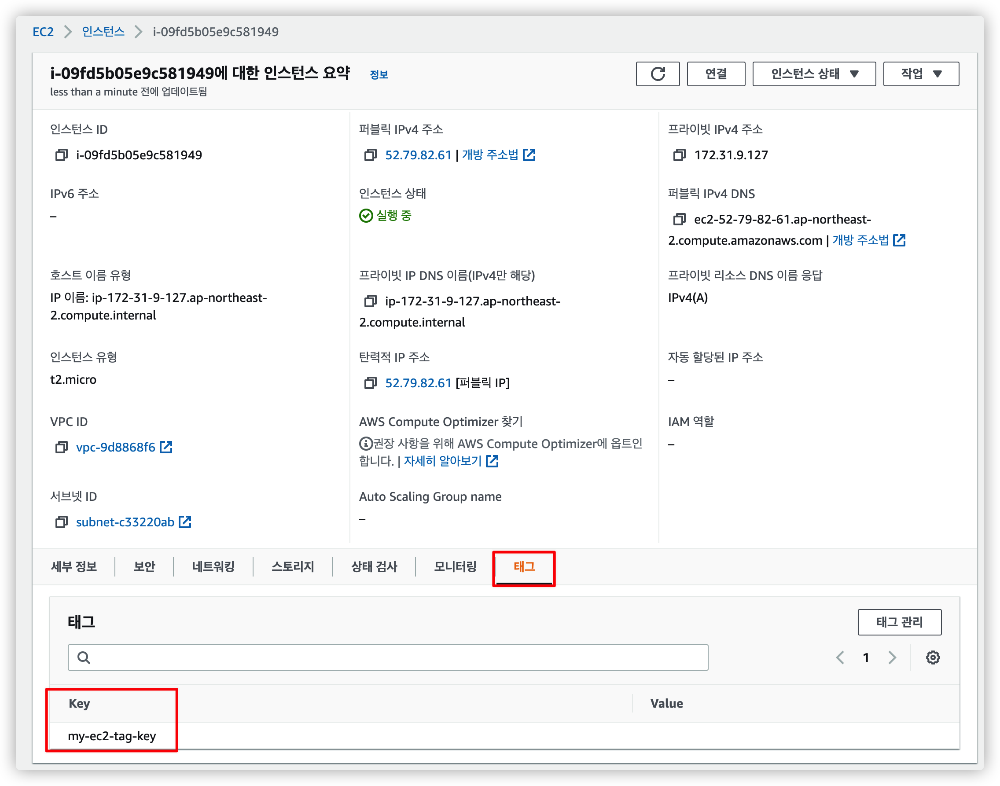

다시 EC2 인스턴스 정보에서 태그가 등록되었는지 확인할 수 있습니다.

<br>

## 2.2. IAM 역할 추가

EC2 인스턴스에서 S3 에 올려놓은 파일에 접근할 수 있도록 권한을 추가해줘야 합니다.

<br>

### 2.2.1. IAM 역할 관리 페이지로 이동

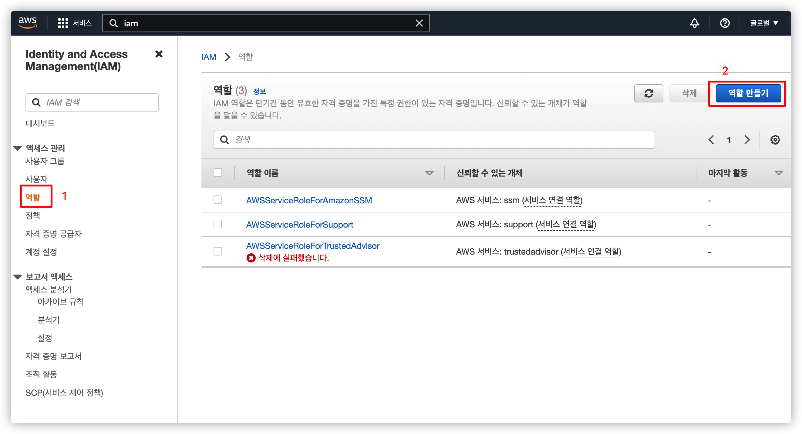

기본적으로 존재하는 역할들이 있는데 신경쓰지 말고 새로운 역할 만들기를 선택합니다.

<br>

### 2.2.2. EC2 엔티티 선택

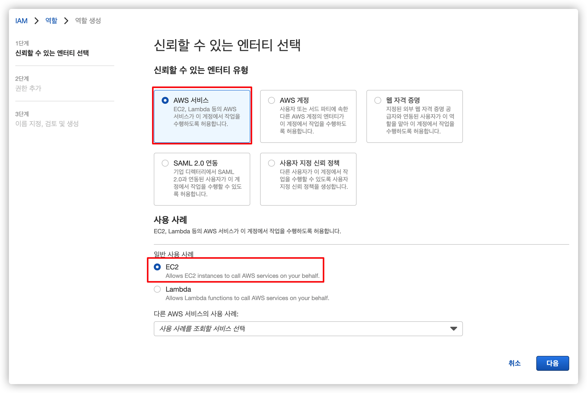

IAM 역할을 연결할 서비스를 선택합니다.

<br>

### 2.2.3. S3 접근 권한 추가

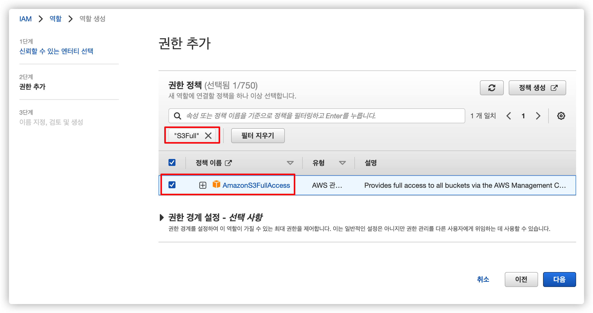

EC2 인스턴스에서 S3 접근할 수 있도록 `AmazonS3FullAccess` 권한을 추가합니다.

<br>

### 2.2.4. 이름 설정

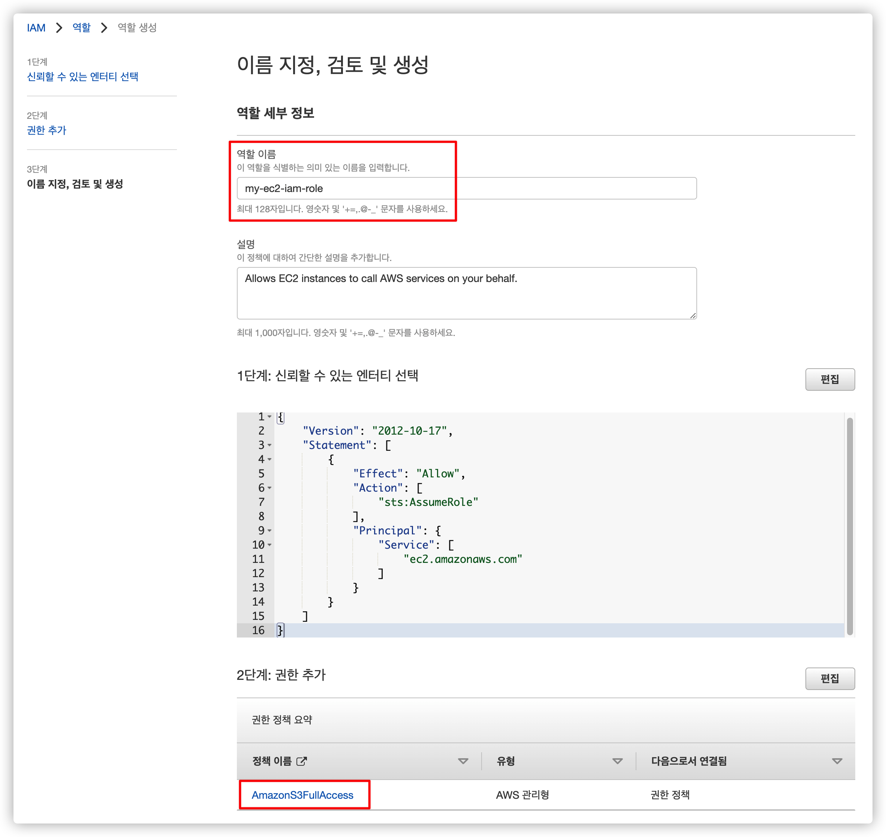

마지막으로 적당한 이름을 입력한 뒤 생성을 완료합니다.

<br>

### 2.2.5. EC2 인스턴스에서 IAM 연결

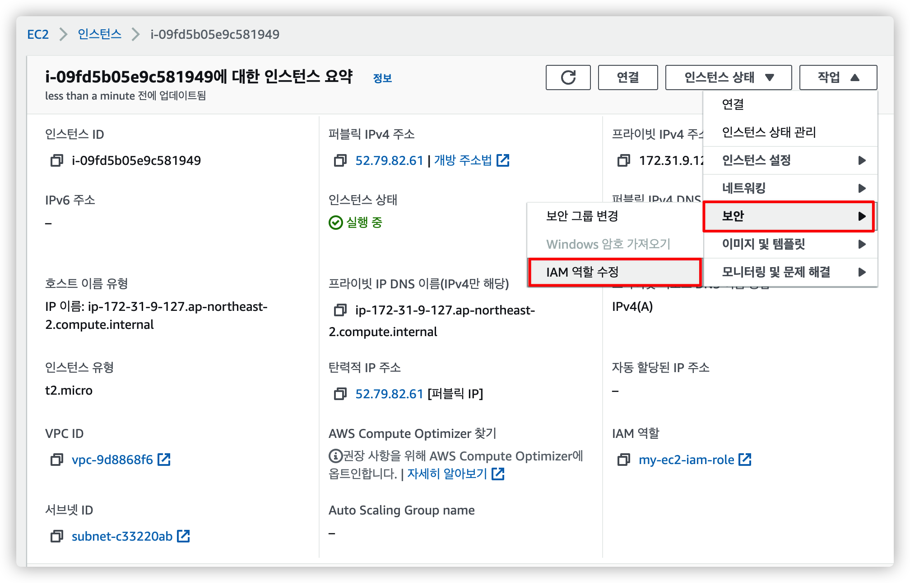

EC2 인스턴스 관리 페이지로 이동해서 "작업 > 보안 > IAM 역할 수정" 을 선택합니다.

<br>

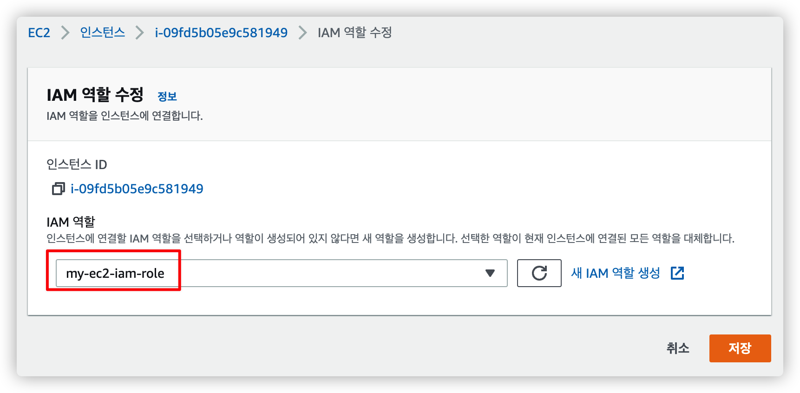

방금 만든 EC2 전용 IAM 역할을 선택한 뒤 저장을 누르면 연결이 완료됩니다.

<br>

## 2.3. CodeDeploy Agent 설치

```sh
$ sudo apt update
$ sudo apt install ruby-full
$ sudo apt install wget
$ cd /home/ubuntu
$ wget https://aws-codedeploy-ap-northeast-2.s3.ap-northeast-2.amazonaws.com/latest/install
$ chmod +x ./install
$ sudo ./install auto > /tmp/logfile
$ sudo service codedeploy-agent status
```

[CodeDeploy Agent 설치](https://docs.aws.amazon.com/ko_kr/codedeploy/latest/userguide/codedeploy-agent-operations-install-ubuntu.html) 를 보고 명령어를 따라 치기만 히면 됩니다.

EC2 환경이 Ubuntu 가 아니거나 버전이 다르다면 공식 문서를 참고해주세요.

<br>

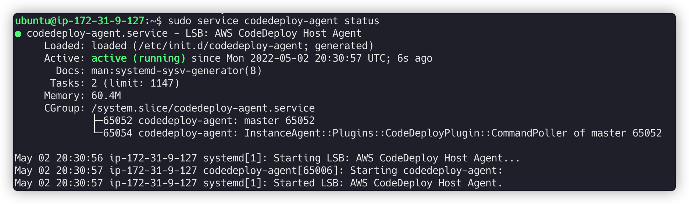

정상적으로 설치가 완료되면 이런 응답이 와야 합니다.

<br>

# 3. AWS S3 생성

빌드한 프로젝트 결과물을 어딘가에 저장해두기 위해 S3 버킷을 생성해야 합니다.

<br>

## 3.1. S3 메뉴에서 버킷 생성

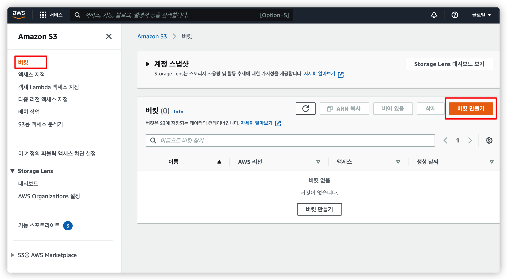

S3 메뉴로 이동해서 "버킷 만들기" 를 누릅니다.

<br>

## 3.2. 일반 구성과 객체 소유권 설정

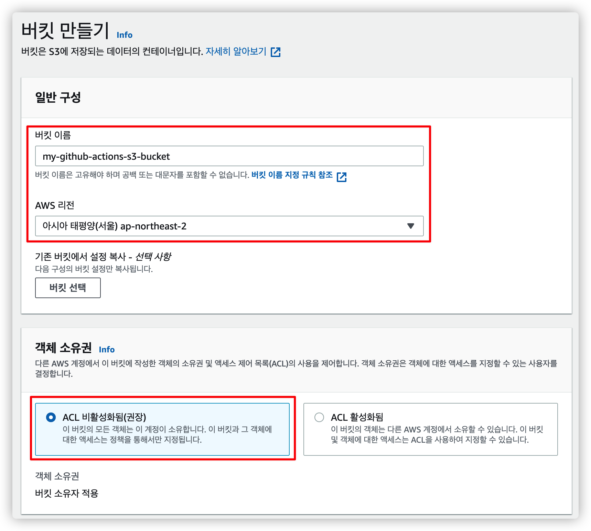

원하는 버킷 이름과 리전을 선택합니다.

ACL 은 기본값을 선택해서 비활성화 합니다.

<br>

## 3.3. 액세스, 버킷 버전, 암호화 비활성화

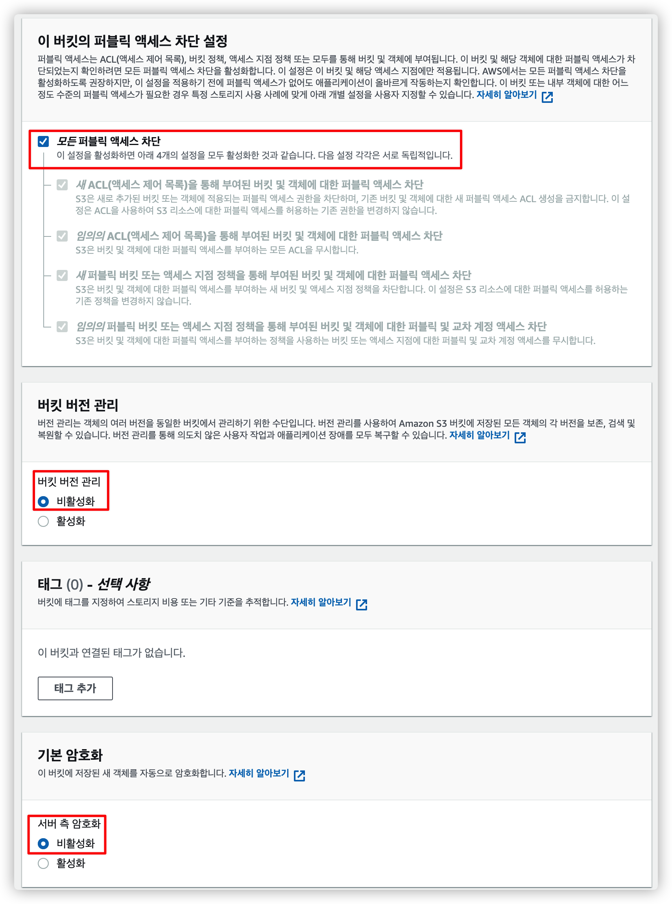

나머지 설정을 마저 합니다.

변경할 필요 없이 기본값 그대로 두면 됩니다.

<br>

## 3.4. S3 버킷 생성 완료

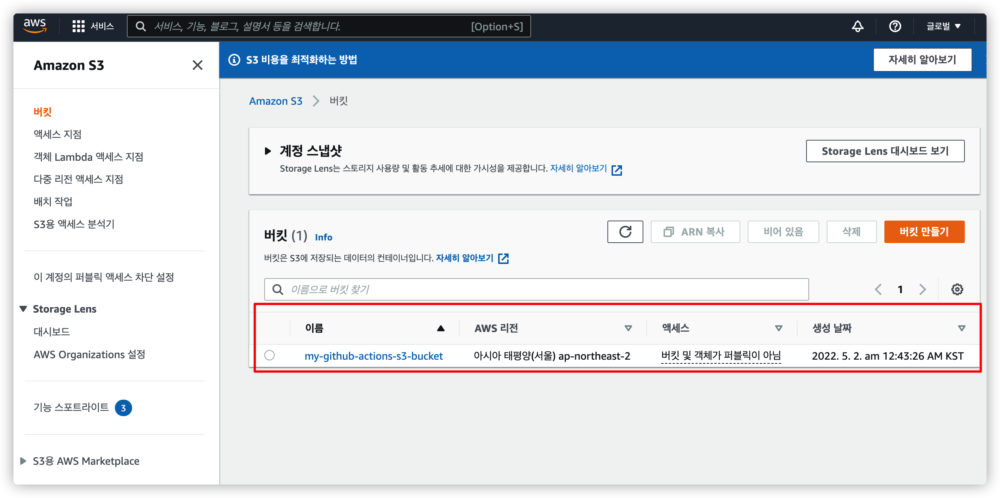

버킷 생성이 완료되면 이렇게 나타납니다.

<br>

# 4. CodeDeploy 생성

배포를 도와주는 CodeDeploy 생성 및 설정을 진행해봅니다.

<br>

## 4.1. CodeDeploy 전용 IAM 역할 만들기

CodeDeploy 를 사용하기 위해선 IAM 에서 역할을 만들어야 합니다.

<br>

### 4.1.1. IAM 메뉴에서 역할 선택


IAM 서비스로 이동해서 역할 만들기를 선택합니다.

<br>

### 4.1.2. CodeDeploy 엔티티 선택

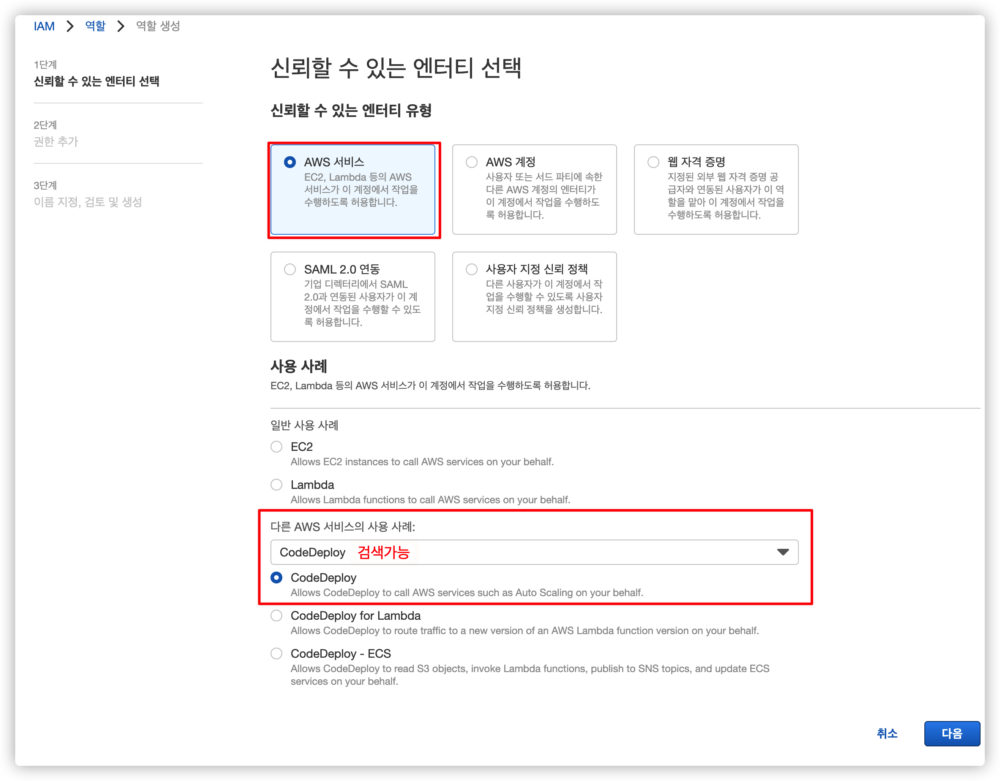

기본적으로 제공되는 AWS 서비스에서 `CodeDeploy` 를 검색한 후 가장 기본적인 걸 선택합니다.

<br>

### 4.1.3. IAM 이름 설정

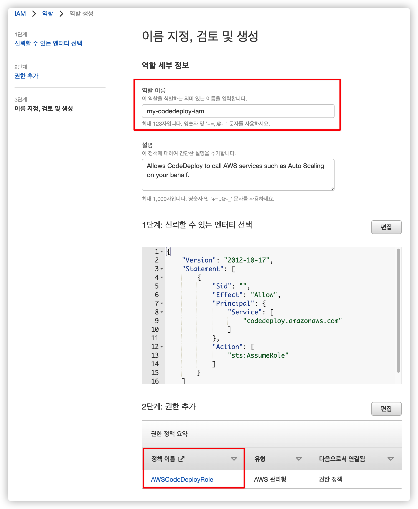

나머지는 건들 필요 없고 이름만 새로 추가합니다.

저는 `my-codedeploy-iam` 로 설정했습니다.

이름을 입력했다면 "역할 생성" 을 눌러 마무리합니다.

<br>

## 4.2. CodeDeploy 애플리케이션 생성

이제 우리가 사용할 CodeDeploy 앱을 생성합니다.

<br>

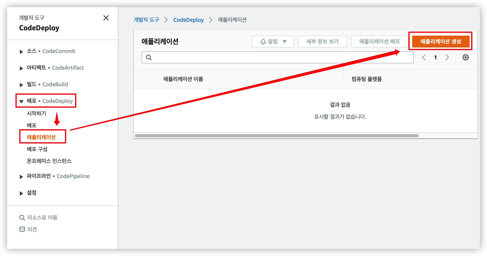

메뉴에서 생성 버튼을 누릅니다.

<br>

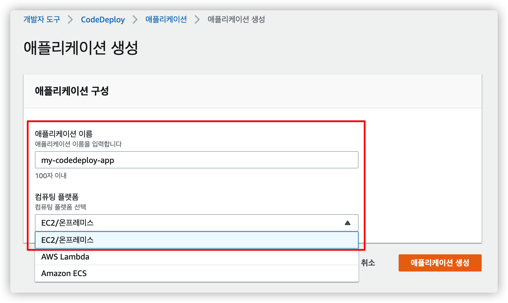

원하는 이름을 입력 후 컴퓨팅 플랫폼은 `EC2/온프레미스` 를 선택합니다.

<br>

## 4.3. CodeDeploy 배포 그룹 생성

CodeDeploy 애플리케이션에서 사용하는 배포 그룹을 생성합니다.

<br>

### 4.3.1. 메뉴에서 선택

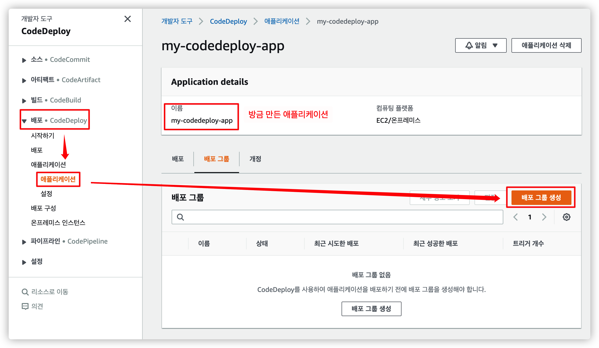

방금 만든 애플리케이션에서 배포 그룹 생성을 누릅니다.

<br>

### 4.3.2. 이름, 역할, 유형 선택

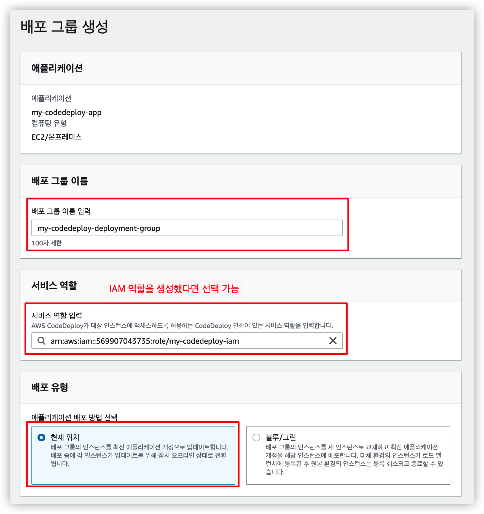

원하는 배포 그룹 이름, 역할, 유형을 설정합니다.

서비스 역할은 위에서 만든 IAM 역할을 선택할 수 있게 나옵니다.

<br>

### 4.3.3. EC2 인스턴스 선택

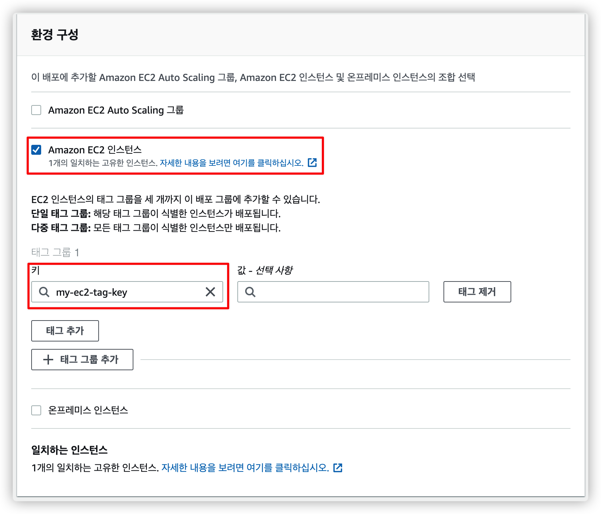

어떤 인스턴스에서 동작할 지 선택합니다.

EC2 인스턴스에서 태그를 추가해야 선택할 수 있습니다.

우리는 위에서 이미 기존 EC2 인스턴스에 태그를 추가했기 때문에 해당 태그 키를 선택합니다.

<br>

### 4.3.4. 나머지 설정 후 배포 그룹 생성

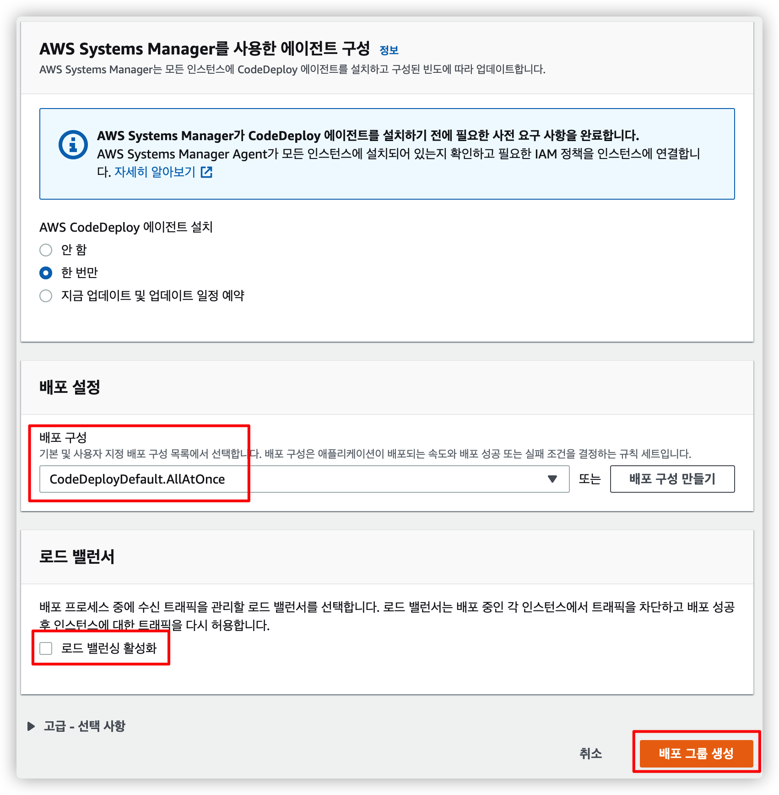

AWS Systems Manager 는 크게 중요한거 같지 않으니 적당히 선택하고 로드 밸런싱을 사용하지 않으니 체크만 해제합니다.

다 설정했으면 배포 그룹 생성을 눌러 마무리합니다.

<br>

# 5. Github Actions 에서 사용할 IAM 사용자 추가

AWS 를 Github Actions 워크 플로우에서 접근하려면 권한이 필요합니다.

지금까지는 IAM 역할만 추가해서 특정 서비스 (EC2, CodeDeploy) 에게 부여 했지만 이번에는 IAM 사용자를 추가해봅니다.

<br>

## 5.1. IAM 사용자 메뉴로 이동

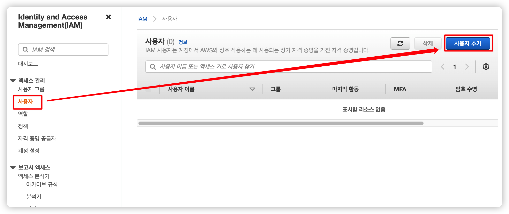

IAM 메뉴에서 사용자 추가를 선택합니다.

<br>

## 5.2. IAM 사용자 이름 및 액세스 유형 설정

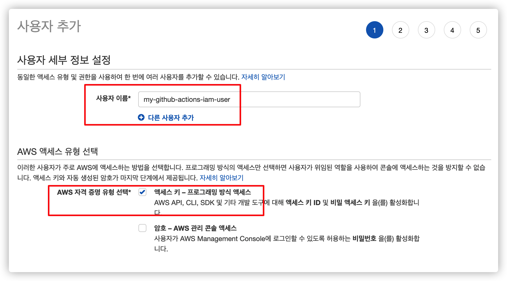

사용자 이름을 추가하고 액세스 유형을 선택합니다.

우리는 Github Actions 에서 사용해야 하기 때문에 암호 방식 대신 액세스 키 방식을 선택합니다.

<br>

## 5.3. 접근이 필요한 권한 추가

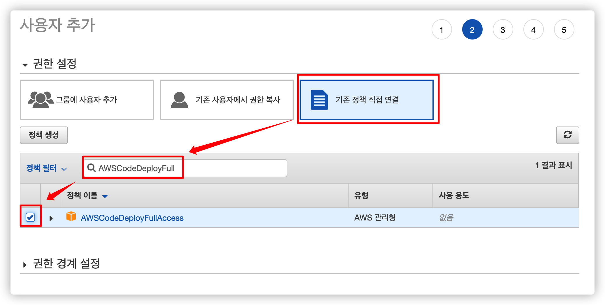

이 사용자에게 추가할 접근 권한을 고릅니다.

워크 플로우에서 CodeDeploy 를 실행해야 하기 때문에 다음 두 권한을 추가합니다.

- AWSCodeDeployFullAccess
- AmazonS3FullAccess

<br>

## 5.4. 사용자 만들기 완료

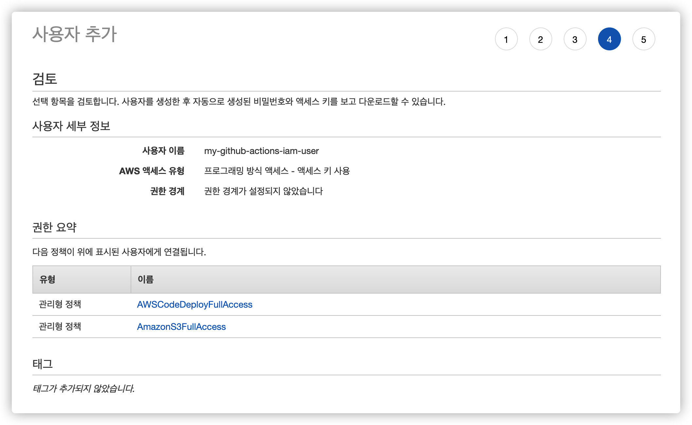

태그는 필요 없기 때문에 생략하고 잘못된 설정이 없는지 마지막으로 확인 후 사용자를 만듭니다.

<br>

## 5.5. Access Key 및 Secret Key 확인

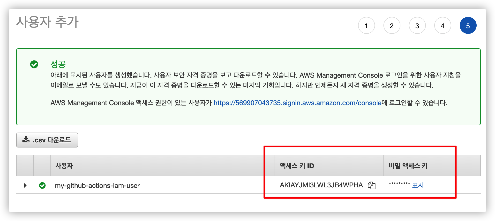

사용자를 만들고 나면 "액세스 키 ID" 와 "비밀 액세스 키" 가 존재합니다.

이 두 개의 키 값을 사용해서 IAM 권한을 획득할 수 있습니다.

우리는 이걸 Github Actions 에서 사용할 수 있도록 등록합니다.

<br>

## 5.6. Github Repository 의 Secrets 추가

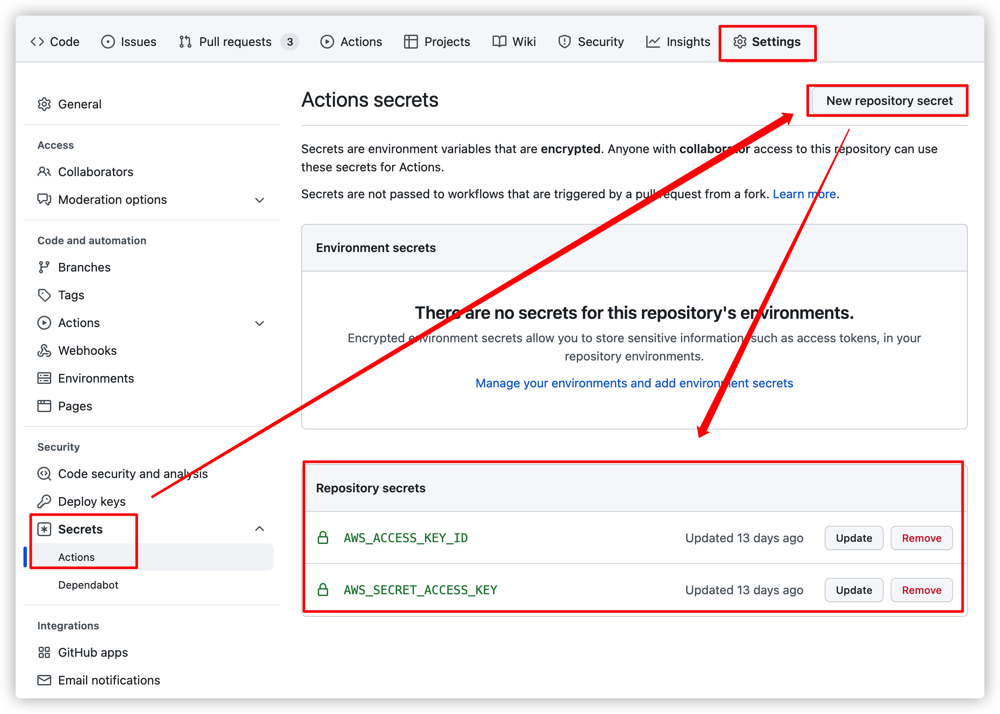

Github Actions 을 적용하려는 `Github > Repository > Settings > Secrets` 로 이동해서 위 키 값들을 등록합니다.

키 이름은 적당히 편한 것으로 설정합니다.

Github Secrets 에 저장한다고 해도 값을 직접 확인할 수 없기 때문에 필요한 경우 따로 저장해둡니다.

<br>

## Trouble Shooting

Spring Boot 2.5 버전부터는 빌드 시 `-plain.jar` 파일이 만들어지기 때문에 `build.gradle` 수정 필요

```gradle
jar {
    enabled = false
}
```

<br>

# CodeDeploy

code-agent 실행 로그 보기 `/opt/codedeploy-agent/deployment-root/deployment-logs/codedeploy-agent-deployments.log`

CodeDeploy 로그 보기 `/var/log/aws/codedeploy-agent/codedeploy-agent.log`

<br>

# Reference

- [CodeDeploy 를 위한 EC2 인스턴스 생성](https://docs.aws.amazon.com/ko_kr/codedeploy/latest/userguide/instances-ec2-create.html)