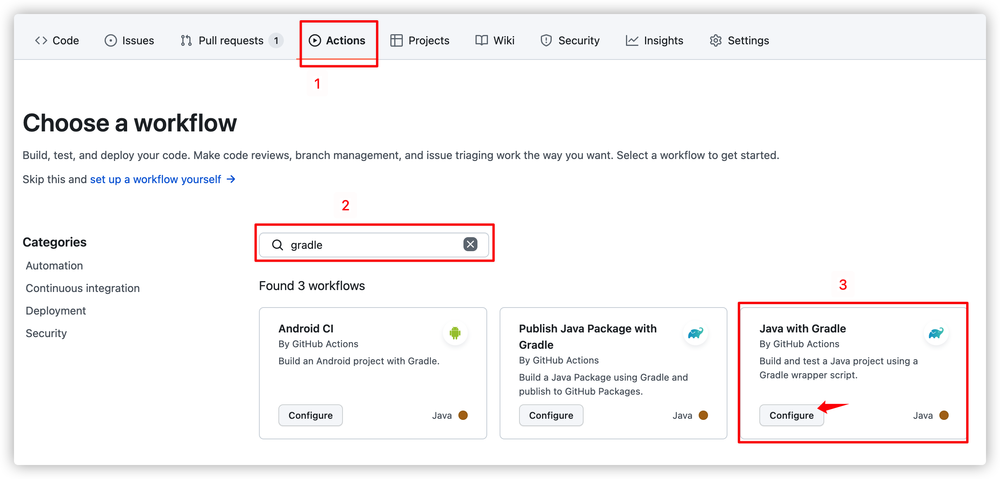
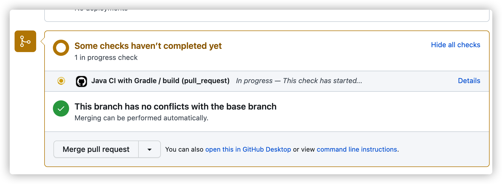
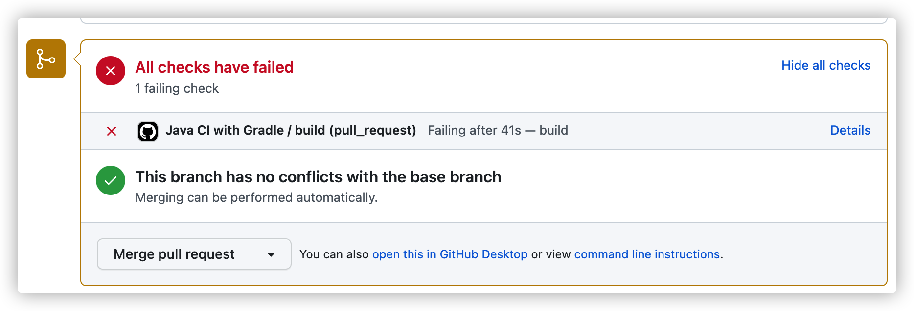
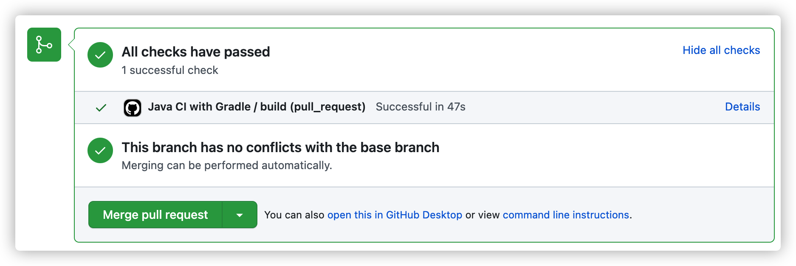

# Github Actions CI: 자동 빌드 및 테스트 하기

# Overview

한 프로젝트를 여러 사람이 개발할 때 코드의 안정성은 굉장히 중요합니다.

환경 변수 변경, 비즈니스 로직 수정, Git 충돌 등 여러 사람들이 코드를 공유하면서 발생할 수 있는 문제점은 굉장히 많습니다.

실수를 방지하기 위해 테스트 코드를 작성하지만 매 PR 리뷰 때마다 각 리뷰어들이 일일히 테스트 코드를 돌려보며 리뷰하면 생산성이 저하됩니다.

단순히 리뷰 요청자의 테스트 잘 돌아갑니다~ 같은 코멘트보다 테스트의 성공을 확실히 보장해주는 수단이 필요합니다.

그래서 CI/CD 라는 개념이 등장했습니다.

<br>

# 1. CI/CD

- CI (Continuous Integration)
  - 해석하면 "지속적 통합" 으로 여러 개발자가 하나의 프로젝트를 같이 개발할 때 발생하는 불일치를 최소화 해주는 개념입니다.
  - CI 를 제대로 구현하면 애플리케이션 변경 사항 반영 시 자동으로 빌드 및 테스트 되어 잘못된 코드가 공유되는 걸 방지합니다.
- CD (Continuous Deployment)
  - "지속적 배포" 라는 뜻으로 프로젝트의 변경 사항을 가상 환경에 자동으로 배포하는 것을 의미합니다.
  - CD 를 구성해두면 변경 사항을 배포할 때 사용하는 파이프라인을 공유하여 번거로움을 없앨 수 있습니다.

좀더 자세한 내용은 [RedHat 공식문서](https://www.redhat.com/ko/topics/devops/what-is-ci-cd)를 참고하세요.

쉽게 표현하자면 CI 는 자동 빌드 및 테스트를 진행하여 여러 개발자들이 공유하는 코드의 신뢰성을 높이는 개념이고 CD 는 배포 플로우를 자동화하여 누구나 동일한 플로우로 배포할 수 있게 만들어주는 개념입니다.

<br>

# 2. Github Actions

Github Actions 는 Github 에서 제공하는 CI/CD 툴입니다.

build, test, deploy 등 필요한 Workflow 를 등록해두면 Gihtub 의 특정 이벤트 (push, pull request) 가 발생했을 때 해당 워크 플로우를 수행합니다.

예를 들어 Pull Request 를 올리면 자동으로 해당 코드의 테스트를 수행하여 수행한다던지 master branch 에 코드를 push 하면 자동으로 코드를 배포하는 등 여러 가지 반복적인 작업을 자동으로 수행해줍니다.

Jenkins, Circle CI, Travis CI 등 다른 후보들도 있지만 Github Actions 은 별다른 툴을 설치하지 않아도 Github Repository 에서 바로 사용할 수 있다는 장점이 있습니다.

<br>

# 3. Github Actions 자동 빌드 및 테스트

Github Actions 를 사용한 CI 환경을 구축해봅니다.

Pull Request 를 올렸을 때 자동으로 빌드 및 테스트를 수행하여 코드의 품질을 검사합니다.

<br>

## 3.1. Workflow 선택



Github Repository 로 이동해서 Actions 탭에서 새로운 Workflow 를 추가할 수 있습니다.

자주 사용되는 언어나 프레임워크는 이미 제공되는게 있기 때문에 검색해서 선택만 하면 됩니다.

Configure 버튼을 누르면 기본적으로 제공되는 `gradle.yml` 파일이 제공됩니다.

<br>

## 3.2. gradle.yml 파일 수정

```yml
name: Java CI with Gradle

on:
  pull_request:
    branches: [ main ]

permissions:
  contents: read

jobs:
  build:
    runs-on: ubuntu-latest

    steps:

    # 1) 워크플로우 실행 전 기본적으로 체크아웃 필요
    - uses: actions/checkout@v3

    # 2) JDK 11 버전 설치, 다른 JDK 버전을 사용한다면 수정 필요
    - name: Set up JDK 11
      uses: actions/setup-java@v3
      with:
        java-version: '11'
        distribution: 'temurin'
    
    # 3) Gradle 사용. arguments 를 붙이면 뒤에 그대로 실행된다고 생각하면 됨
    # 이 워크플로우는 gradle clean build 를 수행함
    - name: Build with Gradle
      uses: gradle/gradle-build-action@0d13054264b0bb894ded474f08ebb30921341cee
      with:
        arguments: clean build
```

기본적으로 제공되는 파일에서 조금 수정했습니다.

크게 신경써야 해줄 부분은 `on` 부분과 `jobs` 부분입니다.

`on` 에서는 워크플로우를 수행할 이벤트를 결정합니다.

위 코드는 `main` 을 베이스 브랜치로 한 Pull Request 를 생성하였을 때 수행된다는 뜻입니다.

`jobs` 에서는 수행할 워크플로우를 차례대로 입력하면 됩니다.

어떤 동작인지 간단하게 주석으로 표현했으며 더 궁금한 점은 [Github Actions Docs](https://docs.github.com/en/actions/using-jobs/using-jobs-in-a-workflow) 를 참고해주세요.

<br>

## 3.3. Pull Request 작성



이제 PR 을 작성하면 자동으로 Github Actions 가 동작하여 빌드를 실행합니다.

<br>

### 3.3.1. Workflow 실패



Github Actions 이 실패하면 이렇게 실패했다고 알려줍니다.

여러 워크 플로우를 한번에 수행시킬 수도 있으며, Github 설정에 따라 워크 플로우가 성공하지 않으면 머지 불가능 하도록 제한할 수도 있습니다.

<br>

### 3.3.2. Workflow 성공



모든 워크플로우가 성공하면 이렇게 녹색으로 성공 여부를 알려줍니다.

코드를 리뷰하는 사람은 직접 코드를 돌려보지 않아도 빌드와 테스트가 성공한다는 사실을 알 수 있습니다.

<br>

# Conclusion

Github Actions 의 가장 큰 이점은 Github 과의 연계성이라고 생각합니다.

대부분의 프로젝트가 Github 저장소를 활용하고 있기 때문에 별다른 세팅 없이도 쉽게 이용할 수 있습니다.

이번 포스팅 내용에서 좀더 나아가 Workflow 에서 테스트 커버리지를 파악해서 알려주는 라이브러리도 존재합니다.

커버리지가 일정 기준을 넘지 않으면 머지 불가능하게 만들어 테스트 코드 작성을 강제할 수도 있습니다.

다음에는 Github Actions 를 사용해 AWS EC2 에 배포하는 과정을 작성해볼 예정입니다.

