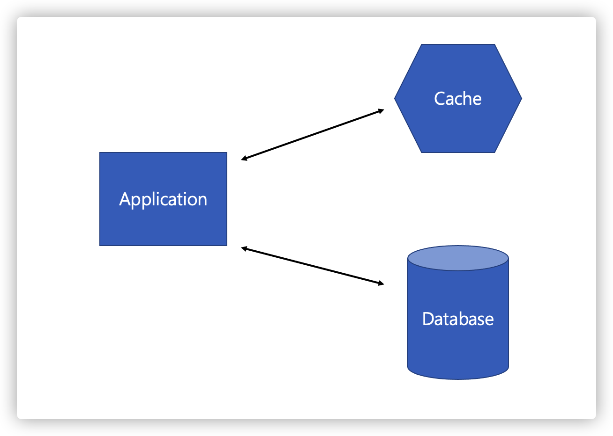

# Cache 전략

# Overview

우리가 사용하는 캐시는 여러가지 전략이 존재합니다.

 

# 1. Cache 종류

- 로컬 캐시 (EHcache)
- DB 내부 캐시
- CDN
- In-Memory 캐시 (Redis, Memcached)

 

# 2. 캐싱하기에 적절한 데이터

- 자주 조회됨
- 데이터의 결과값이 일정함
- 데이터가 자주 변경되지 않음
- 연산이 무거움
- 데이터의 정합성이 덜 중요한 경우
  - 예를 들어 페이스북, 인스타 피드 같은 경우에는 게시글 몇 개 좀 빠져도 큰 문제 없음
  - 금융권 같은 돈 관련된 서비스에서는 데이터가 틀어질 가능성도 있어서 신경써야함

 

# 3. 읽기 캐시 전략

캐시를 읽을 때 어떤 전략을 사용할지 결정합니다.

기본적으로는 캐시 먼저 조회 후 DB 를 다시 확인한 뒤, 캐시를 갱신하는 방법입니다.

 

## 3.1. Cache Aside

1. 캐시에 데이터가 있는지 확인
2. 데이터가 존재하면 (Cache Hit) 해당 캐시 데이터를 반환
3. 데이터가 존재하지 않으면 (Cache Miss) **애플리케이션에서 DB 에 데이터 요청** 후 캐시에 저장하고 데이터를 반환

애플리케이션에서 가장 일반적으로 사용되는 캐시 전략입니다.

주로 읽기 작업이 많은 애플리케이션에 적합합니다.

Cache Hit 의 경우 DB 를 확인하지 않기 때문에 **캐시가 최신 데이터를 가지고 있는지 (동기화) 가 중요합니다.**

캐시가 분리되어 있기 때문에 원하는 데이터만 별도로 구성하여 캐시에 저장할 수 있고 **캐시에 장애가 발생해도 DB 에서 데이터를 가져오는 데 문제가 없습니다.**

하지만 캐시에 장애가 발생했다는 뜻은 DB 로 직접 오는 요청이 많아져서 전체적인 장애로 이어질 수 있습니다.

 

## 3.2. Read Through

1. 캐시에 데이터 요청
2. 캐시는 데이터가 있으면 (Cache Hit) 바로 반환
3. 데이터가 없다면 (Cache Miss) **캐시가 DB 에서 데이터를 조회**한 후에 캐시에 저장 후 반환

Cache Aside 와 비슷하지만 데이터 동기화를 라이브러리 또는 캐시 제공자에게 위임하는 방식이라는 차이점이 있습니다.

마찬가지로 읽기 작업이 많은 경우에 적합하며 두 방법 다 데이터를 처음 읽는 경우에는 Cache Miss 가 발생해서 느리다는 특징이 있습니다.

Cache Aside 와는 다르게 캐시에 의존성이 높기 때문에 캐시에 장애가 발생한 경우 바로 전체 장애로 이어집니다.

이를 방지하기 위해 Cache Cluster 등 가용성 높은 시스템을 구축해두는 것이 중요합니다.

 

## 3.3. 읽기 캐시에서 발생 가능한 장애: Thundering Herd

캐시 서버를 구축했다고 해서 아무런 문제가 없는 것은 아닙니다.

캐시 읽기 전략에서는 공통적으로 캐시 확인 -> DB 확인 순서로 이어지는데 이 과정에서 캐시에 데이터가 있으면 DB 확인을 생략하는 것으로 성능을 향상시킵니다.

하지만 서비스를 이제 막 오픈해서 **캐시가 비어있는 경우에는 들어오는 요청이 전부 Cache Miss 가 발생하고 DB 조회 후 캐시를 갱신**하느라 장애가 발생할 수 있습니다.

이를 회피하기 위해서 캐시에 데이터를 미리 세팅해두는 Cache Warm up 작업을 하거나 첫 요청이 캐시 갱신될 때까지 기다린 후에 이후 요청은 전부 캐시에서 반환하게 할 수 있습니다.

Cache Warm up 작업을 할 때 어떤 데이터를 넣느냐에 따라 마찬가지로 Cache Miss 가 발생할 수 있기 때문에 자주 들어올만한 데이터의 예측이 중요합니다.

 

# 4. 쓰기 캐시 전략

쓰기 요청 시 어떤 시점에 캐시 갱신을 하는지에 따라 나뉩니다.

- Write Around: 캐시를 갱신하지 않음
- Write Through: 캐시를 바로 갱신
- Write Back: 캐시를 모아서 나중에 갱신

 

## 4.1. Write Around

1. 데이터 추가/업데이트 요청이 들어오면 DB 에만 데이터를 반영
2. 쓰기 작업에서 캐시는 건들지 않고 읽기 작업 시 Cache Miss 가 발생하면 업데이트 됨

캐시 쓰기 전략이라고 하기는 좀 애매하게 캐시를 전혀 건들지 않습니다.

수정사항은 DB 에만 반영하고 캐시는 그대로 두기 때문에 Cache Miss 가 발생하기 전까지는 캐시 갱신이 발생하지 않습니다.

Cache 가 갱신된지 얼마 안된 경우에는 **캐시 Expire 처리 되기 전까지 계속 DB 와 다른 데이터를 갖고 있다는 단점**이 있습니다.

만약 업데이트 이후 바로 조회되지 않을거라는 확신이 있다면 캐시를 초기화하여 Cache Miss 를 유도하는 방법으로 보완할 수 있습니다.

 

## 4.2. Write Through

1. 캐시에 데이터를 추가하거나 업데이트
2. 캐시가 DB 에 동기식으로 데이터 갱신
3. 캐시 데이터를 반환

Read Through 와 마찬가지로 DB 동기화 작업을 캐시에게 위임합니다.

동기화까지 완료한 후에 데이터를 반환하기 때문에 **캐시를 항상 최신 상태로 유지할 수 있다**는 장점이 있습니다.

캐시 및 DB 를 동기식으로 갱신한 후에 최종 데이터 반환이 발생하기 때문에 전반적으로 느려질 수 있습니다.

새로운 데이터를 캐시에 미리 넣어두기 때문에 읽기 성능을 향상시킬 수 있지만 **이후에 읽히지 않을 데이터도 넣어두는 리소스 낭비**가 발생할 수 있습니다.

 

## 4.3. Write Back (Write Behind)

1. 캐시에 데이터를 추가하거나 업데이트
2. 캐시 데이터 반환
3. 캐시에 있던 데이터는 이후에 별도 서비스 (이벤트 큐 등) 를 통해 DB 에 업데이트

캐시와 DB 동기화를 비동기로 하는 방법이며 동기화 과정이 생략되기 때문에 **쓰기 작업이 많은 경우에 적합**합니다.

캐시에서 일정 시간 또는 일정량의 **데이터를 모아놓았다가 한번에 DB 에 업데이트** 하기 때문에 쓰기 비용을 절약할 수 있습니다.

다른 캐시 전략에 비해 구현하기 복잡한 편이며 캐시에서 DB 로 데이터를 업데이트 하기 전에 장애가 발생하면 데이터가 유실될 수 있습니다.

 

## 4.4. Refresh Ahead

자주 사용되는 데이터를 캐시 만료 전에 미리 TTL (Expire time) 을 갱신합니다.

캐시 미스 발생을 최소화 할 수 있지만 Warm Up 작업과 마찬가지로 자주 사용되는 데이터를 잘 예측해야 합니다.

 

# Reference

- [What is Caching ?](https://medium.com/system-design-blog/what-is-caching-1492abb92143)