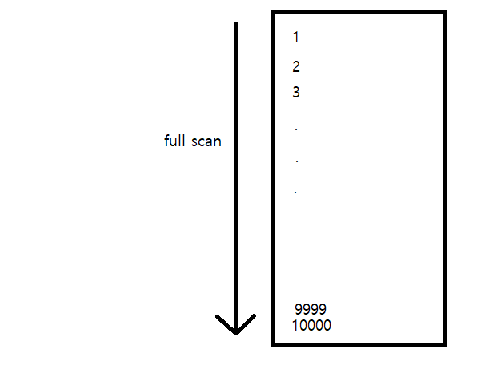
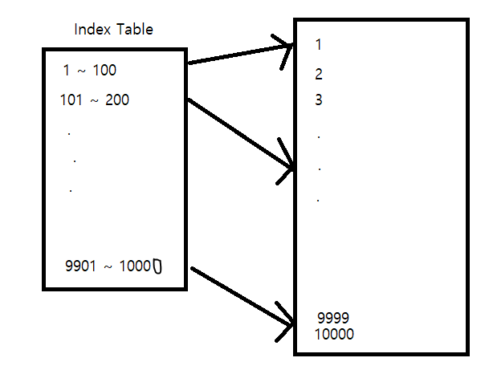

# DB Index 란?

인덱스는 "목차" 라고 할 수 있다.

RDBMS 에서 검색 속도를 향상 시키기 위해 사용한다.

 

## Full Scan

DB 에 1만개의 데이터가 존재한다고 가정해보자.

여기서 9999 라는 숫자를 찾으려면 DB 를 처음부터 끝까지 확인해야 한다.

이를 full scan 이라고 하며 데이터가 1억, 10억 개가 된다면 속도는 더욱 느려진다.

 

## Index 사용

하지만 만약 데이터들을 100 개씩 나누어서 다른 테이블에 표시해둔다면 어떨까요?

특정 데이터를 찾기 위해 full scan 을 할 필요 없이 인덱스 테이블에서 먼저 검색을 할 수 있다.

9999 라는 숫자를 찾기 위해서 9999 개의 데이터를 보는 것이 아니라

인덱스 테이블에서 우선 9901 ~ 10000 의 범위를 찾은 뒤 다시 그 안에서만 검색을 하면 된다.

9999 번 스캔할 데이터를 200 번 정도만 스캔하고도 찾을 수 있다.

 

## 주의점

- 인덱스는 이진트리인 B-Tree 를 사용하기 때문에 기본적으로 정렬 되어 있다.

    따라서 조회가 아닌 삽입, 삭제, 수정이 자주 발생한다면 성능 저하를 초래할 수 있다.

- 인덱스는 공짜가 아니다.

    컬럼에 인덱스를 걸어두면 해당 컬럼에 데이터가 추가될 때마다 인덱스 또한 같이 생성된다.

    무분별하게 모든 컬럼에 인덱스를 걸어두면 오히려 좋지 않다.

- 컬럼의 데이터가 다양하지 않으면 인덱스의 효과를 볼 수 없다.

    성별이라는 컬럼이 있고 값이 "남", "여" 두가지만 있다면 인덱스를 걸어도 half scan 을 해야 한다.

 

## 장점

- 키 값으로 DB 검색 속도를 향상 시킬 수 있다.

 

## 단점

- 무분별하게 사용하면 DB 크기가 커진다.
- 인덱스가 많이 걸리면 인덱스 생성하는 시간도 많이 소요될 수 있다.
- 조회가 아닌 삽입, 삭제, 수정이 자주 발생하는 DB 라면 성능이 저하될 수 있다.
