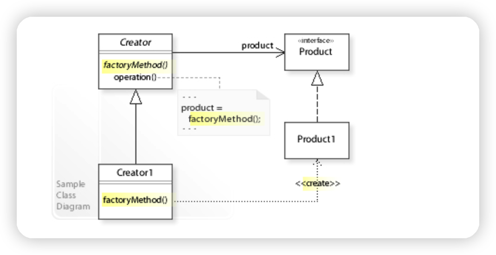

# Factory 패턴 (2/3) - Factory Method 패턴

# 1. Overview

Factory 패턴은 객체 생성과 관련된 디자인 패턴입니다.

1편에서 봤던 Simple Factory 는 객체 생성 역할을 담당하면서 각 클라이언트에서 구현 클래스에 직접 의존하지 않도록 분리했습니다.

하지만 새로운 클래스가 추가되었을 때 Factory 클래스를 수정해야 한다는 한계가 있었습니다.

기존 코드의 변경 없이 확장하기 위한 디자인 패턴이 Factory Method 패턴입니다.

<br>

# 2. Factory Method



**Factory Method Pattern (팩토리 메소드 패턴)** 은 생성 패턴 중 하나로 **객체를 생성할 때 어떤 클래스의 인스턴스를 만들 지 서브 클래스에서 결정**하게 합니다.

즉, 인스턴스 생성을 서브 클래스에게 위임합니다.

부모 추상 클래스는 인터페이스에만 의존하고 실제로 어떤 구현 클래스를 호출할 지는 서브 클래스에서 구현합니다.

이렇게 하면 새로운 구현 클래스가 추가되어도 기존 Factory 코드의 수정 없이 새로운 Factory 를 추가하면 됩니다.

<br>

# 3. Example

사용자 관리 프로그램이 있고 네이버 계정으로 가입할 수 있다고 가정합니다.

<br>

## 2.1. Product (User)

```java
public interface User {
    void signup();
}
```

- `User` 인터페이스 정의

<br>

```java
public class NaverUser implements User {
    @Override
    public void signup() {
        System.out.println("네이버 아이디로 가입");
    }
}
```

- `User` 인터페이스를 구현하는 `NaverUser` 클래스 정의
- 오버라이드한 메서드에는 네이버 유저 전용 로직 추가

<br>

## 2.2. Creator (UserFactory)

```java
public abstract class UserFactory {

    public User newInstance() {
        User user = createUser();
        user.signup();
        return user;
    }

    protected abstract User createUser();
}
```

- 추상 클래스로 `UserFactory` 를 정의
- 외부에서 `User` 객체를 생성할 때는 `newInstance()` 메서드를 호출하면 되고, 실제로 어떤 객체를 생성할 지는 추상 메서드로 정의해서 하위 클래스에서 정의
- Java 8 부터는 인터페이스에서 `default` 메서드를 사용할 수 있기 때문에 인터페이스로 정의할 수도 있지만 `protected` 키워드를 사용해 접근을 제한하고 싶어서 추상 클래스를 사용

<br>

```java
public class NaverUserFactory extends UserFactory {
    @Override
    protected User createUser() {
        return new NaverUser();
    }
}
```

- `UserFactory` 를 상속받는 `NaverUserFactory` 를 정의
- `NaverUser` 를 반환하도록 오버라이드

<br>

## 2.3. Client

```java
UserFactory userFactory = new NaverUserFactory();
User user = userFactory.newInstance();
```

- 클라이언트 코드에서 `NaverUser` 클래스에 대한 의존성 없이 사용 가능
- 의존성 주입을 사용해서 외부에서 Factory 클래스를 받아온다면 `NaverUserFactory` 에 대한 의존성도 제거 가능

<br>

# 3. 스펙 확장

팩토리 메서드 패턴의 장점은 확장할 때 기존 코드의 변경이 없어도 된다는 점이라고 했었습니다.

카카오 서비스가 오픈되고 사용자가 많아져서 카카오 계정으로도 가입할 수 있게 확장되었다고 가정합니다.

Simple Factory 에서는 `UserFactory` 코드를 수정해야 했습니다.

깜빡하고 `if` 문을 추가하지 않으면 코드에 오류가 생기며 Enum 으로 어느정도 방어할 수는 있지만 수정에도 열려있다는 단점은 변하지 않습니다.

하지만 우리는 이미 Factory Method 패턴을 적용했기 때문에 기존 코드 (`User`, `NaverUser`, `UserFactory`, `NaverUserFactory`) 의 수정 없이 새로운 코드를 추가만 하면 됩니다.

<br>

## 3.1. 새로운 Product 와 Creator

```java
public class KakaoUser implements User {
    @Override
    public void signup() {
        System.out.println("카카오 아이디로 가입");
    }
}
```

- `NaverUser` 클래스와 동일하게 `User` 인터페이스를 구현하는 `KakaoUser` 클래스 추가

<br>

```java
public class KakaoUserFactory extends UserFactory {
    @Override
    protected User createUser() {
        return new KakaoUser();
    }
}
```

- `NaverUserFactory` 클래스와 동일하게 `KakaoUserFactory` 정의

<br>

```java
UserFactory userFactory = new NaverUserFactory();
User user = userFactory.newInstance();

// 위 클라이언트 코드 수정 없이 다른 곳에서 사용 가능
UserFactory kakaoUserFactory = new KakaoUserFactory();
User kakaoUser = kakaoUserFactory.newInstance();
```

- 기존 코드의 변경 없이 새로 선언한 클래스만 사용하여 확장 가능

<br>

# 4. 장단점

- 장점: Factory Method 패턴의 가장 큰 장점은 지금까지 본 것처럼 **수정에 닫혀있고 확장에는 열려있는 OCP 원칙을 지킬 수 있다는 점입니다.**
- 단점: 간단한 기능을 사용할 때보다 많은 클래스를 정의해야 하기 때문에 코드량이 증가합니다.

<br>

# Reference

- [Wikipedia - Factory Method Pattern](https://en.wikipedia.org/wiki/Factory_method_pattern)