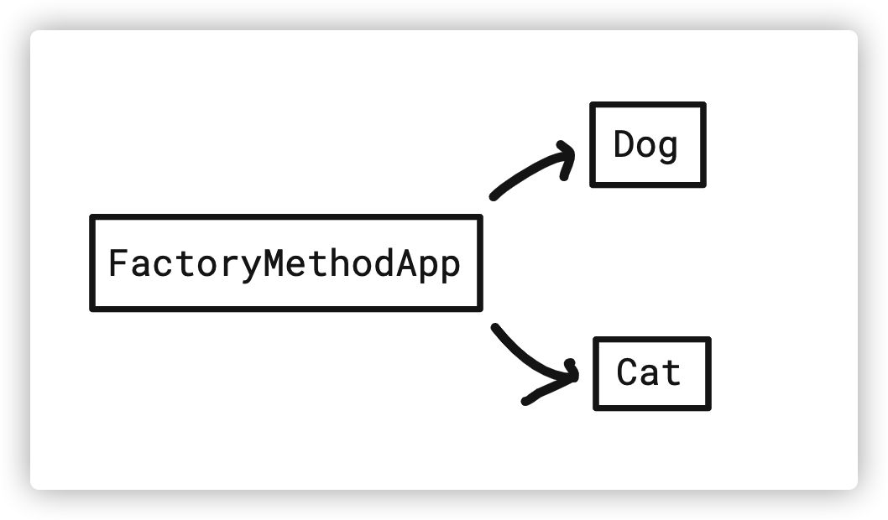
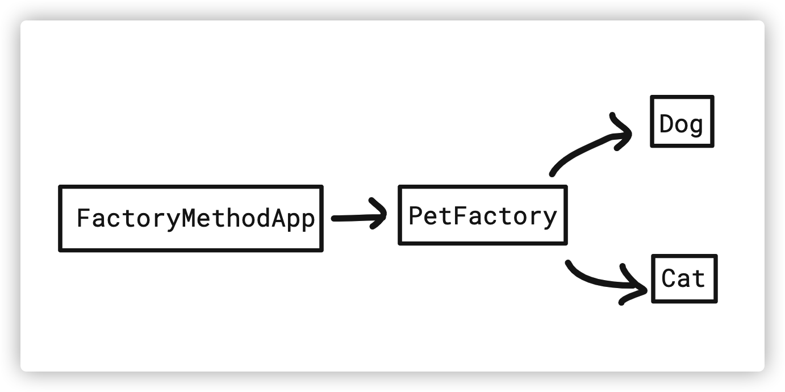

# Factory Method Pattern (팩토리 메소드 패턴)

# 1. 정의

**Factory Method Pattern (팩토리 메소드 패턴)** 은 **객체를 생성할 때 어떤 클래스의 인스턴스를 만들 지 서브 클래스에서 결정**하게 합니다.

즉, 인스턴스 생성을 서브 클래스에게 위임합니다.

우리가 어떤 객체를 만들 때 보통 `new` 키워드를 사용해서 만듭니다.

하지만 팩토리 메소드 패턴을 사용하면 객체 생성을 캡슐화 하여 `new` 를 직접적으로 사용할 필요 없이 `Factory` 에서 메소드를 호출해서 생성해줍니다.

<br>

# 2. 객체

테스트를 위한 객체를 정의합니다.

- Pet: 애완동물
  - Dog: 강아지
  - Cat: 고양이
- PetType: 애완동물 종류를 나타내는 Enum 클래스
- PetFactory: 애완동물 생성을 담당하는 `Factory` 클래스


<br>

## 2.1. Pet & PetType

```java
public interface Pet {
    void walk();    // 산책하다
}
```

- 산책하다라는 `walk()` 메소드 하나만을 갖고 있는 인터페이스입니다.

<br>

```java
public enum PetType {
    DOG, CAT
}
```

<br>

## 2.2. Dog & Cat

```java
public class Dog implements Pet {
    @Override
    public void walk() {
        System.out.println("강아지랑 산책하다");
    }
}

public class Cat implements Pet {
    @Override
    public void walk() {
        System.out.println("고양이랑 산책하다");
    }
}
```

<br>

## 2.3. PetFactory

```java
public class PetFactory {
    
    public Pet createPet(PetType type) {
        switch (type) {
            case DOG:
                return new Dog();
            case CAT:
                return new Cat();
            default:
                throw new IllegalArgumentException("지원하지 않는 Pet 타입입니다.");
        }
    }
}
```

- 파라미터로 받는 `PetType` 에 따라 다른 인스턴스 객체를 리턴합니다.

<br>

# 3. 활용

## 3.1. 기존

```java
public class FactoryMethodApp {
    public static void main(String[] args) {
        Pet dog = new Dog();
        Pet cat = new Cat();

        dog.walk();
        cat.walk();
    }
}
```

만약 팩토리 메소드 패턴을 사용하지 않는다면 `FactoryMethodApp` 에서 `Dog`, `Cat` 같은 구현 클래스를 직접 호출해서 생성합니다.

지금은 한 곳에서 사용하고 있지만 만약 여러 곳에서 사용하고 있다고 가정해봅니다.

클래스의 생성자 파라미터가 바뀌거나, 말도 안되지만 클래스의 이름을 `Dop` 로 잘못 만들었다면 수정할 때 여러 곳을 다 바꿔줘야 합니다.

이런 상황을 `FactoryMethodApp` 이라는 Client 가 `Dog`, `Cat` 클래스에 의존성이 있다고 표현합니다.

<br>



<br>

## 3.2. 적용

```java
public class FactoryMethodApp {
    public static void main(String[] args) {
        PetFactory petFactory = new PetFactory();

        Pet dog = petFactory.createPet(PetType.DOG);
        Pet cat = petFactory.createPet(PetType.CAT);

        dog.walk();
        cat.walk();
    }
}
```

`PetFactory` 를 생성해서 `createPet()` 메소드로 객체를 받아옵니다.

이제 `FactoryMethodApp` 은 `Dog`, `Cat` 클래스를 알 필요가 없기 때문에 의존성이 제거되고 오로지 `PetFactory` 만 알면 됩니다.

위의 가정처럼 `Dop` 클래스로 이름을 잘못 지었어도 `PetFactory` 내부만 수정하면 되기 때문에 Client 쪽 코드를 수정할 필요가 없습니다.

<br>



<br>

# 4. 장점

- 객체 생성을 캡슐화하고 한 곳에서 관리하기 때문에 수정에 닫혀있고 확장에는 열려있습니다 (OCP)
- Client 가 각각의 클래스에 의존적이지 않아 결합도가 낮아집니다.