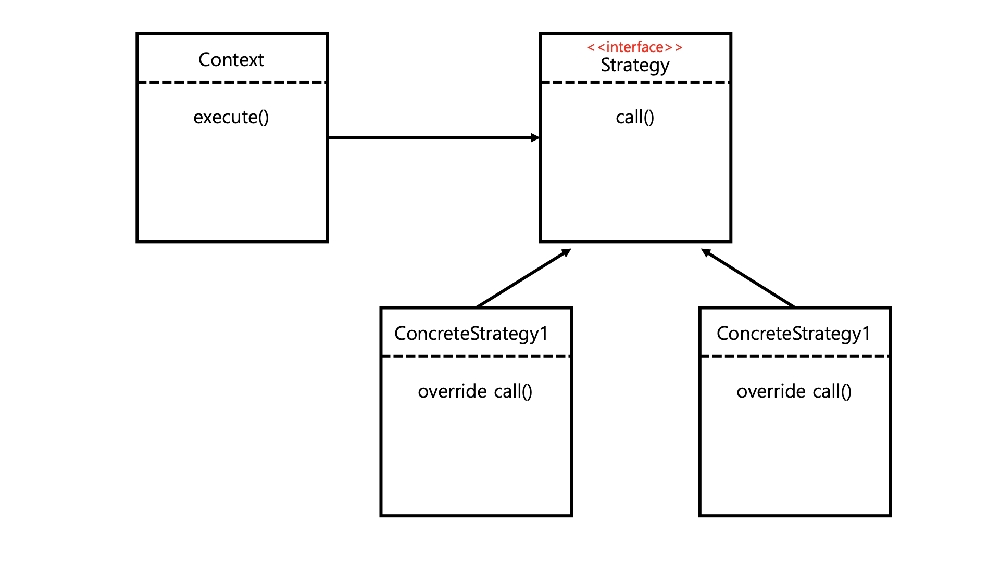

# Strategy (전략) 패턴 (feat. Template Callback 패턴)

# 1. Definition



전략 패턴은 여러 알고리즘 (로직) 을 캡슐화 하여 상호 교환 가능하게 하는 패턴입니다.

단순히 패턴만 보면 어떤 목적인지 이해하기 힘들지만 템플릿 메서드 (Template Method) 패턴과 비교해서 생각해보면 됩니다.

템플릿 메서드 패턴은 추상 클래스에 공통된 로직을 놓고 변경되는 로직은 상속을 통해 구현했습니다.

이 패턴의 단점은 부모 클래스에 의존도가 생긴다는 점이었습니다.

전략 패턴은 변하지 않는 부분을 `Context` 에 두고 변하는 부분을 `Strategy` 인터페이스의 구현체에 작성합니다.

전략에 해당하는 `Strategy` 인터페이스와 구현체에는 비즈니스 로직 외에 아무런 로직이 없기 때문에 공통된 로직이 변경되어도 아무런 영향이 없습니다.

<br>

# 2. Example

간단한 예시 코드를 작성해봅니다.

- 비즈니스 로직 1 존재
- 비즈니스 로직 2 존재
- 각 비즈니스 로직의 실행 시간을 측정하는 공통된 로직 존재

<br>

## 2.1. Before

```java
public class BeforeStrategyApp {

    public static void main(String[] args) {
        logic1();
        logic2();
    }

    private static void logic1() {
        StopWatch stopWatch = new StopWatch();
        stopWatch.start();

        // 비즈니스 로직 시작
        System.out.println("비즈니스 로직 1 실행");
        // 비즈니스 로직 종료

        stopWatch.stop();
        System.out.println("실행 시간 = " + stopWatch.getTotalTimeMillis());
    }

    private static void logic2() {
        StopWatch stopWatch = new StopWatch();
        stopWatch.start();

        // 비즈니스 로직 시작
        System.out.println("비즈니스 로직 2 실행");
        // 비즈니스 로직 종료

        stopWatch.stop();
        System.out.println("실행 시간 = " + stopWatch.getTotalTimeMillis());
    }
}
```

요구사항을 단순하게 구현하면 이렇게 공통된 로직이 존재합니다.

위 코드에서 다른 부분은 "비즈니스 로직 실행" 하나뿐이고 나머지는 전부 중복된 코드입니다.

전략 패턴을 적용해서 리팩토링 해봅시다.

<br>

## 2.2. After

### 2.2.1. Strategy

```java
public interface Strategy {
    void call();
}

public class StrategyLogic1 implements Strategy {

    @Override
    public void call() {
        System.out.println("비즈니스 로직 1 실행");
    }
}

public class StrategyLogic2 implements Strategy {

    @Override
    public void call() {
        System.out.println("비즈니스 로직 2 실행");
    }
}
```

`Strategy` 인터페이스와 각 비즈니스 로직을 담당하는 하위 구현체들을 선언합니다.

나중에 비즈니스 로직 3 이 추가된다면 인터페이스나 다른 구현체 변경 없이 새로 추가하기만 하면 됩니다.

<br>

### 2.2.2. Context

```java
public class Context {

    private final Strategy strategy;

    public Context(Strategy strategy) {
        this.strategy = strategy;
    }

    public void execute() {
        StopWatch stopWatch = new StopWatch();
        stopWatch.start();

        // 비즈니스 로직 시작
        strategy.call();
        // 비즈니스 로직 종료

        stopWatch.stop();
        System.out.println("실행 시간 = " + stopWatch.getTotalTimeMillis());
    }
}
```

공통된 로직이 작성되어 있는 `Context` 클래스입니다.

`Strategy` 를 생성자로 받기 때문에 어떤 구현체를 받느냐에 따라 비즈니스 로직이 달라집니다.

비즈니스 로직을 위임 한다고도 표현합니다.

<br>

### 2.2.3. Application (Client)

```java
public class AfterStrategyApp {

    public static void main(String[] args) {
        Strategy strategy1 = new StrategyLogic1();
        Context context1 = new Context(strategy1);
        context1.execute();

        Strategy strategy2 = new StrategyLogic1();
        Context context2 = new Context(strategy2);
        context2.execute();
    }
}
```

구현을 원하는 로직에 따라 다른 `Strategy` 를 생성자로 넘겨줍니다.

Spring 에서는 Bean 주입 설정만 바꾸면 쉽게 로직을 변경할 수 있습니다.

<br>

# 3. 장단점

- 장점
  - 공통 로직이 부모 클래스에 있지 않고 `Context` 라는 별도의 클래스에 존재하기 때문에 구현체들에 대한 영향도가 적음
  - `Context` 가 `Strategy` 라는 인터페이스를 의존하고 있기 때문에 구현체를 갈아끼우기 쉬움
- 단점
  - 로직이 늘어날 때마다 구현체 Class 가 늘어남
  - `Context` 와 `Strategy` 를 한번 조립하면 전략을 변경하기 힘듬

<br>

# 4. Template Callback 패턴

Spring 에서 전략 패턴은 생성자 파라미터로 한번 주입하고 나면 동적으로 변경할 수 없다는 단점이 있습니다.

이러한 단점을 극복하기 위해 `Context` 의 생성자가 아닌 `execute()` 메서드의 파라미터로 `Strategy` 를 넘겨주기도 합니다.

이런 패턴을 **Template Callback (템플릿 콜백) 패턴**이라고도 부릅니다.

템플릿 콜백 패턴도 전략 패턴과 동일하지만 동적으로 비즈니스 로직을 설정할 수 있다는 장점이 있습니다.

<br>

## 4.1. Example

위에서 사용했던 예제를 템플릿 패턴으로 다시 구현해봅니다.

<br>

### 4.1.1. Callback (Strategy)

```java
public interface Callback {
    void call();
}
```

전략 패턴과 동일하게 인터페이스 하나를 정의합니다.

실제 비즈니스 로직은 런타임에 넘겨줄거라서 별다른 구현체를 만들지 않아도 됩니다.

<br>

### 4.1.2. Template (Context)

```java
public class TimeLogTemplate {

    public void execute(Callback callback) {
        StopWatch stopWatch = new StopWatch();
        stopWatch.start();

        // 비즈니스 로직 시작
        callback.call();
        // 비즈니스 로직 종료

        stopWatch.stop();
        System.out.println("실행 시간 = " + stopWatch.getTotalTimeMillis());
    }
}
```

전략 패턴의 `Context` 에 해당하는 부분이지만 생성자로 받는 대신 `execute()` 의 파라미터로 전략을 넘겨받습니다.

<br>

### 4.1.3. Application (Client)

```java
public class AfterTemplateCallbackApp {

    public static void main(String[] args) {
        TimeLogTemplate timeLogTemplate = new TimeLogTemplate();
        timeLogTemplate.execute(() -> System.out.println("비즈니스 로직 1 실행"));
        timeLogTemplate.execute(() -> System.out.println("비즈니스 로직 2 실행"));
    }
}
```

`Callback` 이 함수형 인터페이스라서 람다식으로 간단하게 표현할 수 있습니다.

이제 새로운 로직이 추가되어도 클래스를 만들지 않고 파라미터의 값만 변경해주면 됩니다.

Spring 에서 `JdbcTemplate`, `RestTemplate` 등 `xxxTemplate` 의 형태를 하면 대부분 템플릿 콜백 패턴을 사용한 거라고 생각하시면 됩니다.

<br>

# Reference

- [스프링 핵심 원리 - 고급편](https://www.inflearn.com/course/%EC%8A%A4%ED%94%84%EB%A7%81-%ED%95%B5%EC%8B%AC-%EC%9B%90%EB%A6%AC-%EA%B3%A0%EA%B8%89%ED%8E%B8/dashboard)
- [코딩으로 학습하는 GoF의 디자인 패턴](https://www.inflearn.com/course/%EB%94%94%EC%9E%90%EC%9D%B8-%ED%8C%A8%ED%84%B4/dashboard)