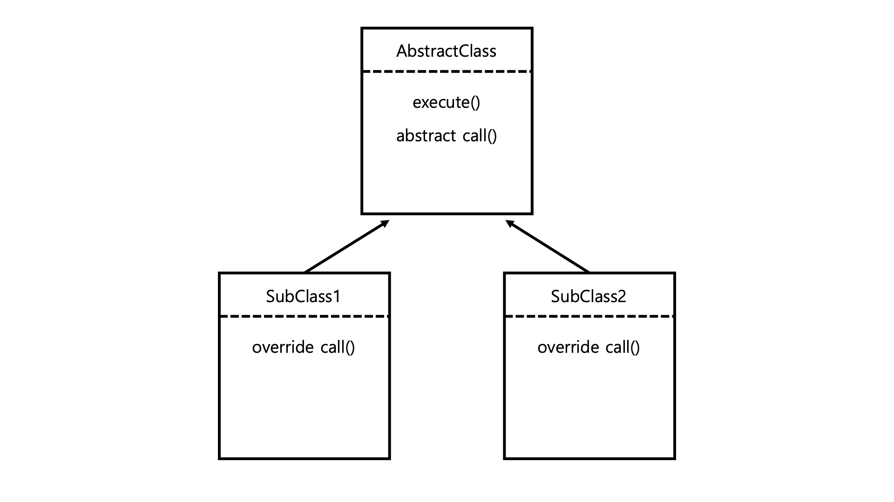

# Template Method (템플릿 메서드) 패턴

# 1. Definition



코드를 작성하다보면 로깅, 예외 처리 등등 반복되어 작성하는 코드가 발생합니다.

이런 경우 코드의 중복을 없애기 위한 패턴 중 하나가 템플릿 메서드 패턴입니다.

AbstractClass (추상 클래스) 는 템플릿을 제공하고 이를 상속 받는 하위 클래스가 구체적인 로직을 작성합니다.

추상 클래스가 전체적인 골격을 정의하고 일부 로직은 하위 상속 클래스에서 구현합니다.

중복된 로직은 추상 클래스에 정의하고 달라지는 비즈니스 로직만 상속 클래스에서 재정의 (오버라이딩) 합니다.

여기서 중복된 로직은 일반적으로 "변하지 않는 부분" 이고 비즈니스 로직은 "변하는 부분" 이라고 할 수 있습니다.

<br>

# 2. Example

간단한 예시 코드를 작성해봅니다.

- 비즈니스 로직 1 존재
- 비즈니스 로직 2 존재
- 각 비즈니스 로직의 실행 시간을 측정하는 공통된 로직 존재

<br>

## 2.1. Before

```java
public class BeforeTemplateMethodApp {

    public static void main(String[] args) {
        logic1();
        logic2();
    }

    private static void logic1() {
        StopWatch stopWatch = new StopWatch();
        stopWatch.start();

        // 비즈니스 로직 시작
        System.out.println("비즈니스 로직 1 실행");
        // 비즈니스 로직 종료

        stopWatch.stop();
        System.out.println("실행 시간 = " + stopWatch.getTotalTimeMillis());
    }

    private static void logic2() {
        StopWatch stopWatch = new StopWatch();
        stopWatch.start();

        // 비즈니스 로직 시작
        System.out.println("비즈니스 로직 2 실행");
        // 비즈니스 로직 종료

        stopWatch.stop();
        System.out.println("실행 시간 = " + stopWatch.getTotalTimeMillis());
    }
}
```

요구사항을 단순하게 구현하면 이렇게 공통된 로직이 존재합니다.

위 코드에서 다른 부분은 "비즈니스 로직 실행" 하나뿐이고 나머지는 전부 중복된 코드입니다.

템플릿 메서드 패턴을 적용해서 리팩토링 해봅시다.

<br>

## 2.2. After

### 2.2.1. AbstractClass

```java
public abstract class AbstractTemplate {

    public void execute() {
        StopWatch stopWatch = new StopWatch();
        stopWatch.start();

        // 비즈니스 로직 시작
        call();
        // 비즈니스 로직 종료

        stopWatch.stop();
        System.out.println("실행 시간 = " + stopWatch.getTotalTimeMillis());
    }

    protected abstract void call();
}
```

공통된 로직을 갖고 있는 추상 클래스 입니다.

`execute()` 메서드 내부에서 비즈니스 로직 부분은 `call()` 메서드 호출로 대체합니다.

`call()` 메서드는 이 추상 클래스를 상속하는 자식 클래스에서 오버라이딩 합니다.

<br>

### 2.2.2. SubClass

```java
public class SubClassLogic1 extends AbstractTemplate {

    @Override
    protected void call() {
        System.out.println("비즈니스 로직 1 실행");
    }
}

public class SubClassLogic2 extends AbstractTemplate {

    @Override
    protected void call() {
        System.out.println("비즈니스 로직 2 실행");
    }
}
```

추상 클래스를 상식하는 `SubClass` 입니다.

비즈니스 로직만 정의해둔 간단한 메서드입니다.

이후에 또다른 비즈니스 로직 3 이 필요하다면 `SubClassLogic3` 을 정의해서 사용하면 됩니다.

<br>

### 2.2.3. Application(Client)

```java
public class AfterTemplateMethodApp {

    public static void main(String[] args) {
        AbstractTemplate template1 = new SubClassLogic1();
        template1.execute();

        AbstractTemplate template2 = new SubClassLogic2();
        template2.execute();
    }
}
```

실제로 사용하는 부분입니다.

`execute()` 메서드를 호출하는 건 동일하지만 어떤 객체를 만드냐에 따라 로직이 달라집니다.

전체적인 코드량이 오히려 많아진 것 같지만, 디자인 패턴의 진가는 기존 코드를 수정하거나 확장할 때 드러납니다.

<br>

# 3. 장단점

- 장점
  - 중복된 코드를 없애고 SubClass 에서는 비즈니스 로직에만 집중할 수 있음 (SRP)
  - 나중에 새로운 비즈니스 로직이 추가되어도 기존 코드를 수정하지 않아도 됨 (OCP)
- 단점
  - SubClass 를 계속 만들어야 함
  - 자식 클래스는 실제로 부모 클래스를 사용하지 않는데 단순히 패턴 구현을 위한 상속 때문에 의존 관계를 갖고 있음

<br>  

템플릿 메서드 패턴과 비슷한 역할을 하면서 상속의 단점을 제거할 수 있는 디자인 패턴으로 Strategy (전략) 패턴이 있습니다.

<br>

# Reference

- [스프링 핵심 원리 - 고급편](https://www.inflearn.com/course/%EC%8A%A4%ED%94%84%EB%A7%81-%ED%95%B5%EC%8B%AC-%EC%9B%90%EB%A6%AC-%EA%B3%A0%EA%B8%89%ED%8E%B8/dashboard)
- [코딩으로 학습하는 GoF의 디자인 패턴](https://www.inflearn.com/course/%EB%94%94%EC%9E%90%EC%9D%B8-%ED%8C%A8%ED%84%B4/dashboard)