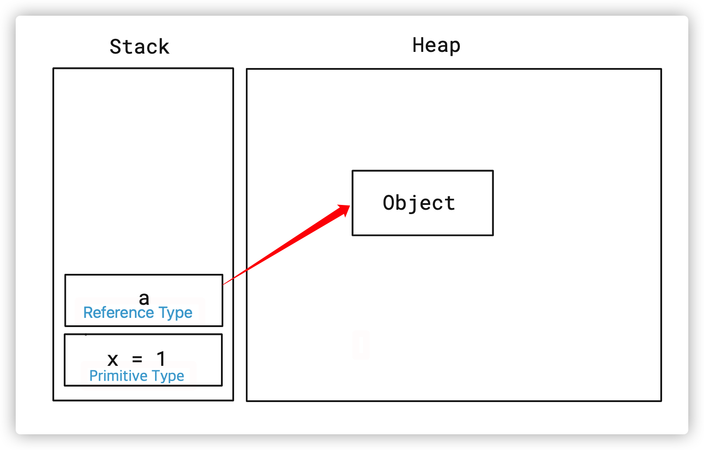
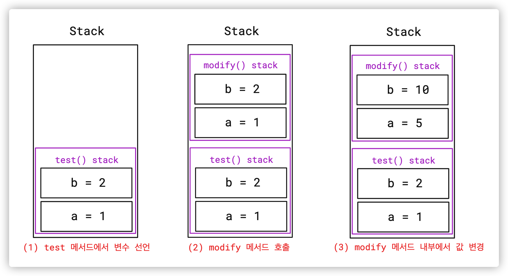
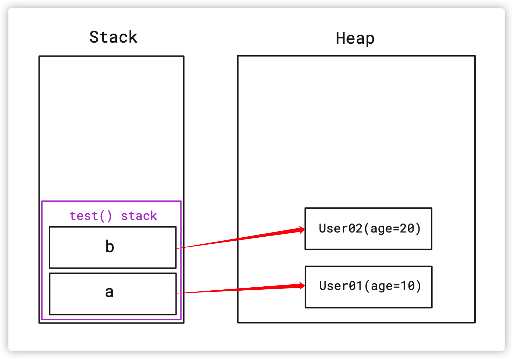
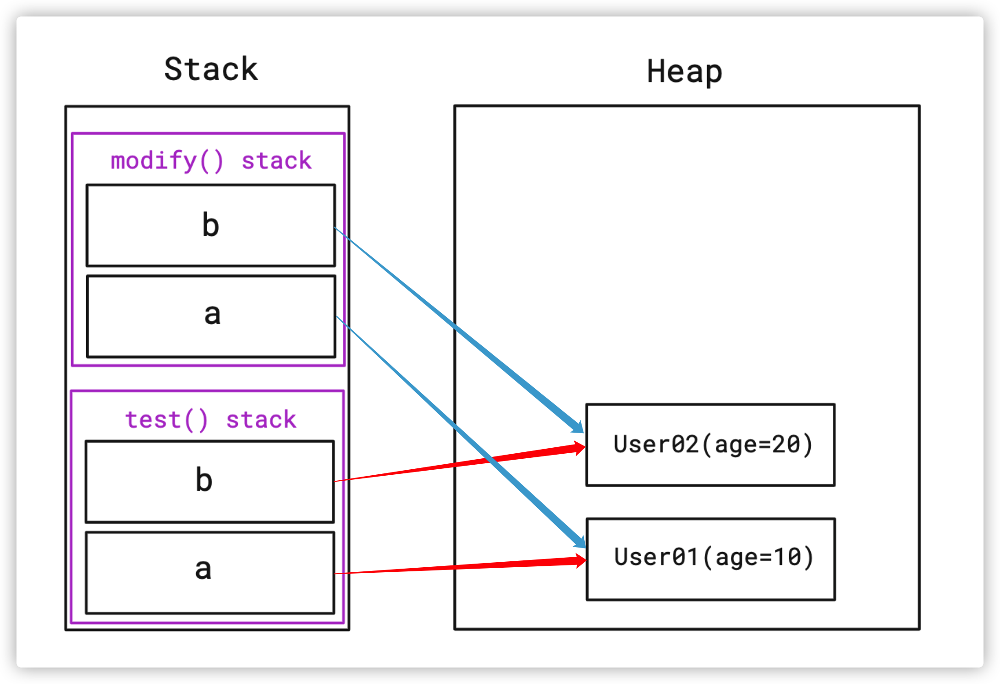
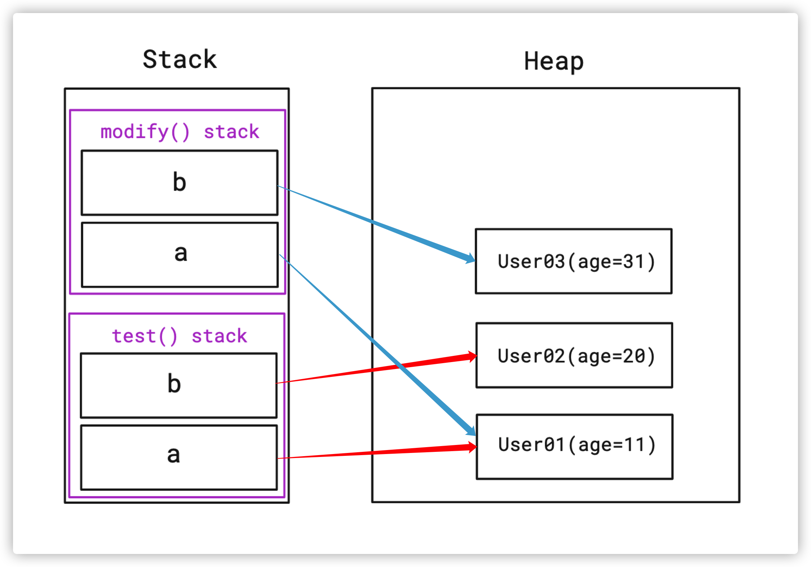
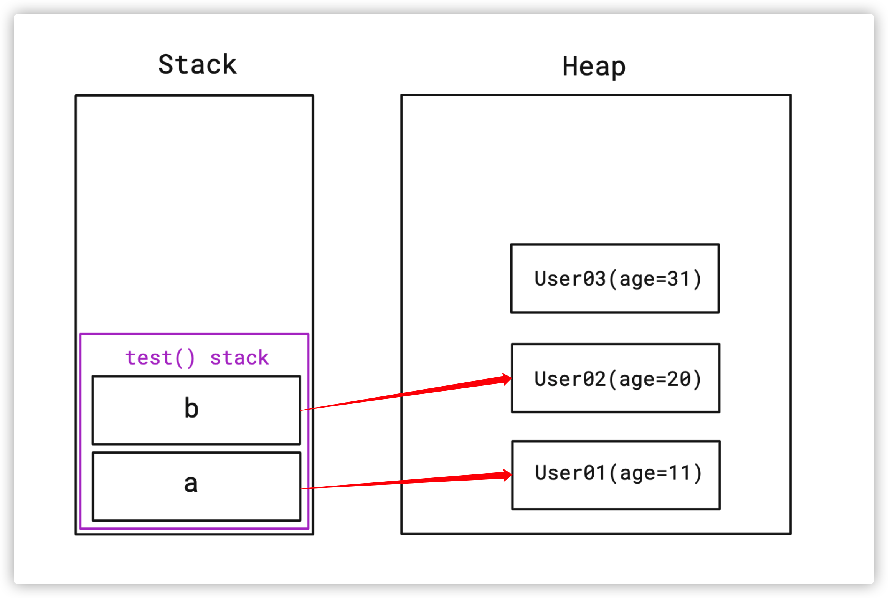

# Java 에서의 Call by Value, Call by Reference

# Overview

Java 에서 메서드를 호출 시 파라미터를 전달하는 방법에 대해 알아봅니다.

순서는 다음과 같이 진행합니다.

1. Call by Value, Call by Reference 차이
2. Java 에서의 파라미터 전달 방법
3. JVM 메모리에 변수가 저장되는 위치
4. 원시 타입 (Primitive Type) 전달
5. 참조 타입 (Reference Type) 전달

<br>

# 1. Call by Value, Call by Reference

메서드를 호출할 때 파라미터를 전달하는 방법에는 두 가지가 있습니다.

<br>

## 1.1. Call by Value

Call by Value 는 메서드를 호출할 때 값을 넘겨주기 때문에 Pass by Value 라고도 부릅니다.

메서드를 호출하는 호출자 (Caller) 의 변수와 호출 당하는 수신자 (Callee) 의 파라미터는 복사된 **서로 다른 변수**입니다.

값만을 전달하기 때문에 수신자의 파라미터를 수정해도 호출자의 변수에는 아무런 영향이 없습니다.

<br>

## 1.2. Call by Reference

Call by Reference 는 참조 (주소) 를 직접 전달하며 Pass By Reference 라고도 부릅니다.

참조를 직접 넘기기 때문에 호출자의 변수와 수신자의 파라미터는 **완전히 동일한 변수**입니다.

메서드 내에서 파라미터를 수정하면 그대로 원본 변수에도 반영됩니다.

<br>

# 2. Java 에서의 파라미터 전달 방법

그럼 Java 에서는 어떤 방법을 사용할까요?

Java 로 개발을 해봤다면 메서드로 변수를 넘기고 거기서 값을 수정해본 경험이 있을 겁니다.

그래서, Call by Reference 라고 오해하기 쉽지만, **Java 는 오직 Call by Value 로만 동작**합니다.

<br>

# 3. JVM 메모리에 변수가 저장되는 위치

Java 의 Call by Value 에 대해 이해하기 위해선 먼저 변수 생성 시 메모리에 어떤 식으로 저장되는 지 알아야 합니다.

Java 에서 변수를 선언하면 Stack 영역에 할당됩니다.

원시 타입 (Primitive Type) 은 Stack 영역에 변수와 함께 저장되며 

참조 타입 (Reference Type) 객체는 Heap 영역에 저장되고 Stack 영역에 있는 변수가 객체의 주소값을 갖고 있습니다.

<br>



그림으로 표현하면 이렇

원시 타입, 참조 타입을 생성할 때마다 동일한 방식으로 메모리에 할당됩니다.

이제 각 타입별로 파라미터를 넘겨줄 때 어떤 식으로 동작하는지 알아봅니다.

<br>

# 4. 원시 타입 (Primitive Type) 전달

원시 타입은 Stack 영역에 위치합니다

메서드 호출 시 넘겨받는 파라미터들도 원시 타입이라면 Stack 영역에 생성됩니다.

간단한 예시 코드와 함께 확인해봅니다.

<br>

```java
public class PrimitiveTypeTest {

    @Test
    @DisplayName("Primitive Type 은 Stack 메모리에 저장되어서 변경해도 원본 변수에 영향이 없다")
    void test() {
        int a = 1;
        int b = 2;

        // Before
        assertEquals(a, 1);
        assertEquals(b, 2);

        modify(a, b);

        // After: modify(a, b) 호출 후에도 값이 변하지 않음
        assertEquals(a, 1);
        assertEquals(b, 2);
    }

    private void modify(int a, int b) {
        // 여기 있는 파라미터 a, b 는 이름만 같을 뿐 test() 에 있는 a, b 와 다른 변수
        a = 5;
        b = 10;
    }
}
```

위 코드에서 `test()` 의 변수 `a`, `b` 와 `modify(a, b)` 로 전달받은 파라미터 `a`, `b` 의 이름과 값은 같습니다.

하지만 다른 변수입니다.

`modify(a, b)` 를 호출하는 순간 Stack 영역에 새로운 변수 `a`, `b` 가 새로 생성되어 총 4 개의 변수가 존재합니다.

<br>



그림으로 보면 한눈에 이해가기 쉽습니다.

Stack 내부에 `test()` 와 `modify()` 라는 영역이 나뉘어져 있고 거기에 동일한 이름을 가진 변수 `a`, `b` 가 존재합니다.

그래서 `modify()` 영역의 값을 바꿔도 `test()` 영역의 변수는 변화가 없습니다.

**원시 타입의 전달은 값만 전달하는 Call by Value 로 동작**합니다.

<br>

# 5. 참조 타입 (Reference Type) 전달

참조 타입은 원시 타입과는 조금 다릅니다.

변수 자체는 Stack 영역에 생성되지만 실제 객체는 Heap 영역에 위치합니다.

그리고 Stack 에 있는 변수가 Heap 에 있는 객체를 바라보고 있는 형태입니다.

마찬가지로 코드 예시와 함께 알아봅니다.

<br>

```java
class User {
    public int age;

    public User(int age) {
        this.age = age;
    }
}

public class ReferenceTypeTest {

    @Test
    @DisplayName("Reference Type 은 주소값을 넘겨 받아서 같은 객체를 바라본다" +
                 "그래서 변경하면 원본 변수에도 영향이 있다")
    void test() {
        User a = new User(10);
        User b = new User(20);

        // Before
        assertEquals(a.age, 10);
        assertEquals(b.age, 20);

        modify(a, b);

        // After
        assertEquals(a.age, 11);
        assertEquals(b.age, 20);
    }

    private void modify(User a, User b) {
        // a, b 와 이름이 같고 같은 객체를 바라본다.
        // 하지만 test 에 있는 변수와 확실히 다른 변수다.

        // modify 의 a 와 test 의 a 는 같은 객체를 바라봐서 영향이 있음
        a.age++;

        // b 에 새로운 객체를 할당하면 가리키는 객체가 달라지고 원본에는 영향 없음
        b = new User(30);
        b.age++;
    }
}
```

원시 타입 코드와 마찬가지로 동일한 변수 `a`, `b` 가 존재합니다.

여기서 `modify(a, b)` 를 호출한 후에 `a.age` 의 값이 변경되었기 때문에 Call by Reference 로 파라미터를 넘겨주었다고 착각하기 쉽습니다.

하지만 **Reference 자체를 전달하는 게 아니라 주소값만 전달**해주고 `modify()` 에서 생긴 변수들이 주소값을 보고 객체를 같이 참조하고 있는 겁니다.

단계별 그림으로 확인해봅니다.

<br>

## 5.1. 처음 변수 선언 시 메모리 상태



원시 타입과는 다르게 변수만 Stack 영역에 생성되고 실제 객체는 Heap 영역에 생성됩니다.

각 변수는 Heap 영역에 있는 객체를 바라보고 있습니다.

<br>

## 5.2. modify(a, b) 호출 시점의 메모리 상태



넘겨받은 파라미터는 Stack 영역에 생성되고 넘겨받은 주소값을 똑같이 바라봅니다.

<br>

## 5.3. modify(a, b) 수행 직후 메모리 상태



`test()` 영역과 `modify()` 영역에 존재하는 `a` 라는 변수들은 같은 객체인 `User01` 을 바라보고 있기 때문에 객체를 공유합니다.

`b` 라는 변수는 서로 같은 객체인 `User02` 를 바라보고 있었지만 `modify(a, b)` 내부에서 새로운 객체를 생성해서 할당했기 때문에 `User03` 이라는 객체를 바라봅니다.

그래서 `User03` 의 `age` 값을 변경해도 `test()` 에 있는 `b` 에는 아무런 변화가 없습니다.

<br>

## 5.4. test() 끝난 후 최종 메모리 상태



`modify(a, b)` 메서드를 빠져나오면 Stack 영역에 할당된 변수들은 사라집니다.

최종적으로 위와 같은 상태가 되며 `User03` 은 어떤 곳에서도 참조되고 있지 않기 때문에 나중에 Garbage Collector 에 의해 제거될 겁니다.

<br>

# Conclusion

"결국 주소값을 넘기는 게 결국 Call by Reference 아닌가?" 라는 생각을 할 수도 있습니다.

하지만 Call by Reference 는 참조 자체를 넘기기 때문에 새로운 객체를 할당하면 원본 변수도 영향을 받습니다.

가장 큰 핵심은 **호출자 변수와 수신자 파라미터는 Stack 영역 내에서 각각 존재하는 다른 변수다** 라고 생각합니다.

<br>

# Reference

- [Pass-By-Value as a Parameter Passing Mechanism in Java by Baeldung](https://www.baeldung.com/java-pass-by-value-or-pass-by-reference)