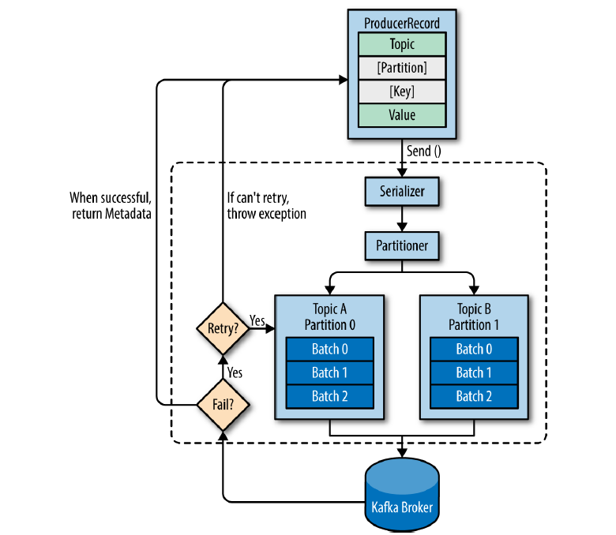

# 실전 아파치 카프카

- [실전 아파치 카프카](#실전-아파치-카프카)
- [1장 카프카 개요](#1장-카프카-개요)
  - [1.1. 카프카의 장점](#11-카프카의-장점)
  - [1.2. 카프카를 도입함으로써 해결 가능한 고민들](#12-카프카를-도입함으로써-해결-가능한-고민들)
  - [1.3. 카프카의 주요 특징](#13-카프카의-주요-특징)
- [2장 카프카 환경 구성](#2장-카프카-환경-구성)
- [3장 카프카 기본 개념과 구조](#3장-카프카-기본-개념과-구조)
  - [3.1. 카프카 기초 다지기](#31-카프카-기초-다지기)
    - [3.1.1. 리플리케이션 (Replication)](#311-리플리케이션-replication)
    - [3.1.2. 파티션 (Partition)](#312-파티션-partition)
    - [3.1.3. 세그먼트 (Segment)](#313-세그먼트-segment)
  - [3.2. 카프카의 핵심 개념](#32-카프카의-핵심-개념)
    - [3.2.1. 분산 시스템](#321-분산-시스템)
    - [3.2.2. 페이지 캐시](#322-페이지-캐시)
    - [3.2.3. 배치 전송 처리](#323-배치-전송-처리)
    - [3.2.4. 압축 전송](#324-압축-전송)
    - [3.2.5. 토픽, 파티션, 오프셋](#325-토픽-파티션-오프셋)
    - [3.2.6. 주키퍼의 의존성](#326-주키퍼의-의존성)
  - [3.3. 프로듀서 맛보기](#33-프로듀서-맛보기)
    - [3.3.1. 프로듀서의 기본 동작](#331-프로듀서의-기본-동작)
    - [3.3.2. 프로듀서의 주요 옵션](#332-프로듀서의-주요-옵션)
    - [3.3.3. Java 에서의 사용법](#333-java-에서의-사용법)
  - [3.4. 컨슈머 맛보기](#34-컨슈머-맛보기)
    - [3.4.1. 컨슈머의 기본 동작](#341-컨슈머의-기본-동작)
    - [3.4.2. 컨슈머의 주요 옵션](#342-컨슈머의-주요-옵션)
    - [3.4.3. Java 에서의 사용법](#343-java-에서의-사용법)
    - [3.4.4. 컨슈머 그룹의 이해](#344-컨슈머-그룹의-이해)
- [4장 카프카의 내부 동작 원리와 구현](#4장-카프카의-내부-동작-원리와-구현)
  - [4.1. 카프카 리플리케이션](#41-카프카-리플리케이션)
    - [4.1.1. 리플리케이션 동작 개요](#411-리플리케이션-동작-개요)
    - [4.1.2. 리더와 팔로워](#412-리더와-팔로워)
    - [4.1.3. 복제 유지와 커밋](#413-복제-유지와-커밋)
    - [4.1.4. 리더와 팔로워의 단계별 리플리케이션 동작](#414-리더와-팔로워의-단계별-리플리케이션-동작)
    - [4.1.5. 리더에포크와 복구](#415-리더에포크와-복구)
  - [4.2. 컨트롤러](#42-컨트롤러)
    - [4.2.1. 장애 상황으로 리더가 다운된 경우](#421-장애-상황으로-리더가-다운된-경우)
    - [4.2.2. 평범하게 브로커를 종료한 경우](#422-평범하게-브로커를-종료한-경우)
  - [4.3. 로그 (로그 세그먼트)](#43-로그-로그-세그먼트)
    - [4.3.1. 로그 세그먼트 삭제](#431-로그-세그먼트-삭제)
    - [4.3.2. 로그 세그먼트 컴팩션](#432-로그-세그먼트-컴팩션)
  - [4.4. 정리](#44-정리)

# 1장 카프카 개요

## 1.1. 카프카의 장점

- 높은 처리량
  - HTTP 기반으로 전달되는 이벤트도 카프카로 처리되는 응답 시간은 한자리수 ms
- 순서 보장
  - 엔티티 간의 유효성 검사나 동시 수정 같은 무수한 복잡성 제거 가능
- 적어도 한번 (at least once) 전송 방식
  - 멱등성 (동일한 작업을 여러 번 수행하더라도 결과가 달라지지 않는 것) 이 보장되기 때문에 이벤트가 중복 발생해도 문제 없음
  - 이벤트 중복에서 자유롭기 때문에 프로듀서가 부담없이 재전송이 가능하고 **메시지 손실에 대한 걱정이 사라짐**
- 자연스러운 백프레셔 핸들링
  - 카프카의 클라이언트는 풀 (pull) 방식으로 동작
  - 풀 방식의 장점으로는 **자기 자신의 속도로 데이터를 처리 가능**
- 강력한 파티셔닝
  - 논리적으로 토픽을 여러 개로 나누어 다른 파티션과 관계 없이 처리 가능
  - 이로 인해 수평 확장 가능
- 로그 컴팩션
  - 스냅샷 역할 가능

 

## 1.2. 카프카를 도입함으로써 해결 가능한 고민들

- 동기/비동기 데이터 전송에 대한 고민이 있는가?
- 실시간 데이터 처리에 대한 고민이 있는가?
- 현재의 데이터 처리에 한계를 느끼는가?
- 새로운 데이터 파이프라인이 복잡하다고 느끼는가?
- 데이터 처리의 비용 절감을 고려하고 있는가?

 

## 1.3. 카프카의 주요 특징

- 높은 처리량과 낮은 지연시간
  - RabbitMQ 가 응답 속도는 더 빠르지만 처리량까지 고려하면 카프카가 압도적
- 높은 확장성
  - 아무리 처리량이 높은 시스템이라도 한계가 존재하기 때문에 확장이 용이해야 함
- 고가용성
  - 초기에는 무엇보다 빠른 처리가 목표였지만 2013 년에 리플리케이션 (replication) 이 추가되면서 고가용성도 확보
- 내구성
  - 프로듀서가 메시지를 전송할 때 `acks` 옵션으로 메시지의 내구성 강화 가능
  - 안전한 저장소인 카프카의 로컬 디스크에 저장됨
  - 컨슈머가 메시지를 가져가도 메시지가 삭제되지 않고 **지정된 설정 시간 또는 로그의 크기만큼 로컬 디스크에 보관**
  - 버그나 장애가 발생해도 과거 메시지들을 가져와 처리 가능
- 개발 편의성
  - 메시지를 전송하는 프로듀서 (producer) 와 메시지를 가져오는 컨슈머 (consumer) 가 완벽하게 분리됨
  - 서로 영향을 주지 않기 때문에 각각 개발 가능

 

# 2장 카프카 환경 구성

책에서는 AWS 상에서 환경 구성을 진행한다고 합니다.

AWS EC2 를 생성하면 과금이 되니 [Docker 를 사용해서 Kafka 세팅](https://github.com/ParkJiwoon/PrivateStudy/blob/master/kafka/kafka-docker-setup.md) 해봅니다.

 

# 3장 카프카 기본 개념과 구조

## 3.1. 카프카 기초 다지기

카프카를 구성하는 주요 요소는 다음과 같습니다.

- **주키퍼 (ZookKeeper)**
  - 카프카의 메타데이터 (metadata) 관리 및 브로커의 정상 상태 점검 (health check) 을 담당
  - 카프카를 띄우기 위해선 주키퍼가 필수지만 최근에는 주키퍼가 없는 카프카도 릴리즈되었음
- **카프카 (Kafka) 또는 카프카 클러스터 (Kafka Cluster)**
  - 여러 대의 브로커를 구성한 클러스터
  - 고가용성 확보 가능
- **브로커 (Broker)**
  - 카프카가 설치된 서버 또는 노드. 카프카 서버를 칭한다고 생각해도 됨
- **프로듀서 (Producer)**
  - 카프카로 메시지 보내는 클라이언트
- **컨슈머 (Consumer)**
  - 카프카에서 메시지를 꺼내는 (pull) 클라이언트
- **토픽 (Topic)**
  - 카프카가 메시지 피드를 구분하는 단위
  - 토픽의 이름은 카프카 내에서 고유함
- **파티션 (Partition)**
  - 하나의 토픽을 여러 개로 나눈 단위
  - 프로듀서가 하나의 토픽에 다량의 메시지를 보내도 
- **세그먼트 (Segment)**
  - 프로듀서가 전송한 메시지를 브로커의 로컬 디스크에 저장한 파일
- **메시지 (Message) 또는 레코드 (Record)**
  - 프로듀서가 브로커로 전송하거나 컨슈머가 읽어가는 데이터 조각

 

### 3.1.1. 리플리케이션 (Replication)

카프카에서의 리플리케이션이란 각 **메시지들을 여러 개로 복제해서 카프카 클러스터 내 브로커들에 분산**시키는 작업을 의미합니다.

리플리케이션은 **파티션 단위로 복제**되어 분산 저장하기 때문에 하나의 브로커가 다운되어도 다른 브로커에서 메시지를 복구하여 카프카를 안정적으로 운영할 수 있습니다.

`replication-factor` 옵션으로 설정할 수 있으며 만약 3 을 지정했다면 원본과 복제본 포함해서 총 세개가 존재한다는 뜻입니다.

**리플리케이션 팩터 수가 높아지면 안정성은 높아지지만 그만큼 복제에 대한 비용이 많이 들기** 때문에 보통 3개 정도로 세팅하는 편입니다.

리플리케이션에서 읽기, 쓰기 요청을 처리하는 역할을 리더 (Leader), 오로지 복제 역할만 하면 팔로워 (Follower) 라고 합니다.

리더가 존재하는 브로커가 다운되는 경우 나머지 팔로워 중 하나가 리더가 되어 빈 자리를 채웁니다.

 

### 3.1.2. 파티션 (Partition)

하나의 토픽에 들어오는 메시지들을 병렬 처리하기 위해 나눈 단위를 파티션이라고 합니다.

메시지가 한번에 들어와도 각 파티션별로 나누어서 병렬 처리가 가능하기 때문에 처리량을 높일 수 있지만 각 파티션끼리의 순서는 보장되지 않는다는 단점이 있습니다.

파티션의 적절한 갯수를 정하는 기준은 모호한 경우가 많지만, **파티션을 늘리는건 가능하지만 줄이는건 불가능**하기 때문에 처음엔 작게 설정한 뒤에 트래픽에 따라 적절히 늘려가는 것이 좋습니다.

 

### 3.1.3. 세그먼트 (Segment)

프로듀서에게 전달받은 메시지는 토픽의 파티션의 세그먼트라는 로그 파일의 형태로 브로커의 로컬 디스크에 저장됩니다.

파티션에 저장된 세그먼트 로그 파일은 컨슈머가 읽어갈 수 있습니다.

 

## 3.2. 카프카의 핵심 개념

카프카의 높은 처리량과 안정성에 대해 조금 더 알아봅시다.

 

### 3.2.1. 분산 시스템

카프카는 여러 개의 브로커를 사용한 클러스터로 구성되기 때문에 **브로커 하나가 다운되어도 다른 브로커가 대체 가능**하다는 장점이 있습니다.

그리고 부하가 높아졌을 때도 **브로커를 추가하는 방식으로 확장이 용이**합니다.

 

### 3.2.2. 페이지 캐시

페이지 캐시는 직접 디스크에 ㅇ릭고 쓰는 대신 애플리케이션이 사용하지 않는 잔여 메모리에 데이터를 저장해두는 겁니다.

디스크 I/O 가 줄어들기 때문에 성능이 향상됩니다.

 

### 3.2.3. 배치 전송 처리

수많은 메시지를 단건으로 보내는 대신 일정 갯수만큼 묶어서 전달하여 네트워크 오버헤드를 줄일 수 있습니다.

메시지를 단건으로 처리하는 것보다 실시간성이 떨어지기 때문에 로그나 히스토리 기록 같은 이벤트에 적용하는 것이 권장됩니다.

 

### 3.2.4. 압축 전송

메시지 전송 시 압축해서 보내기 때문에 네트워크 비용을 줄일 수 있습니다.

gzip, snappy, lz4, zstd 등의 압축 타입이 지원됩니다.

높은 압축률이 필요하다면 gzip, zstd 가 권장되고 빠른 응답 속도가 필요하다면 lz4, snappy 가 권장됩니다.

 

### 3.2.5. 토픽, 파티션, 오프셋

카프카는 토픽이라는 곳에 데이터를 저장합니다.

토픽은 병렬 처리를 위해 여러 개의 파티션이라는 단위로 다시 나뉩니다.

파티션에서 메시지가 저장되는 위치를 오프셋 (offset) 이라고 하며, 각 파티션의 오프셋은 별개로 존재하여 메시지의 순서를 보장합니다.

 

### 3.2.6. 주키퍼의 의존성

주키퍼는 카프카의 브로커들을 관리하는 역할을 하며 투표 동률이 나오지 않기 위해 홀수로 구성하는게 일반적입니다.

주키퍼 하나당 카프카 하나씩 매핑된다고 생각할 수 있으며 최근에는 이 의존성을 제거해서 주키퍼를 사용하지 않는 카프카가 등장했습니다.

 

## 3.3. 프로듀서 맛보기

프로듀서의 기본 동작과 옵션에 대해서 알아봅니다.

 

### 3.3.1. 프로듀서의 기본 동작

(이미지 출처: https://dzone.com/articles/take-a-deep-dive-into-kafka-producer-api)

`ProducerRecord` 는 카프카로 전송하기 위한 실제 데이터이며 Topic, Partition, Key, Value 로 구성됩니다.

프로듀서는 카프카의 특정 토픽으로 메시지를 전송하기 때문에 레코드의 Topic, Value (Message) 는 필수값이며 Partition, Key 등은 옵션입니다.

`send()` 메서드를 실행하면 우선 Serializer 를 거치는데 프로듀서의 직렬화 방식과 컨슈머의 역직렬화 방식이 같아야 데이터를 읽을 수 있습니다.

직렬화 후에는 Partitioner 를 거치는데 만약 레코드에서 파티션을 지정했다면 해당 파티션으로 전달하고 아무런 지정이 없다면 라운드 로빈 방식으로 동작합니다.

프로듀서 내부에서는 파티션별로 레코드들을 잠시 모아둔 후에 배치 전송을 진행합니다.

전송이 실패하면 지정된 횟수만큼 재시도를 한 후 성공하면 메타데이터를 리턴, 실패하면 최종 실패 응답이 발생합니다.

 

### 3.3.2. 프로듀서의 주요 옵션

대부분 기본값으로 사용해도 문제 없지만 세밀한 설정을 할 때 필요합니다.

- `bootstrap.servers`
  - 카프카 서버를 지정
  - 카프카 클러스터는 여러 개의 카프카 서버로 구성되어 있는데 클러스터 마스터라는 개념이 없음
  - 그래서 카프카 클러스터라면 카프카 서버를 여러 개 입력해야 함
- `acks`
  - 프로듀서가 카프카 토픽의 리더 측에 메시지 전송 후 요청 완료에 대한 결정
  - 0: 빠른 전송만 하고 확인하지 않음, 메시지 손실 가능성 있음
  - 1: 리더가 메시지를 받았는지 확인, 나머지 팔로워에 대해서는 확인하지 않음
  - all: 리더와 모든 팔로워가 메시지를 받았는지 확인, 속도가 다소 느리지만 안정성 높음
- `buffer.memory`
  - 프로듀서가 카프카 서버로 데이터를 보내기 위해 잠시 대기 (배치 전송이나 딜레이 등) 할 수 있는 버퍼 사이즈
- `compression.type`
  - 메시지 전송 시 선택할 수 있는 압축 타입
  - none, gzip, snappy, lz4, zstd 등의 타입 존재
- `max.in.flight.requests.per.connection`
  - 하나의 커넥션에서 프로듀서가 최대한 ACK 없이 전송할 수 있는 요청 수
  - 메시지 순서가 중요하다면 1로 설정할 것을 권장하지만 성능은 다소 떨어짐
- `retries`
  - 전송이 실패한 데이터를 다시 보내는 횟수
- `enable.idempotence`
  - true 로 설정하는 경우 중복 없는 전송 가능
  - 만약 true 로 한다면 max.in.flight.requests.per.connection 은 5 이하, retries 는 0 이상, acks 는 all 로 설정해야함
- `batch.size`
  - 동일한 파티션으로 보내는 메시지의 배치 크기
- `linger.ms`
  - 배치 형태의 메시지를 보내기 전에 기다리는 시간
  - 배치 사이즈만큼 채워지지 않아도 정해진 시간이 되면 메시지를 전달함
- `transactional.id`
  - "정확히 한번 전송" 을 위해 사용하는 옵션
  - 동일한 Transaction ID 에 한해 정확히 한 번을 보장
  - enable.idempotence 옵션을 true 로 설정해야함

 

### 3.3.3. Java 에서의 사용법

코드는 생략합니다.

`producer.send()` 메서드를 실행하면 `Future<RecordMetadata>` 를 리턴받습니다.

무시해도 되고 값을 꺼내서 결과를 확인할 수도 있습니다.

다만, 결과를 확인하려면 `future.get()` 의 블로킹 메서드를 호출해야 합니다.

논블로킹/비동기로 전송 결과를 확인하고 싶다면 카프카에서 제공하는 `org.apache.kafka.clients.producer.Callback` 인터페이스를 구현해서 `send()` 메서드의 두번째 파라미터로 넣어주면 됩니다.

 

## 3.4. 컨슈머 맛보기

컨슈머의 기본 동작과 옵션에 대해 알아봅니다.

 

### 3.4.1. 컨슈머의 기본 동작

(이미지 출처: https://www.oreilly.com/library/view/kafka-the-definitive/9781491936153/ch04.html)

프로듀서가 카프카에 메시지를 전송하면 파티션에 데이터가 보관되어 있습니다.

컨슈머는 특정 토픽에 저장된 메시지를 가져옵니다.

컨슈머는 전달받는 게 아닌 가져오는 (pull) 방식이기 때문에 수용 가능한 만큼의 데이터를 가져와서 처리할 수 있습니다.

파티션과 컨슈머는 1대1로 매핑되는게 가장 이상적입니다.

컨슈머는 여러 파티션에서 데이터를 가져오지면 파티션은 여러 컨슈머들에게 데이터를 줄 수 없습니다.

즉, **파티션(N) : 컨슈머(1) 은 가능하지만 파티션(1) : 컨슈머(N) 은 불가능**합니다.

위 그림을 간단히 요약해봅시다.

- 파티션 갯수 > 컨슈머 갯수 : 최대한 효율적으로 가져갈 수 있게 분배됨
- 파티션 갯수 = 컨슈머 갯수 : 하나의 컨슈머가 하나의 파티션을 바라보는 이상적인 갯수
- 파티션 갯수 < 컨슈머 갯수 : 한 파티션에 여러 컨슈머가 접근할 수 없기 때문에 노는 컨슈머가 발생

 

### 3.4.2. 컨슈머의 주요 옵션

컨슈머는 옵션에 따라 오토 커밋, 배치 등의 설정을 할 수 있습니다.

- `bootstrap.servers`
  - 프로듀서와 동일하게 브로커의 정보를 입력
- `fetch.min.bytes`
  - 한번에 가져올 수 있는 최소 데이터 크기
  - 만약 지정한 크기보다 작은 경우, 요청에 응답하지 않고 데이터가 누적될 때까지 대기
- `group.id`
  - 컨슈머 그룹 아이디
  - 동일한 그룹 내의 컨슈머 정보는 모두 공유됨
- `heartbeat.interval.ms`
  - 하트비트란 헬스체크와 비슷한 개념
  - 하트비트가 존재한다는 건 컨슈머의 상태가 active 임을 의미
  - session.timeout.ms 보다 낮은 값으로 설정해야 함 (일반적으로 1/3)
- `session.timeout.ms`
  - 컨슈머가 종료되었는지 판단하는 시간
  - 일정 주기로 하트비트가 와야 하는데 이 시간만큼 오지 않은 경우 컨슈머가 종료딘 것으로 간주하고 컨슈머 그룹에서 제거하고 리밸런싱 시작
- `max.partition.fetch.bytes`
  - 파티션당 가져올 수 있는 최대 크기
- `enable.auth.commit`
  - 백그라운드로 주기적으로 오프셋 커밋 여부
- `auto.offset.reset`
  - 카프카에서 초기 오프셋이 없거나 현재 오프셋이 더 이상 존재하지 않는 경우 판단
  - earliest: 가장 초기의 오프셋 값으로 설정
  - latest: 가장 마지막 오프셋 값으로 설정
  - none: 이전 오프셋 값이 없다면 에러
- `fetch.max.bytes`
  - 한 번의 가져오기 요청으로 가져올 수 잇는 최대 크기
- `fetch.max.wait.ms`
  - fetch.min.bytes 에 설정된 데이터보다 적은 경우 요청에 대해 응답을 기다리는 최대 시간
- `group.instance.id`
  - 컨슈머의 고유한 식별자
- `isolation.level`
  - 트랜잭션 컨슈머에서 사용되는 옵션
  - read_uncommitted: 기본값. 모든 메시지를 읽음
  - read_commited: 트랜잭션이 완료된 메시지만 읽음
- `max.poll.records`
  - 한번의 poll() 요청으로 가져오는 최대 메시지 수
- `partition.assignment.strategy`
  - 파티션 할당 전략. 기본값은 range

 

### 3.4.3. Java 에서의 사용법

컨슈머가 메시지를 가져오는 방법이 따로 있는게 아니라 반복문만큼 계속 폴링하며 메시지가 있는지 확인합니다.

`consumer.poll(1000)` 메서드로 파라미터 시간만큼 블록하고 메시지를 가져옵니다.

`poll()` 메서드는 데이터를 하나만 가져오는게 아니라서 `ConsumerRecords` 을 리턴값으로 받습니다.

단수형인 `ConsumerRecord` 타입으로 순회 가능합니다.

 

### 3.4.4. 컨슈머 그룹의 이해

(이미지 출처: https://www.oreilly.com/library/view/kafka-the-definitive/9781491936153/ch04.html)

컨슈머는 항상 특정 컨슈머 그룹에 속해있으며 컨슈머 그룹 내의 컨슈머는 서로 정보를 공유합니다.

기존의 Message Queue 솔루션에서는 컨슈머가 메시지를 가져가면 해당 메시지는 큐에서 삭제되었습니다.

하지만 카프카는 컨슈머가 메시지를 가져가도 큐에서 즉시 삭제되지 않기 때문에 **하나의 토픽에 여러 컨슈머 그룹이 붙어 메시지를 가져갈 수 있습니다.**

또한, 토픽은 컨슈머 그룹별로 파티션 오프셋을 별도로 관리하기 때문에 컨슈머 그룹 독립적으로 동작할 수 있게 됩니다.

 

# 4장 카프카의 내부 동작 원리와 구현

카프카의 내부 동작 원리와 구현에서 **가장 중요한 부분 중 하나는 리플리케이션**입니다.

리플리케이션을 통해 카프카는 최대한 성능에 영향을 주지 않으면서도 안정성을 높였습니다.

 

## 4.1. 카프카 리플리케이션

카프카는 초기 설계 단계에서부터 브로커 한두 대에서 장애가 발생하더라도 안정적으로 운영될 수 있도록 구상됐습니다.

이 안정성을 확보하기 위한 방법이 리플리케이션입니다.

 

### 4.1.1. 리플리케이션 동작 개요

카프카의 리플리케이션 동작을 위해 토픽 생성 시 `replication factor` 옵션을 설정해야 합니다.

지정한 리플리케이션 수만큼 각 브로커에 동일한 메시지를 보관합니다.

메시지가 있는 브로커가 전부 다운되지 않는 이상 메시지를 유실하지 않습니다.

 

### 4.1.2. 리더와 팔로워

리플리케이션은 리더와 팔로워로 나뉩니다.

리더는 모든 읽기, 쓰기를 담당하는 역할로 **프로듀서는 리더에게만 메시지를 보내고 컨슈머도 리더에게서 메시지를 가져옵니다.**

 

위 그림은 프로듀서, 컨슈머, 리더의 관계를 그림으로 표현한 겁니다.

리더만 프로듀서, 컨슈머와 통신하고 각 팔로워들은 리더에게서 메시지를 가져옵니다.

리더에게 문제가 생긴 경우 팔로워 중 하나가 리더로 승격하여 메시지를 처리합니다.

 

### 4.1.3. 복제 유지와 커밋

**팔로워의 복제 요청과 리더의 감시**

리더와 팔로워는 ISR (InSyncReplica) 라는 논리적 그룹으로 묶여있습니다.

ISR 에 속한 팔로워들만이 리더로 승격할 자격을 가집니다.

ISR 내의 팔로워들은 리더와의 데이터 일치를 유지하기 위해 지속적으로 리더의 데이터를 복사해옵니다.

**리더는 단순히 메시지 복사만 해주는게 아니라 팔로워들이 제대로 메시지를 가져가는지 감시**합니다.

팔로워들은 메시지 복사를 위해 일정 주기마다 리더에게 요청하는데, 너무 오랜 시간 요청이 없다면 리더는 해당 팔로워에게 문제가 생겼다고 인지합니다.

그래서 만약 네트워크 오류, 브로커 장애 등의 이유로 **팔로워에 문제가 생기면 리더가 감지하여 ISR 그룹에서 추방**합니다.

 

**커밋**

모든 팔로워가 복제를 완료하면 리더는 내부적으로 커밋되었다는 표시를 합니다.

마지막 커밋 오프셋 위치를 하이워터마크 (High Water Mark) 라고 부릅니다.

즉, **커밋되었다는 건 모든 리플리케이션이 전부 메시지를 가져갔음을 의미**합니다.

그리고 이렇게 **커밋된 메시지만 컨슈머가 읽어갈 수 있게 함**으로써 카프카는 메시지의 일관성을 유지합니다.

 

위 그림을 보면 모든 팔로워가 리더에게서 `message-1` 을 복사했기 때문에 리더는 커밋 표시를 남겼습니다.

컨슈머는 커밋표시된 `message-1` 까지만 가져갈 수 있습니다.

`message-2` 는 프로듀서가 리더에게 메시지를 전달했는데 아직 팔로워들이 가져가지 않아서 컨슈머가 가져가지 못하는 상태입니다.

 

만약 리더가 다운된다면 커밋된 위치를 어떻게 복구할 수 있을까요?

브로커는 로컬 디스크의 `replication-offset-checkpoint` 라는 파일에 마지막 커밋 오프셋 위치를 저장해둡니다.

 

### 4.1.4. 리더와 팔로워의 단계별 리플리케이션 동작

지금까지의 설명만 보면 리더가 하는 일이 엄청 많습니다.

프로듀서, 컨슈머와 통신하는 리더가 팔로워들과도 많은 통신을 주고받는다면 성능에 문제가 생길 수 있습니다.

그래서 **카프카는 리더와 팔로워 간의 리플리케이션 동작을 최소화**하여 리더의 부하를 줄였습니다.

 

리더와 팔로워들의 통신 과정을 알아봅니다.

1. 리더가 메시지1 (오프셋0) 을 받음
2. 팔로워들은 리더에게 오프셋0 을 요청해서 메시지1 을 받아감
3. 리더가 메시지2 (오프셋1) 을 받음
4. 팔로워들은 현재 오프셋0 을 갖고 있으므로 오프셋1 을 리더에게 요청
5. **리더는 모든 팔로워들이 오프셋1 을 요청하면 오프셋0 을 전부 받았다는 것을 눈치채고 커밋되었다는 응답도 함께 보냄**
6. 팔로워도 커밋을 표시하고 오프셋1을 저장

 

리더와 팔로워는 위 과정을 반복하며 리플리케이션을 진행합니다.

여기서 중요한 점은 **리더와 팔로워는 서로에게 ACK 응답을 하지 않는다**는 겁니다.

이런 통신을 줄임으로서 비용을 최소화 할 수 있습니다.

 

> 의문점) 5번 설명에 의하면 팔로워들이 오프셋1을 요청한 시점에 오프셋0 커밋 여부도 함께 응답한다고 되어 있다.
> 그럼 리더는 팔로워들이 모두 요청을 보낼때까지 기다렸다가 한번에 커밋여부까지 보내는걸까?
> 이 과정에 대해 자세히 나와있는 곳이 없었다
> 
> 예상되는 과정은 두가지입니다.
> 1) 보통 팔로워를 2~3개만 지정하기 때문에 요청을 한번에 받아서 처리하는데 이슈가 없다
> 2) 팔로워는 주기적으로 리더에게 복제 요청을 보내기 때문에 꼭 커밋여부를 동시에 주지 않고 다음 요청에 줘도 된다
> 
> 자세히 나와있는 곳이 없기 때문에 크게 중요하지 않은 것 같아서 이정도로만 하고 넘어감

 

### 4.1.5. 리더에포크와 복구

[리더에포크 (LeaderEpoch)](https://cwiki.apache.org/confluence/display/KAFKA/KIP-101+-+Alter+Replication+Protocol+to+use+Leader+Epoch+rather+than+High+Watermark+for+Truncation) 는 카프카의 파티션들이 복구 동작을 할 때 메시지의 일관성을 유지하기 위한 용도로 사용됩니다.

리더에포크는 리더와 팔로워의 하이워터마크가 서로 불일치한 상태로 장애가 나서 리더가 다운됐을 경우 가장 최신의 하이워터마크를 새로 리더가 되는 팔로워에게 전달됩니다.

그래서 뉴리더는 팔로워 시절의 하이워터마크 대신 리더에포크를 확인하여 메시지 싱크를 맞춰 최대한 유실하는 메시지가 없도록 합니다.

 

> 의문점) 책에는 팔로워가 리더에게 요청하여 리더에포크를 받는다고 나와있는데 리더가 이미 장애로 다운된 경우 리더에포크를 요청하지 못할텐데 어떻게 받는걸까?
> 리더에포크 역시 찾아봐도 많은 정보가 없다
> 위 첨부된 링크를 확인해도 이런 상황에 대한 얘기가 없어서 내가 잘못 이해하고 있는건가 싶음
> 우선 리더에포크는 leader-epoch-checkpoint 파일로 관리되기 때문에 컨트롤러가 새로운 리더 선출할때 같이 전달하는 느낌도 든다

 

## 4.2. 컨트롤러

주키퍼는 카프카 클러스터 중 하나의 브로커를 컨트롤러로 선정합니다.

컨트롤러는 주키퍼에 저장되어 있는 ISR 리스트에서 리더를 선출하며 리더가 다운됐을 경우 새로운 리더를 선출하기도 합니다.

새로운 리더가 선출되면 주키퍼에 변경된 정보를 기록하고 다른 팔로워들에게 전파합니다.

새로운 리더를 선출하는 경우는 크게 두 가지가 존재합니다.

 

### 4.2.1. 장애 상황으로 리더가 다운된 경우

리더 파티션이 존재하는 브로커가 다운되면 주키퍼가 이를 감지합니다.

주키퍼의 감지 내용은 컨트롤러까지 전달되고 컨트롤러는 ISR 리스트에서 새로운 리더를 선출하여 주키퍼에 저장합니다.

그리고 나머지 팔로워에게 새로운 리더 정보를 전파합니다.

하나의 브로커에는 여러 리더가 있어서 많은 팔로워에게 전파해야 할 수도 있는데, 카프카는 이 부분을 개선해서 굉장히 빠른 속도로 처리하기 때문에 최신 버전의 카프카를 사용한다면 걱정할 필요 없습니다.

 

### 4.2.2. 평범하게 브로커를 종료한 경우

장애 상황과 다르게 사용자가 직접 브로커를 종료하는 경우에는 컨트롤러를 통해 새로운 리더를 먼저 선출하고 종료됩니다.

장애상황과 다르게 리더를 먼저 선출하기 때문에 다운타임 (downtime) 을 최소화 할 수 있다는 장점이 있습니다.

 

## 4.3. 로그 (로그 세그먼트)

카프카의 토픽으로 들어오는 메시지(레코드) 는 세그먼트 (Segment) 라는 파일에 저장됩니다.

로그 세그먼트 파일에는 메시지의 키, 밸류, 오프셋, 메시지 크기 등이 함께 기록되며 브로커의 로컬 디스크에 보관됩니다.

세그먼트 파일은 오프셋 시작 번호를 이용해서 파일 이름을 생성합니다.

세그먼트 과정을 간단하게 설명하면 기본적으로 활성화 되어 있는 세그먼트에 값이 기록되며 1GB 가 넘어가는 경우 새로운 파일을 만들어서 이어서 저장합니다.

1GB 가 채워진 세그먼트들은 로컬 디스크에 남아있다가 정책에 따라 삭제되거나 컴팩션 (Compaction) 됩니다.

 

### 4.3.1. 로그 세그먼트 삭제

브로커 설정파일인 `server.properties` 에 `log.cleanup.policy=delete` 값을 추가하면 삭제 정책을 사용하며 따로 추가하지 않아도 기본값이 `delete` 입니다.

일정 주기마다 세그먼트 파일을 체크하면서 삭제 작업을 수행합니다.

별다른 설정을 하지 않으면 기본 체크 주기는 5분이고 삭제 주기는 7일입니다.

즉, 5분마다 체크해서 7일 이상 로그 세그먼트는 삭제됩니다.

 

### 4.3.2. 로그 세그먼트 컴팩션

컴팩션은 삭제하지 않고 컴팩션 (압축) 하여 보관하는 겁니다.

로컬 디스크에 저장된 세그먼트 중 활성화된 세그먼트를 제외하고 컴팩션을 실행합니다.

컴팩션을 하더라도 무기한 보관하다보면 언젠가 용량에 한계가 오기 때문에 카프카는 좀더 효율적으로 메시지(레코드)의 키 값을 기준으로 마지막의 데이터만 보관한비다.

로그 컴팩션 정책을 사용하면 장애 복구 시 전체 로그를 복구하지 않고 메시지의 키를 기준으로 최신 상태만 복구하기 때문에 빠르게 복구할 수 있다는 장점이 있습니다.

 

## 4.4. 정리

지금까지 카프카 메시지의 신뢰성을 보장하는 데 중요한 리플리케이션 개념에 대해 알아봤습니다.

- 리더: 메시지 읽기, 쓰기를 담당
- 팔로워: 리더에게서 메시지를 복사하여 언제든지 리더가 될 준비를 하고있음
- 컨트롤러: 리더가 다운된 경우 ISR 리스트에서 새로운 리더 선출
