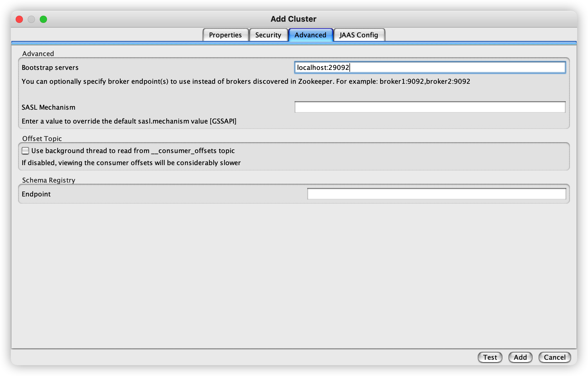
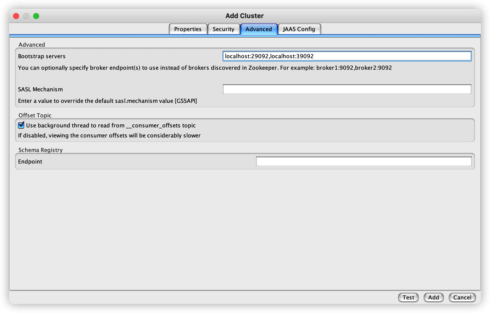
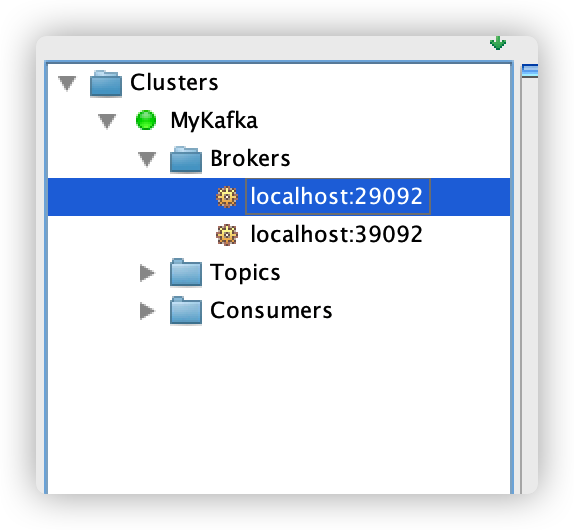

# Docker 를 사용해서 Kafka 세팅

# Overview

Docker 를 사용해서 로컬에 설치하는 방법을 알아봅니다.

<br>

# 1. Kafka 단일 서버 실행

우선 카프카 서버를 하나 띄워보고 나중에 여러 서버로 띄워봅시다.

Kafka 서버를 실행하기 위해선 Zookeeper 서버를 먼저 실행해야 하기 때문에 `docker-compose` 환경으로 실행하는 것이 좋습니다.

카프카 서버를 실행하기 전에 항상 주키퍼 서버를 먼저 실행하고 자동으로 종료하도록 `docker-compose.yml` 파일에 정의할 수 있습니다.

<br>

## 1.1. docker-compose.yml

```yml
version: '2'
services:
  zookeeper:
    image: confluentinc/cp-zookeeper:latest
    environment:
      ZOOKEEPER_CLIENT_PORT: 2181
      ZOOKEEPER_TICK_TIME: 2000
    ports:
      - 22181:2181
  
  kafka:
    image: confluentinc/cp-kafka:latest
    depends_on:
      - zookeeper
    ports:
      - 29092:29092
    environment:
      KAFKA_BROKER_ID: 1
      KAFKA_ZOOKEEPER_CONNECT: zookeeper:2181
      KAFKA_ADVERTISED_LISTENERS: PLAINTEXT://kafka:9092,PLAINTEXT_HOST://localhost:29092
      KAFKA_LISTENER_SECURITY_PROTOCOL_MAP: PLAINTEXT:PLAINTEXT,PLAINTEXT_HOST:PLAINTEXT
      KAFKA_INTER_BROKER_LISTENER_NAME: PLAINTEXT
      KAFKA_OFFSETS_TOPIC_REPLICATION_FACTOR: 1
```

주키퍼 서버는 2181 포트로 카프카 서버와 동일 컨테이너에서 실행됩니다.

클라이언트는 22181 포트로 접근할 수 있게 열어둡니다.

카프카 서버는 컨테이너 내에 9092 포트로 띄우고 29092 포트로 외부에 열어줍니다.

<br>

## 1.2. 카프카 서버 실행

```sh
$ docker-compose up -d
Creating network "kafka_default" with the default driver
Creating kafka_zookeeper_1 ... done
Creating kafka_kafka_1     ... done
```

`dokcer-compose` 명령어로 컨테이너를 띄우고 카프카 서버를 실행합니다.

<br>

```sh
$ nc -z localhost 22181
Connection to localhost port 22181 [tcp/*] succeeded!

$ nc -z localhost 29092
Connection to localhost port 29092 [tcp/*] succeeded!
```

`nc` 명령어로 두 서버가 잘 떴는지 확인해봅니다.

<br>

```sh
$ docker-compose logs kafka | grep -i started
kafka_1      | [2022-03-05 16:49:18,469] INFO [SocketServer listenerType=ZK_BROKER, nodeId=1] Started data-plane acceptor and processor(s) for endpoint : ListenerName(PLAINTEXT) (kafka.network.SocketServer)
kafka_1      | [2022-03-05 16:49:18,472] INFO [SocketServer listenerType=ZK_BROKER, nodeId=1] Started data-plane acceptor and processor(s) for endpoint : ListenerName(PLAINTEXT_HOST) (kafka.network.SocketServer)
kafka_1      | [2022-03-05 16:49:18,472] INFO [SocketServer listenerType=ZK_BROKER, nodeId=1] Started socket server acceptors and processors (kafka.network.SocketServer)
kafka_1      | [2022-03-05 16:49:18,484] INFO [KafkaServer id=1] started (kafka.server.KafkaServer)
kafka_1      | [2022-03-05 16:49:18,508] DEBUG [ReplicaStateMachine controllerId=1] Started replica state machine with initial state -> HashMap() (kafka.controller.ZkReplicaStateMachine)
kafka_1      | [2022-03-05 16:49:18,528] DEBUG [PartitionStateMachine controllerId=1] Started partition state machine with initial state -> HashMap() (kafka.controller.ZkPartitionStateMachine)
```

로그를 확인해서 카프카 서버가 잘 떴는지 확인해볼 수도 있습니다.

<br>

## 1.3. Kafka Tool 연동



마지막으로 [Kafka Tool](https://kafkatool.com/download.html) GUI 프로그램과 카프카 서버를 연동해봅니다.

`Bootstrap servers` 라는 곳에 카프카 서버 정보를 입력해서 연동할 수 있습니다.

<br>

# 2. Kafka Cluster 세팅

안정적인 환경을 만들기 위해 `docker-compose.yml` 파일을 확장해서 여러 개의 노드를 사용하는 카프카 클러스터를 만들어봅시다.

<br>

## 2.1. docker-compose.yml

```yml
version: '2'
services:
  zookeeper-1:
    image: confluentinc/cp-zookeeper:latest
    environment:
      ZOOKEEPER_CLIENT_PORT: 2181
      ZOOKEEPER_TICK_TIME: 2000
    ports:
      - 22181:2181

  zookeeper-2:
    image: confluentinc/cp-zookeeper:latest
    environment:
      ZOOKEEPER_CLIENT_PORT: 2181
      ZOOKEEPER_TICK_TIME: 2000
    ports:
      - 32181:2181
  
  kafka-1:
    image: confluentinc/cp-kafka:latest
    depends_on:
      - zookeeper-1
      - zookeeper-2

    ports:
      - 29092:29092
    environment:
      KAFKA_BROKER_ID: 1
      KAFKA_ZOOKEEPER_CONNECT: zookeeper-1:2181,zookeeper-2:2181
      KAFKA_ADVERTISED_LISTENERS: PLAINTEXT://kafka-1:9092,PLAINTEXT_HOST://localhost:29092
      KAFKA_LISTENER_SECURITY_PROTOCOL_MAP: PLAINTEXT:PLAINTEXT,PLAINTEXT_HOST:PLAINTEXT
      KAFKA_INTER_BROKER_LISTENER_NAME: PLAINTEXT
      KAFKA_OFFSETS_TOPIC_REPLICATION_FACTOR: 1
  kafka-2:
    image: confluentinc/cp-kafka:latest
    depends_on:
      - zookeeper-1
      - zookeeper-2
    ports:
      - 39092:39092
    environment:
      KAFKA_BROKER_ID: 2
      KAFKA_ZOOKEEPER_CONNECT: zookeeper-1:2181,zookeeper-2:2181
      KAFKA_ADVERTISED_LISTENERS: PLAINTEXT://kafka-2:9092,PLAINTEXT_HOST://localhost:39092
      KAFKA_LISTENER_SECURITY_PROTOCOL_MAP: PLAINTEXT:PLAINTEXT,PLAINTEXT_HOST:PLAINTEXT
      KAFKA_INTER_BROKER_LISTENER_NAME: PLAINTEXT
      KAFKA_OFFSETS_TOPIC_REPLICATION_FACTOR: 1
```

처음 세팅과 달리 주키퍼와 카프카 서버를 하나씩 더 늘려줍니다.

주의할 점은 서비스 이름과 `KAFKA_BROKER_ID` 를 서비스끼리 중복되지 않게 지정하는 겁니다.

그리고 각각의 서비스는 클라이언트에게 각각 고유의 포트를 열어야 합니다.

zookeeper-1 과 zookeeper-2 는 2181 포트로 실행되었지만 외부에는 22181 과 32181 로 열었습니다.

kafka-1 과 kafka-2 도 마찬가지로 29092, 39092 포트로 열어둡니다.

<br>

## 2.2. 카프카 클러스터 실행

```sh
$ docker-compose up -d
Creating network "kafka_default" with the default driver
Creating kafka_zookeeper-1_1 ... done
Creating kafka_zookeeper-2_1 ... done
Creating kafka_kafka-2_1     ... done
Creating kafka_kafka-1_1     ... done
```

마찬가지로 `docker-compose` 명령어를 사용해서 실행시켜줍니다.

위에서 실행한 컨테이너가 떠있어서 에러가 발생한다면 `docker-compose down` 명령어로 기존에 실행한 컨테이너를 내려줘야 합니다.

<br>

## 2.3. 카프카 툴 연동



Cluster 이름을 적당히 추가하고 `Advanced` 탭에서 카프카 서버를 여러개 추가합니다.

<br>



저는 클러스터 이름을 `MyKafka` 로 지정했고 연동이 완료되면 이렇게 확인할 수 있습니다.

<br>

# Reference

- [Guide to Setting Up Apache Kafka Using Docker by Baeldung](https://www.baeldung.com/ops/kafka-docker-setup)