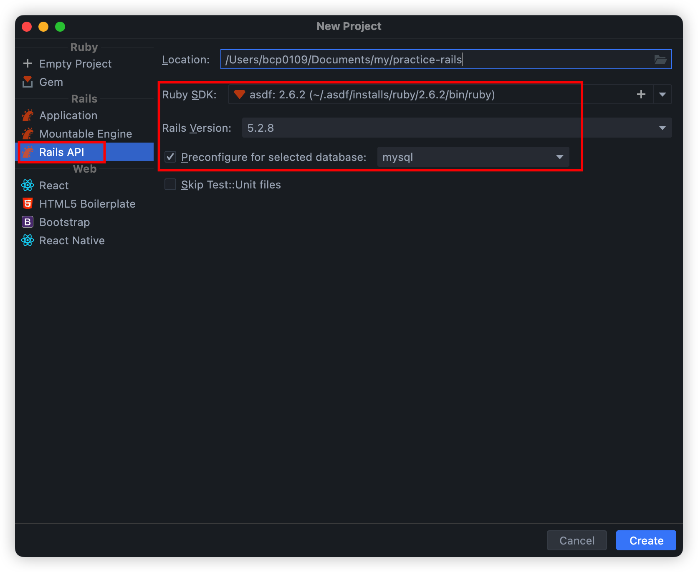
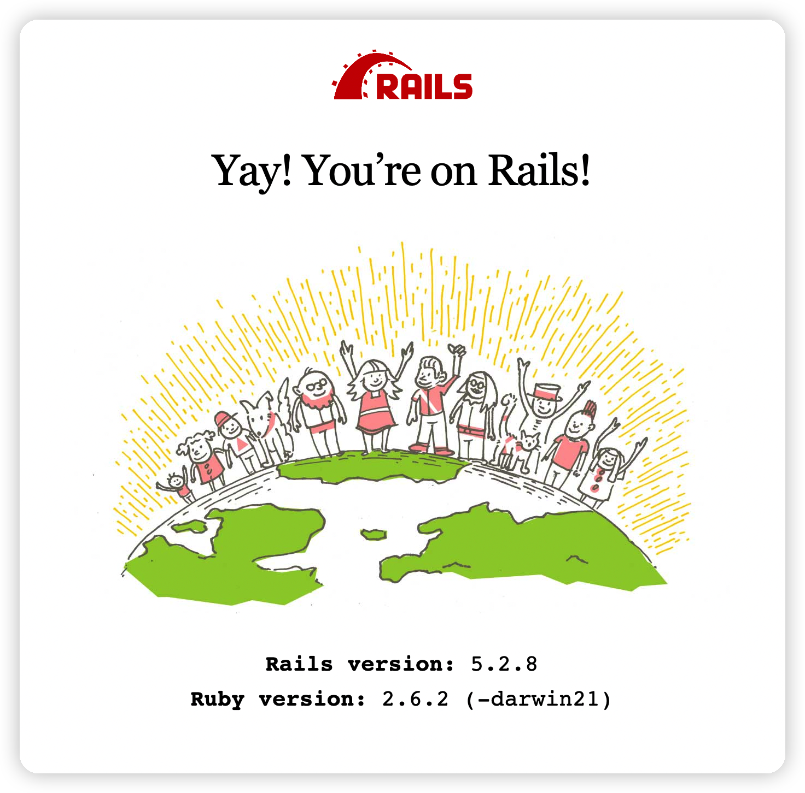

# Rails 프로젝트 히스토리 정리

# Overview

Rails 연습을 위해 이것저것 적용해보면서 시간 흐름에 따라 정리합니다.

<br>

# Skills

- Ruby 2.6.2
- Rails 5.2.8
- [Grape API](https://github.com/ruby-grape/grape)

Rails 6+ 에서 Grape API 사용 시 `Unknown NameError` 발생해서 Rails 5.2.8 로 다운그레이드 했습니다.

<br>

# ERD

간단한 게시판 예제입니다.

<br>

# 1. Install Ruby

```sh
# 1. asdf 설치 (rbenv 같은 버전 관리 툴)
$ brew install asdf

# 2. ruby 설치 (XCode12 버전부터 install 하면 에러가 발생해서 컴파일 옵션 변경 필요)
$ asdf plugin add ruby
$ export CFLAGS="-Wno-error=implicit-function-declaration"
$ asdf install ruby 2.6.2

# 설치 확인
$ asdf list
$ asdf global ruby 2.6.2
$ asdf current
```

[asdf](https://asdf-vm.com/) 를 사용해 설치합니다.

<br>

# 2. Install MySQL

로컬에서 직접 실행시키지 말고 Docker 를 사용합니다.

[Apple Silicon 에서 MySQL Docker 실행](https://github.com/ParkJiwoon/PrivateStudy/blob/master/ci-cd/docker-mysql.md) 을 참고하여 설치, 실행합니다.

혹시 3306 포트로 실행이 안되면 로컬 MySQL 이 실행된거니 `brew services stop mysql` 명령어로 중지해줍니다.

`ps -ef | grep mysql` 명령어를 사용했을 때 아무것도 나오지 않아야 로컬 DB 충돌이 없습니다.

혹시라도 `mysqld -v` 같은 프로세스가 떠있다면 kill 해줍니다.

<br>

# 3. Start Rails



RubyMine 에서 New Project 로 생성합니다.

아무것도 건들지 않은 상태로 `(asdf exec) rails s` 를 사용해서 서버를 띄워봅니다.

실패나는 경우는 보통 DB 연결이 제대로 안되어 있어서 그런거니 [✨ first commit](https://github.com/ParkJiwoon/practice-rails/commit/16fd5ad541a9c149ca6c7fe5470ac2748bee87f4) 의 `config/database.yml` 을 보고 맞춰줍니다.

<br>



http://127.0.0.1:3000 접속 시 위 사진처럼 서버가 정상적으로 뜨면 [gitignore](https://www.toptal.com/developers/gitignore) 를 사용해서 `.gitignore` 파일을 수정해줍니다.

저는 `Rails`, `RubyMine+all` 을 입력해서 생성했습니다.

<br>

# Grape API

Ruby 2.4 or newer is required.

Grape is available as a gem, to install it run:

```sh
bundle add grape
```

<br>


<br>

# Reference
