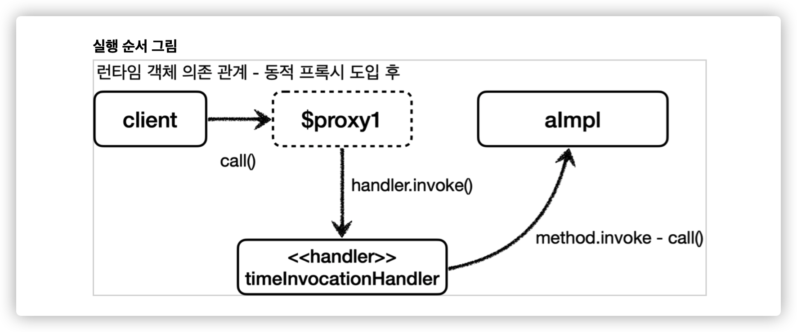
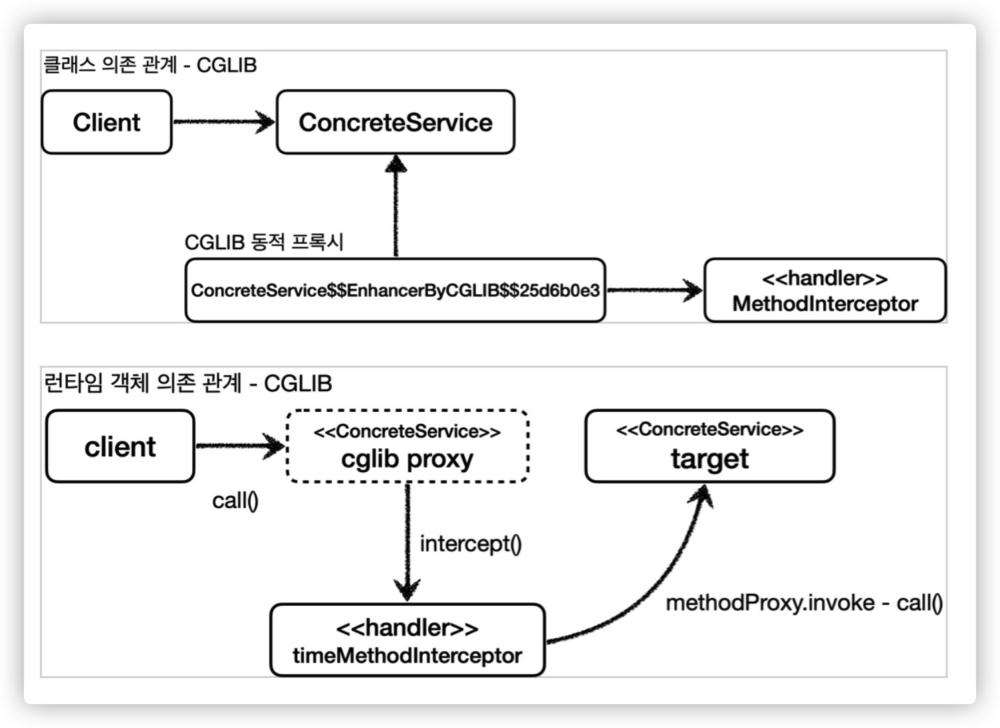
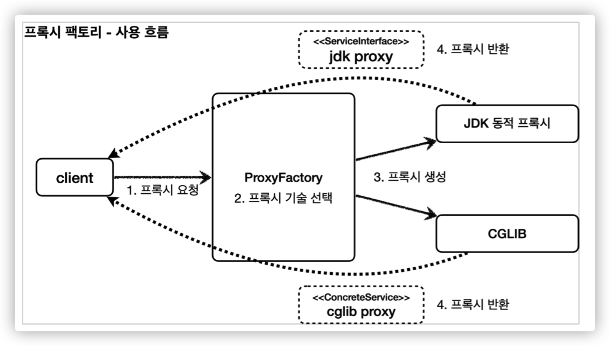
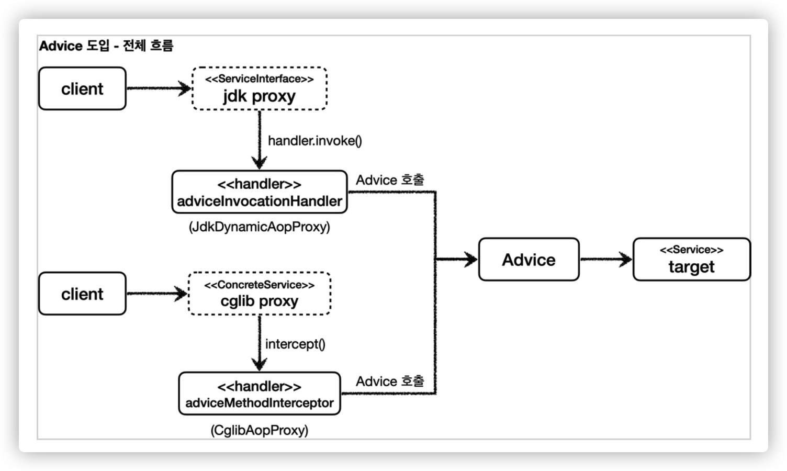
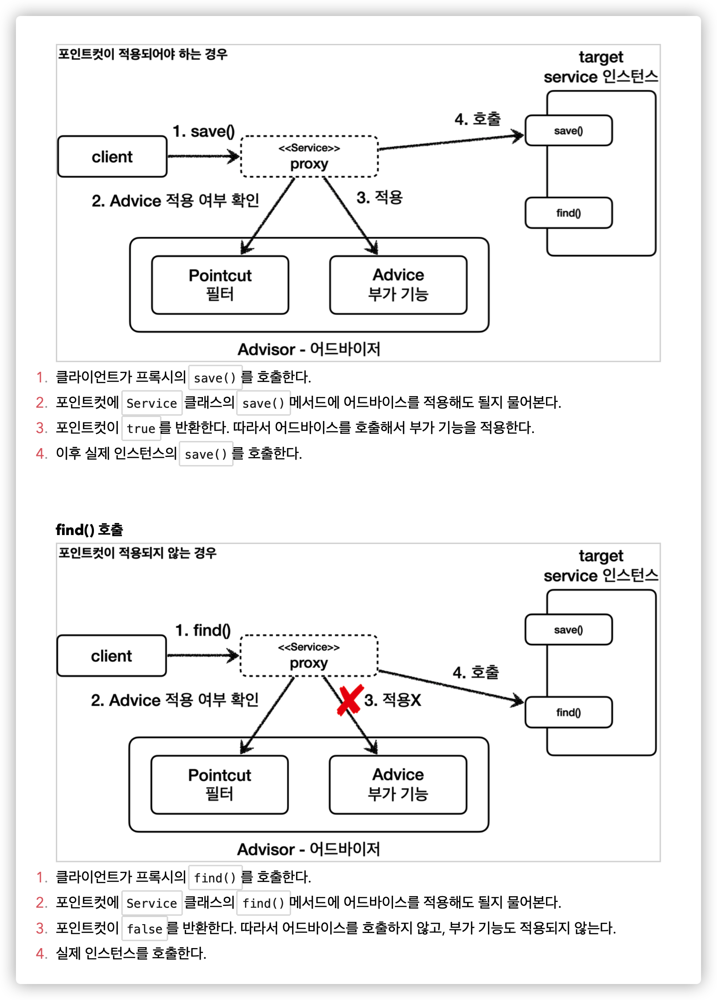
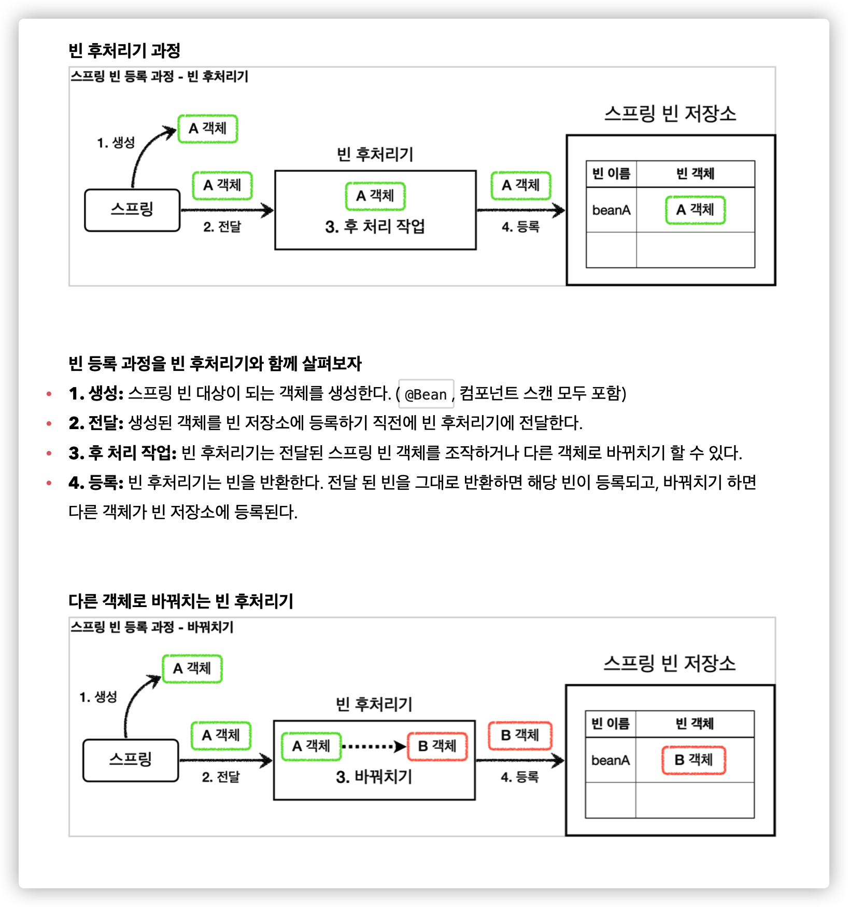
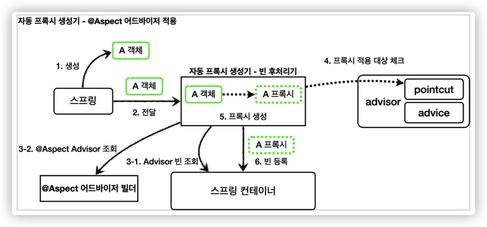

# Spring AOP

# ThreadLocal

쓰레드 로컬은 쓰레드 별로 사용되는 개인 저장소입니다.

각 쓰레드에 연결된 개별 저장소를 사용하기 때문에 여러 쓰레드에서 동시에 변수에 접근할 때의 동시성 문제를 해결할 수 있습니다.

WAS(톰캣) 처럼 쓰레드풀을 사용하는 경우에는 쓰레드 로컬을 사용한 후에 항상 저장한 값을 삭제해야합니다.

그렇지 않으면 다음에 해당 쓰레드가 사용될 때 이전에 저장한 값을 사용하게 됩니다.

Spring Boot (WAS) 는 요청이 들어올 때마다 쓰레드 풀에서 쓰레드를 가져와서 처리하고 다시 반납합니다.

이미 반납된 쓰레드는 다른 요청에서 재사용될 수 있고 쓰레드로컬은 "쓰레드 단위" 로 저장소가 공유되기 때문에 잘못된 정보를 조회하게 됩니다.

<br>

# 인터페이스 기반 프록시 vs 클래스 기반 프록시

인터페이스가 없어도 클래스 기반으로 프록시를 생성할 수 있습니다.

- 인터페이스 기반 프록스
  - 인터페이스만 같은면 모든 구현체에 적용 가능
- 클래스 기반 프록시
  - 해당 클래스에만 적용 가능
  - 상속을 사용하기 때문에 몇가지 제약이 존재
    - 부모 클래스의 생성자를 호출해야 함
    - 클래스에 `final` 이 붙어 있으면 상속이 불가능 (Kotlin 에서 `open` 키워드를 붙여야 하는 이유)
    - 메서드에도 `final` 키워드가 없어야 오버라이딩 가능

이렇게만 비교하면 상속이라는 제약이 없는 인터페이스 기반 프록시가 더 좋아보입니다.

인터페이스 기반 프록시의 단점은 인터페이스가 필요하다는 점 그 자체입니다.

<br>

실무에서는 인터페이스도 존재하고 클래스도 존재하기 때문에 두 가지 모두 대응할 수 있어야 합니다.

프록시 적용 대상마다 모두 프록시 클래스를 생성하면 클래스가 100 개일 때 100 개의 프록시 클래스를 생성해야 합니다.

따라서 동적 프록시 기술을 사용해 직접 프록시 클래스를 사용하지 않고 로드 타임에 생성시켜야 합니다.

<br>

# 동적 프록시 기술

프록시 패턴을 사용하면 기존 코드를 변경하지 않고 메서드 호출 전후로 부가 기능을 추가할 수 있습니다.

하지만 적용 대상마다 프록시 클래스를 일일히 만들어야 한다는 단점이 있습니다.

이런 문제를 해결하기 위해 동적 프록시 기술을 사용하며, 이 기술에는 크게 두 가지가 있습니다.

하나는 자바에서 기본으로 제공하는 **JDK 동적 프록시**, 다른 하나는 **CGLIB 프록시 생성 오픈소스** 입니다.

JDK 동적 프록시를 이해하기 위해선 먼저 자바의 리플렉션 기술을 이해해야 합니다.

<br>

## 1. Reflection (리플렉션)

리플렉션을 활용하면 클래스나 메서드의 메타 정보를 동적으로 획득하고 호출할 수 있습니다.

JDK 동적 프록시를 이해하기 위한 최소한의 리플렉션 기술을 알아봅니다.

<br>

```java
public class Hello {
    public String callA() {
        log.info("callA");
        return "A";
    }

    public String callB() {
        log.info("callB");
        return "B";
    }
}
```

`Hello` 클래스가 존재하고 `callA()`, `callB()` 라는 메서드가 존재합니다.

각 메서드는 평범하게 객체를 생성한 후에 호출할 수도 있지만, 리플렉션을 활용해서 호출할 수도 있습니다.

<br>

```java
// 객체 생성
Hello target = new Hello();

// 메서드 호출
String result1 = target.callA();
String result2 = target.callB();

// 리플렉션으로 메서드 호출
Method methodCallA = target.getClass().getMethod("callA");
Object result = method.invoke(target);

Method methodCallB = target.getClass().getMethod("callB");
Object result = method.invoke(target);
```

리플렉션을 사용하면 메서드를 직접 호출하는 대신 `Method` 라는 공통의 메서드로 추상화 가능합니다.

위 코드를 보면 알수 있듯이 리플렉션을 사용하면 `getMethod()` 부분만 제외하면 코드가 동일합니다.

그리고 String 파라미터로 받기 때문에 별도의 공통 로직으로 따로 분리할 수 있습니다.

<br>

### 리플렉션 사용 시 주의사항

리플렉션은 런타임에 동작하기 때문에 컴파일 시점에서 오류를 잡아낼 수 없습니다.

예를 들어 위 리플렉션 예제 코드에서 `callZ` 라는 값을 넣어도 실제로 실행시키기 전까지는 전혀 알 수가 없습니다.

그래서 리플렉션은 일반적으로 사용하면 안됩니다.

<br>

## 2. JDK 동적 프록시

위에서 알아본 자바의 리플렉션을 활용해서 런타임에 동적으로 프록시를 만들어주는 기술입니다.

JDK 동적 프록시는 인터페이스를 기반으로 만들어주기 때문에 꼭 인터페이스를 만들어야 합니다.

우선 `SampleInterface` 와 이를 구현하는 `SampleImpl` 을 만듭니다.

<br>

### SampleInterface, SampleImpl

```java
// interface
public interface SampleInterface {
    void foo();
}

// impl
public class SampleImpl implements SampleInterface {

    @Override
    public void foo() {
        System.out.println("Foo 메서드 호출");
    }
}
```

가장 단순한 메서드 `foo()` 하나만 선언합니다.

이제 JDK 동적 프록시를 적용해야 합니다.

<br>

### InvocationHandler

```java
public interface InvocationHandler {

    /**
     * JDK 동적 프록시가 제공하는 Handler
     *
     * @param proxy         프록시 자신
     * @param method        호출한 메서드
     * @param args          메서드를 호출할 때 전달한 파라미터
     * @return              메서드 호출 결과
     * @throws Throwable    발생 가능한 예외
     */
    public Object invoke(Object proxy, Method method, Object[] args) throws Throwable;
}
```

자바 리플렉션 패키지 `java.lang.reflect.InvocationHandler` 에서 제공하는 인터페이스입니다.

JDK 동적 프록시가 제공하는 `InvocationHandler` 를 구현하는 Handler 를 하나 만들어야 합니다.

<br>

### TimeInvocationHandler

```java
public class TimeInvocationHandler implements InvocationHandler {

    private static final Logger log = LoggerFactory.getLogger(TimeInvocationHandler.class);

    // 동적 프록시가 호출할 대상
    private final Object target;

    public TimeInvocationHandler(Object target) {
        this.target = target;
    }

    @Override
    public Object invoke(Object proxy, Method method, Object[] args) throws Throwable {
        log.info("TimeProxy 실행");
        StopWatch stopWatch = new StopWatch();
        stopWatch.start();

        // 비즈니스 로직
        Object result = method.invoke(target, args);

        stopWatch.stop();
        log.info("TimeProxy 종료 resultTime={}", stopWatch.getTotalTimeMillis());
        return result;
    }
}
```

외부에서 메서드를 호출할 객체 `target` 을 받습니다.

그리고 `method.invoke(target, args)` 를 통해 원하는 메서드를 대신 호출합니다.

호출하는 메서드 전후로 원하는 로직을 추가할 수 있습니다.

여기서는 메서드의 실행시간을 측정하는 `StopWatch` 를 추가했습니다.

<br>

### JDK 동적 프록시 테스트 코드

```java
// 비즈니스 로직을 가진 객체
SampleInterface target = new SampleImpl();

// 공통 로직이 포함된 Handler
InvocationHandler handler = new TimeInvocationHandler(target);

// 프록시 객체 생성
SampleInterface proxy = (SampleInterface) Proxy.newProxyInstance(
        SampleInterface.class.getClassLoader(),
        new Class[]{SampleInterface.class},
        handler);

// 프록시 메서드 호출
proxy.foo();
```

별도의 프록시 클래스를 생성하지 않고도 이렇게 비즈니스 로직에 공통 로직을 적용할 수 있습니다.

이제 더이상 프록시 로직만큼 클래스를 생성하지 않고 `InvocationHandler` 의 구현체만 더 만들면 됩니다.

<br>



실행 순서는 다음과 같습니다.

1. 클라이언트가 JDK 동적 프록시의 `foo()` 메서드를 실행 (`proxy.foo()`)
2. JDK 동적 프록시는 `InvocationHandler.invoke()` 를 호출 (여기서는 `TimeInvocationHandler`)
3. 공통 로직이 수행된 후 `method.invoke(target, args)` 를 호출해서 `target` 의 실제 객체에 있는 로직을 호출
4. `SampleImpl` 클래스의 `foo()` 메서드가 실행

<br>

### JDK 동적 프록시의 한계

JDK 동적 프록시는 인터페이스가 필수입니다.

그래서 항상 인터페이스를 추가로 만들어야 하기 때문에 비효율적입니다.

그래서 클래스만 있는 경우에 프록시를 생성해주는 CGLIB 라는 오픈소스를 사용합니다.

<br>

## 2. CGLIB: Code Generator Library

CGLIB 는 바이트코드를 조작해서 동적으로 클래스를 생성하는 라이브러리입니다.

CGLIB 를 사용하면 인터페이스 없이 구체 클래스만으로 동적 프록시를 만들어낼 수 있습니다.

CGLIB 는 원래 외부 라이브러리지만 스프링 프레임워크가 스프링 내부 소스 코드에 포함해서 스프링에서는 별도 라이브러리를 추가하지 않아도 사용할 수 있습니다.

<br>

### ConcreteService

```java
public class ConcreteService {

    public void call() {
        System.out.println("ConcreteService 호출");
    }
}
```

비즈니스 로직을 가진 구체 클래스를 정의합니다.

JDK 동적 프록시와 달리 인터페이스가 없어도 됩니다.

<br>

### MethodInterceptor

```java
public interface MethodInterceptor extends Callback {

    /**
     * CGLIB 에서 사용하는 Interceptor
     *
     * @param obj           CGLIB 가 적용된 객체
     * @param method        호출한 메서드
     * @param args          메서드를 호출할 때 전달한 파라미터
     * @param proxy         메서드 호출에 사용
     * @return              메서드 호출 결과
     * @throws Throwable    발생 가능한 예외
     */
    Object intercept(Object obj, Method method, Object[] args, MethodProxy proxy) throws Throwable;
}
```

JDK 동적 프록시가 `InvocationHandler` 를 제공했다면 CGLIB 는 `MethodInterceptor` 를 제공합니다.

`org.springframework.cglib.proxy.MethodInterceptor` 에서 제공해주기 때문에 구현체만 만들어주면 됩니다.

<br>

### TimeMethodInterceptor

```java
public class TimeMethodInterceptor implements MethodInterceptor {

    private static final Logger log = LoggerFactory.getLogger(TimeMethodInterceptor.class);
    private final Object target;

    public TimeMethodInterceptor(Object target) {
        this.target = target;
    }

    @Override
    public Object intercept(Object obj, Method method, Object[] args, MethodProxy proxy) throws Throwable {
        log.info("TimeProxy 실행");
        StopWatch stopWatch = new StopWatch();
        stopWatch.start();

        // method.invoke(target, args) 를 사용해도 되지만
        // CGLIB 는 성능상 proxy 에서 호출하는 것을 권장함
        Object result = proxy.invoke(target, args);

        stopWatch.stop();
        log.info("TimeProxy 종료 resultTime={}", stopWatch.getTotalTimeMillis());
        return result;
    }
}
```

JDK 동적 프록시와 동일하게 시간을 측정하는 로직을 추가합니다.

코드 구조는 이전과 크게 다를게 없습니다.

다만 주석에 나와있는대로 `method.invoke()` 대신 `proxy.invoke()` 를 사용하는게 권장됩니다.

<br>

### CGLIB 테스트 코드

```java
// 비즈니스 로직을 가진 타겟
ConcreteService target = new ConcreteService();

// CGLIB 에서 프록시를 생성하기 위하 제공하는 객체
Enhancer enhancer = new Enhancer();

// CGLIB 는 구체 클래스를 상속 받아서 프록시 생성. 상속받을 SuperClass 설정
enhancer.setSuperclass(ConcreteService.class);

// 프록시에 적용할 공통 로직 (MethodInterceptor 가 Callback 을 상속받음)
enhancer.setCallback(new TimeMethodInterceptor(target));

ConcreteService proxy = (ConcreteService) enhancer.create();

proxy.call();
```

실제 코드는 적지만 주석 때문에 조금 길어졌습니다.

CGLIB 는 프록시 생성을 위한 `Enhancer` 를 제공합니다.

SuperClass (비즈니스 로직) 와 Callback (공통 로직) 을 세팅하고 객체를 생성한 후에 호출하면 됩니다.

<br>



그림으로 나타내면 위와 같습니다.

<br>

### CGLIB 제약

클래스 기반 프록시는 상속을 사용하기 때문에 몇가지 제약이 있습니다.

- `ConcreteService` 에 기본 생성자가 필요 (자식 클래스를 동적으로 생성하기 위해)
- 클래스에 `final` 키워드가 없어야함 (상속을 위해)
- 메서드에 `final` 키워드가 없어야 함 (오버라이딩을 위해)

<br>

# 프록시 팩토리 (ProxyFactory)

지금까지 JDK 동적 프록시와 CGLIB 프록시를 사용해서 인터페이스가 있을 때와 없을 때 각각 프록시를 동적으로 생성하는 방법을 알아보았습니다.

각 케이스에 맞게 `InvocationHandler` 와 `MethodInterceptor` 를 개발자가 만들어야 한다면 귀찮을 겁니다.

스프링에서는 둘을 통합해서 편리하게 만들어주는 `ProxyFactory` 를 제공합니다.

<br>



프록시 팩토리는 인터페이스가 있으면 JDK 동적 프록시를 사용하고 구체 클래스만 있으면 CGLIB 를 사용하며, 옵션으로 한 가지 방법만 사용하도록 설정할 수도 있습니다.

<br>

## 1. Advice

JDK 동적 프록시는 `InvocationHandler` 를 사용하고 CGLIB 는 `MethodInterceptor` 를 사용합니다.

프록시 팩토리가 상황에 맞게 프록시를 생성하려면 두 개를 모두 구현해야 합니다.

스프링은 이 문제를 해결하기 위해 부가 기능을 공통화한 `Advice` 라는 개념을 도입했습니다.

<br>



어떤 프록시에서든 `Advice` 가 호출되어 공통된 로직이 적용됩니다.

이전에는 각 Handler 또는 Interceptor 에 공통로직을 직접 구현했지만 이제는 `Advice` 에게 위임할 뿐입니다.

<br>

### MethodInterceptor

```java
public interface MethodInterceptor extends Interceptor {

    /**
     * Advice 구현을 위한 인터페이스
     *
     * @param invocation    메서드 정보, 현재 프록시 객체, 파라미터 등이 포함되어 있음
     * @return              프록시 호출 결과
     * @throws Throwable    발생 가능한 예외
     */
    Object invoke(MethodInvocation invocation) throws Throwable;
}
```

`Advice` 를 만들기 위해 구현해야 하는 인터셉터입니다.

CGLIB 에서 사용한 인터페이스와 이름이 같지만 이 인터페이스는 `org.aopalliance.intercept` 에서 제공하기 때문에 헷갈리지 말아야 합니다.

<br>

### TimeAdvice

```java
public class TimeAdvice implements MethodInterceptor {

    private static final Logger log = LoggerFactory.getLogger(TimeAdvice.class);

    @Override
    public Object invoke(MethodInvocation invocation) throws Throwable {
        log.info("TimeProxy 실행");
        StopWatch stopWatch = new StopWatch();
        stopWatch.start();

        Object result = invocation.proceed();

        stopWatch.stop();
        log.info("TimeProxy 종료 resultTime={}", stopWatch.getTotalTimeMillis());
        return result;
    }
}
```

`Advice` 에서 타겟 메서드 호출은 단순합니다.

`invocation.proceed()` 만 호출하면 결과를 알아서 전달해줍니다.

<br>

### Advice 테스트

```java
ConcreteService target = new ConcreteService();

// target 인스턴스 정보로 프록시 생성 (인터페이스 존재 - JDK, 구체 클래스만 존재 - CGLIB)
ProxyFactory proxyFactory = new ProxyFactory(target);
// proxyFactory.setProxyTargetClass(true);

// 프록시가 사용할 부가 기능 추가
proxyFactory.addAdvice(new TimeAdvice());

ConcreteService proxy = (ConcreteService) proxyFactory.getProxy();
proxy.call();

assertThat(AopUtils.isAopProxy(proxy)).isTrue();
assertThat(AopUtils.isJdkDynamicProxy(proxy)).isFalse();
assertThat(AopUtils.isCglibProxy(proxy)).isTrue();
```

위에서 사용했던 `ConcreteService` 를 재활용합니다.

`ProxyFactory` 는 생성자 파라미터로 받는 `target` 객체의 정보를 갖고 프록시 생성 정책을 결정합니다.

구체 클래스로 선언했어도 상위 인터페이스가 존재한다면 JDK 동적 프록시로 생성합니다.

`addAdvice` 로 원하는 Advice (부가 기능) 을 추가하고 프록시를 생성하여 호출할 수 있습니다.

주석 처리된 `setProxyTargetClass` 옵션을 `true` 로 주면 인터페이스가 존재해도 항상 CGLIB 로 프록시를 생성합니다.

<br>

## 2. Advisor (and Pointcut)

**Advisor** 는 **어디(Pointcut)** 에 **부가 기능(Advice)** 을 추가할 지 갖고 있습니다.

- PointCut
  - 어디에 부가 기능을 적용할지 판단하는 필터링 로직
  - 클래스와 메서드 이름으로 필터링
- Advice
  - 프록시가 호출하는 부가 기능
- Advisor
  - 포인트컷 1 + 어드바이스 1

<br>

### StoreService

```java
public class StoreService {

    public void find() {
        System.out.println("StoreService - find 호출");
    }

    public void save() {
        System.out.println("StoreService - save 호출");
    }
}
```

Advisor 를 적용하기 위한 예제 클래스를 하나 생성한비다.

<br>

### Advisor 적용

```java
StoreService target = new StoreService();

ProxyFactory proxyFactory = new ProxyFactory(target);

// 스프링에서 제공하는 포인트컷으로 save 메서드에만 프록시 적용
NameMatchMethodPointcut pointcut = new NameMatchMethodPointcut();
pointcut.setMappedNames("save");

// 생성자를 통해 하나의 포인트컷과 하나의 어드바이스를 넣어주면 됨
DefaultPointcutAdvisor advisor = new DefaultPointcutAdvisor(pointcut, new TimeAdvice());
proxyFactory.addAdvisor(advisor);

// 프록시 객체 생성
StoreService proxy = (StoreService) proxyFactory.getProxy();

// 프록시 호출
proxy.save();
proxy.find();
```

스프링에서는 포인트컷을 쉽게 생성하는 방법을 제공합니다.

포인트컷과 어드바이스를 사용해서 어드바이저를 생성하고 나면 프록시 팩토리에 추가합니다.

이제 프록시 객체를 생성해서 각각 메서드를 호출하면 `save()` 메서드에만 프록시가 적용된 걸 볼 수 있습니다.

<br>



실제 동작은 위 그림과 같습니다.

<br>

### 여러 개의 Advisor 적용

```java
// advisor 두개 생성
DefaultPointcutAdvisor advisor1 = new DefaultPointcutAdvisor(Pointcut.TRUE, new Advice1());
DefaultPointcutAdvisor advisor2 = new DefaultPointcutAdvisor(Pointcut.TRUE, new Advice2());

ServiceInterface target = new ServiceImpl();
ProxyFactory proxyFactory = new ProxyFactory(target);

// advisor 를 추가한 순서대로 실행됨
proxyFactory.addAdvisor(advisor1);
proxyFactory.addAdvisor(advisor2);
ServiceInterface proxy = (ServiceInterface) proxyFactory.getProxy();

// 실행
proxy.call();
```

한 프록시에 여러 개의 부가 기능을 추가하고 싶다면 어드바이저를 여러개 만들면 됩니다.

추가된 어드바이저는 순서대로 실행됩니다.

위 코드는 `client -> proxy -> advisor1 -> advisor2 -> target` 순서대로 호출됩니다.

우리가 한 객체에 여러 개의 프록시를 적용해도 프록시 객체는 오직 하나만 만들어지며 어드바이저가 여러개 적용된겁니다.

<br>

## 3. ProxyFactory 제약

프록시 팩토리 덕분에 대상 객체를 신경쓰지 않고 편리하게 프록시를 생성할 수 있습니다.

추가로 Advice, Pointcut, Advisor 라는 개념 덕분에 어디에 어떤 부가 기능을 적용할지도 편리하게 설정 가능합니다.

하지만 프록시 팩토리만으로는 아직 문제가 있습니다.

- `Bean` Config 파일이 너무 많아짐
- 프록시 팩토리로 프록시를 생성해야 하기 때문에 컴포넌트 스캔 활용이 불가능함. 전부 Config 파일에 정의해야함

<br>

# 빈 후처리기



BeanPostProcessor (빈 후처리기) 란 생성된 Bean 객체를 Bean 저장소에 등록하기 직전에 조작하는 기술을 말합니다.

이름 그대로 해석하면 Bean 을 생성한 후에 무언가를 처리하는 겁니다.

빈 후처리기를 사용하면 빈 저장소에 등록되기 전에 빈 객체를 조작하거나 심지어 다른 객체로 바꿔버릴 수도 있습니다.

<br>

## 1. 빈 후처리기가 필요한 이유?

보통 스프링에서는 컴포넌트 스캔을 통해 Bean 을 등록합니다.

하지만 프록시를 적용하기 위해선 프록시 객체를 일일이 생성해서 Bean Configuration 에 등록해야 합니다.

쓸데 없는 중복 코드를 없애기 위해 빈 후처리기를 사용하면 Bean 저장소에 등록하기 직전에 프록시 객체로 바꿔치기 해서 등록할 수 있습니다.

<br>

## 2. 스프링에서 제공하는 빈 후처리기

스프링은 프록시 생성 빈 후처리기 (`AnnotationAwareAspectJAutoProxyCreator`) 를 이미 제공하기 때문에 개발자가 직접 만들 필요 없습니다.

이 빈후처리기는 스프링 빈으로 등록된 `Advisor` 를 자동으로 찾아서 프록시가 필요한 곳에 적용해줍니다.

<br>

# @Aspect AOP

스프링 애플리케이션에 프록시를 적용하려면 `Advisor` (Pointcut + Advice) 를 만들어서 스프링 빈으로 등록하면 됩니다.

스프링 빈으로 등록된 `Advisor` 를 빈 후처리기가 자동으로 처리해줍니다.

`Advisor` 를 생성하는 방법 중 하나로 AspectJ 프로젝트에서 제공하는 `@Aspect` 어노테이션이 존재합니다.

위에서 자동 프록시 생성기 (빈 후처리기) (`AnnotationAwareAspectJAutoProxyCreator`) 가 `Advisor` 를 자동으로 찾아와서 생성하고 필요한 곳에 적용해준다고 했습니다.

여기서 `Advisor` 로 만드는게 `@Aspect` 로 등록된 빈입니다.



<br><br>

<br>

# Spring AOP 실무 주의사항

프록시 방식의 Spring AOP 를 실무에서 사용할 때의 주의사항 두가지를 알아보고 해결방법을 알아봅니다.

<br>

## 1. 프록시와 내부호출

스프링은 프록시 방식의 AOP 사용합니다.

따라서 AOP 를 적용하려면 대상 객체 (Target) 를 호출해야 합니다.

하지만 **대상 객체의 내부에서 메서드 호출이 발생하면 프록시를 거치지 않고 직접 호출하는 문제**가 발생합니다.

<br>

### 원인

내부에서 호출하면 현재 자신의 인스턴스로 호출하게 됩니다.

따라서 프록시를 거쳐서 호출하는게 아닌 Target 객체의 메서드를 직접 호출하는 거라서 AOP 가 적용되지 않습니다.

<br>

### 프록시 방식의 AOP 한계

스프링은 프록시 방식의 AOP 를 사용하기 때문에 내부 호출에 프록시를 적용할 수 없습니다.

실제 코드에 직접 적용하는 `AspectJ` 방식을 사용하면 **컴파일 시점 또는 클래스 로드 시점에 직접 코드를 끼워넣는 방식**이라서 외부에서 호출하던 내부에서 호출하던 문제가 발생하지 않습니다.

하지만 로드 타임 위빙을 위해 추가 설정을 하거나 JVM 옵션을 주어야 하는 등 불편한 점이 많습니다.

프록시 방식일 때 내부 메서드 호출 문제를 해결하는 방법을 알아봅니다.

<br>

### 해결방법

1. 자기자신을 주입받아서 호출
  - 내부에서 바로 호출하면 프록시를 타지 못하므로 자기 자신의 Bean 을 주입 받아서 외부호출처럼 변경
  - 생성자 주입을 쓰면 순환참조가 발생하기 때문에 Setter 또는 Field 주입을 해야함
  - **Spring Boot 2.6 부터는 순환 참조를 기본으로 막아놨기 때문에 사용 불가능**
2. 지연 조회
  - 셀프 주입과 비슷하지만 메서드 호출 시점에 빈을 꺼낸다는게 차이점
  - 순환 참조가 발생하지 않음
3. 구조 변경
  - 스프링에서 가장 권장하는 방법
  - 그냥 별도의 컴포넌트를 만들어서 호출, 즉 내부 메서드 호출을 물리적으로 제거

<br>

## 2. 타입 캐스팅

JDK 동적 프록시와 CGLIB 는 프록시 생성 시 차이점이 있습니다.

JDK 동적 프록시는 인터페이스 기반으로 생성하고 CGLIB 는 구체 클래스 기반으로 생성합니다.

인터페이스가 없고 구체 클래스만 존재하는 경우에는 CGLIB 를 사용할 수밖에 없지만, 인터페이스가 존재하는 경우에는 옵션으로 둘 중 어떤걸 사용할지 선택할 수 있습니다.

`ProxyFactory` 의 `proxyTargetClass` 옵션에 따라 생성 방법이 고정됩니다.

<br>

# Reference

- 스프링 핵심 원리 - 고급편
