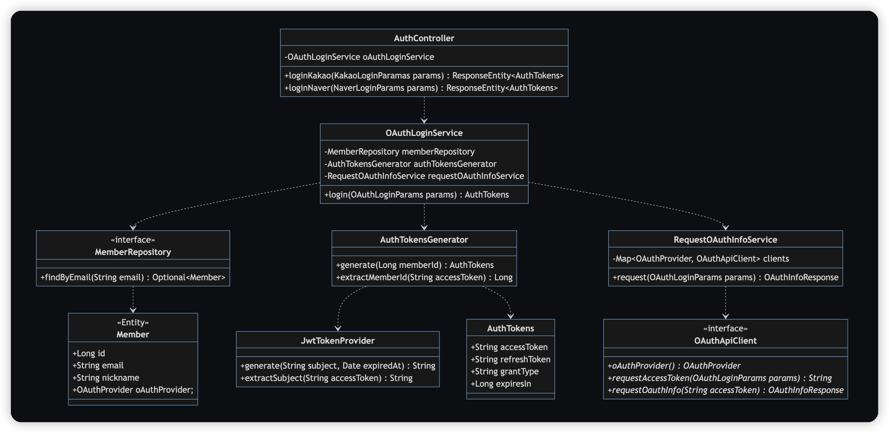
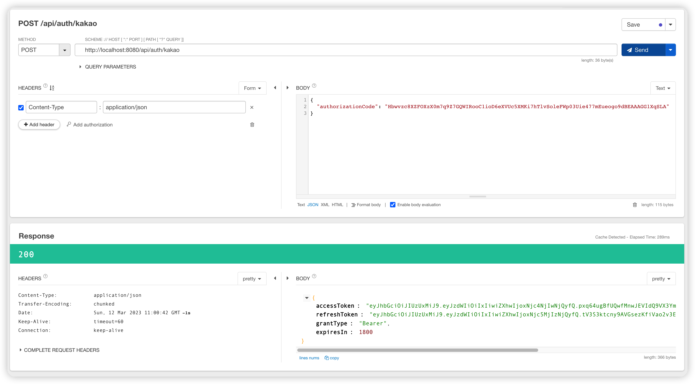
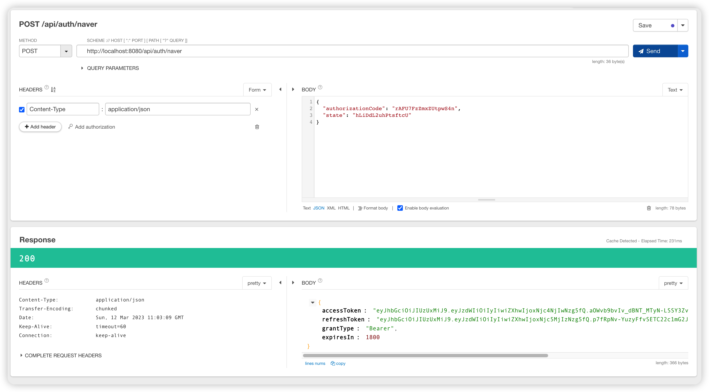
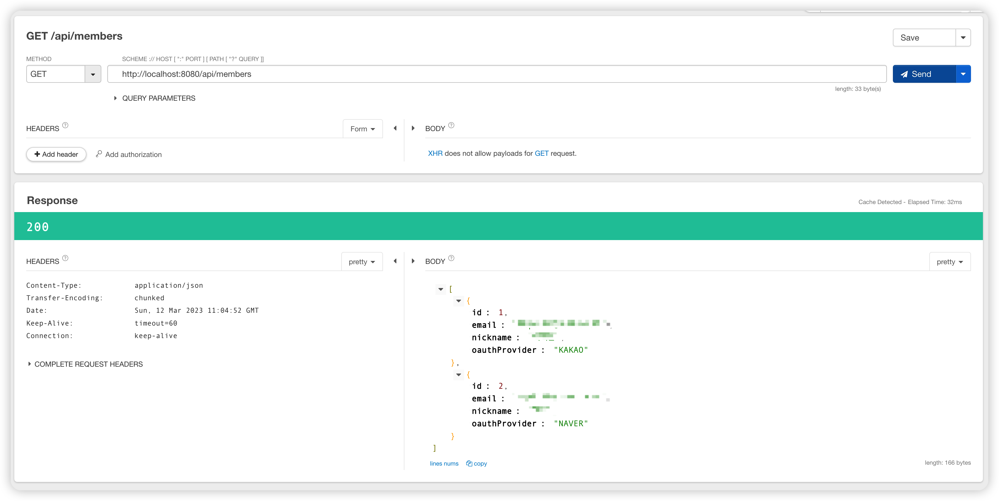

# Spring Boot 에서 Kakao, Naver 로그인하기 2편 (OAuth 2.0) - 코드 구현

# 1. Overview

1편에서는 OAuth 2.0 에 대한 간단한 개념을 알아보고 네이버, 카카오 앱 등록까지 완료했습니다.

2편에서는 직접 코드를 구현하면서 최종적으로 API 만들어봅니다.

샘플 코드를 볼 때 다음 내용들을 참고해주세요.

- Spring Security 를 사용하지 않음
- ID, PW 인증하는 기본 로그인 코드는 작성하지 않음
- 회원을 의미하는 `Member` 테이블에 저장되는 데이터는 각자 설계하기 나름이고 여기서는 기본적인 데이터만 사용
- OAuth 2.0 은 Client (웹, 앱) 개발자와의 협업이 필수지만 여기서는 Backend 코드만 작성
  - 클라이언트 없이 테스트 하는 방법 소개

<br>

# 2. Server 의 역할

서버에서 구현해야 하는 로직은 크게 세가지 입니다.

1. 카카오/네이버와 같은 OAuth 플랫폼에 인증 후 프로필 정보 가져오기
2. email 정보로 사용자 확인 (없으면 새로 가입처리)
3. Access Token 생성 후 내려주기

<br>

# 3. 개발 환경

```java
plugins {
    id 'java'
    id 'org.springframework.boot' version '3.0.3'
    id 'io.spring.dependency-management' version '1.1.0'
}

group = 'com.example'
version = '0.0.1-SNAPSHOT'
sourceCompatibility = '17'

configurations {
    compileOnly {
        extendsFrom annotationProcessor
    }
}

repositories {
    mavenCentral()
}

dependencies {
    implementation 'org.springframework.boot:spring-boot-starter-web'
    implementation 'org.springframework.boot:spring-boot-starter-data-jpa'
    runtimeOnly 'com.h2database:h2'
    compileOnly 'org.projectlombok:lombok'
    annotationProcessor 'org.projectlombok:lombok'
    testImplementation 'org.springframework.boot:spring-boot-starter-test'

    implementation 'io.jsonwebtoken:jjwt-api:0.11.5'
    implementation 'io.jsonwebtoken:jjwt-impl:0.11.5'
    implementation 'io.jsonwebtoken:jjwt-jackson:0.11.5'
}

tasks.named('test') {
    useJUnitPlatform()
}
```

프로젝트 환경은 다음과 같습니다.

- Spring Boot 3.0.3
- Java 17
- Spring Web
- Spring Data JPA
- H2 Database
- Lombok
- JWT 관련 라이브러리

<br>

# 4. 사전 세팅

## 4.1. application.yml

```yml
jwt:
  secret-key: Z29nby10bS1zZXJ2ZXItZGxyamVvYW9yb3JodG9kZ290c3Atam9vbmdhbmduaW0teWVvbHNpbWhpaGFsZ2VveW8K

oauth:
  kakao:
    client-id: 160cd4f66fc928d2b279d78999d6d018
    url:
      auth: https://kauth.kakao.com
      api: https://kapi.kakao.com
  naver:
    secret: W_2DmcLfYU
    client-id: Y2i4SlApP7A1KZsUoott
    url:
      auth: https://nid.naver.com
      api: https://openapi.naver.com
```

JWT 토큰 생성을 위한 Secret Key 와 OAuth 요청을 위한 여러가지 정보를 넣어둡니다.

Secret 값 같은 경우는 외부에 노출되지 않게 Vault 같은 보안 저장소에 넣을 수도 있습니다.

각자 본인이 등록한 Client ID 를 사용해야 합니다. (저는 게시글 작성 후 앱 삭제 예정)

<br>

## 4.2. Configuration

```java
@Configuration
public class ClientConfig {

    @Bean
    public RestTemplate restTemplate() {
        return new RestTemplate();
    }
}
```

RestTemplate 을 사용하기 위해 Spring Bean 컴포넌트로 등록하는 설정을 추가합니다.

<br>

# 5. Member 도메인 정의

```java
public enum OAuthProvider {
    KAKAO, NAVER
}
```

회원의 로그인 타입을 저장하는 Enum 클래스입니다.

"OAuth 인증 제공자" 라는 의미에서 `OAuthProvider` 라는 네이밍을 사용했습니다.

<br>

```java
@Getter
@Entity
@NoArgsConstructor
public class Member {

    @Id
    @GeneratedValue(strategy = GenerationType.IDENTITY)
    private Long id;

    private String email;

    private String nickname;

    private OAuthProvider oAuthProvider;

    @Builder
    public Member(String email, String nickname, OAuthProvider oAuthProvider) {
        this.email = email;
        this.nickname = nickname;
        this.oAuthProvider = oAuthProvider;
    }
}
```

회원 정보를 담는 `Member` 엔티티입니다.

Email, Nickname 과 같은 프로필 정보나 인증 타입을 갖고 있습니다.

프로젝트 성격에 따라 회원 (`Member`) 도메인과 인증 (`Authentication`) 도메인을 분리하는 경우도 있으니 이 부분은 설계하기에 따라 바뀔 수 있습니다.

<br>

# 6. 외부 API 요청

외부 API 요청을 위한 Client 클래스를 만들어봅니다.

API 요청을 위해 `RestTemplate` 을 사용했지만, 선호도에 따라 다른 걸 사용해도 됩니다.

- `OAuthApiClient`: 카카오나 네이버 API 요청 후 응답값을 리턴해주는 (인터페이스)
- `OAuthLoginParams`: 카카오, 네이버 요청에 필요한 데이터를 갖고 있는 파라미터 (인터페이스)
- `KakaoTokens`, `NaverTokens`: 인증 API 응답
- `OAuthInfoResponse`: 회원 정보 API 응답 (인터페이스)
- `RequestOAuthInfoService`: 외부 API 요청의 중복되는 로직을 공통화한 클래스

인터페이스를 많이 사용했는데 다음과 같은 장점이 있습니다.

- 카카오, 네이버 외에 새로운 OAuth 로그인 수단이 추가되어도 쉽게 추가할 수 있음
- "외부 Access Token 요청 -> 프로필 정보 요청 -> 이메일, 닉네임 가져오기" 라는 공통된 로직을 하나로 묶을 수 있음

<br>

## 6.1. OAuthLoginParams

```java
public interface OAuthLoginParams {
    OAuthProvider oAuthProvider();
    MultiValueMap<String, String> makeBody();
}
```

OAuth 요청을 위한 파라미터 값들을 갖고 있는 인터페이스입니다.

이 인터페이스의 구현체는 Controller 의 `@RequestBody` 로도 사용하기 때문에 `getXXX` 라는 네이밍을 사용하지 않아야 합니다.

<br>

```java
@Getter
@NoArgsConstructor
public class KakaoLoginParams implements OAuthLoginParams {
    private String authorizationCode;

    @Override
    public OAuthProvider oAuthProvider() {
        return OAuthProvider.KAKAO;
    }

    @Override
    public MultiValueMap<String, String> makeBody() {
        MultiValueMap<String, String> body = new LinkedMultiValueMap<>();
        body.add("code", authorizationCode);
        return body;
    }
}
```

카카오 API 요청에 필요한 `authorizationCode` 를 갖고 있는 클래스입니다.

<br>

```java
@Getter
@NoArgsConstructor
public class NaverLoginParams implements OAuthLoginParams {
    private String authorizationCode;
    private String state;

    @Override
    public OAuthProvider oAuthProvider() {
        return OAuthProvider.NAVER;
    }

    @Override
    public MultiValueMap<String, String> makeBody() {
        MultiValueMap<String, String> body = new LinkedMultiValueMap<>();
        body.add("code", authorizationCode);
        body.add("state", state);
        return body;
    }
}
```

네이버는 `authorizationCode` 와 `state` 값을 필요로 합니다.

<br>

## 6.2. KakaoTokens, NaverTokens

Authorization Code 를 기반으로 타플랫폼 Access Token 을 받아오기 위한 Response Model 입니다.

여러 가지 값을 받아오지만 여기서 사용할 부분은 Access Token 뿐입니다.

<br>

```java
@Getter
@NoArgsConstructor
public class KakaoTokens {

    @JsonProperty("access_token")
    private String accessToken;

    @JsonProperty("token_type")
    private String tokenType;

    @JsonProperty("refresh_token")
    private String refreshToken;

    @JsonProperty("expires_in")
    private String expiresIn;

    @JsonProperty("refresh_token_expires_in")
    private String refreshTokenExpiresIn;

    @JsonProperty("scope")
    private String scope;
}
```

`https://kauth.kakao.com/oauth/token` 요청 결과값입니다.

[Kakao Developers - 카카오 로그인 토큰 받기](https://developers.kakao.com/docs/latest/ko/kakaologin/rest-api#request-token-response) 의 응답값 부분을 참고했습니다.

<br>

```java
@Getter
@NoArgsConstructor
public class NaverTokens {

    @JsonProperty("access_token")
    private String accessToken;

    @JsonProperty("refresh_token")
    private String refreshToken;

    @JsonProperty("token_type")
    private String tokenType;

    @JsonProperty("expires_in")
    private String expiresIn;
}
```

`https://nid.naver.com/oauth2.0/token` 요청 결과값입니다.

[Naver Developers - 로그인 API 명세의 접근 토큰 발급 요청](https://developers.naver.com/docs/login/api/api.md#4-2--%EC%A0%91%EA%B7%BC-%ED%86%A0%ED%81%B0-%EB%B0%9C%EA%B8%89-%EC%9A%94%EC%B2%AD) 응답값을 참고했습니다.

<br>

## 6.3. OAuthInfoResponse

```java
public interface OAuthInfoResponse {
    String getEmail();
    String getNickname();
    OAuthProvider getOAuthProvider();
}
```

Access Token 으로 요청한 외부 API 프로필 응답값을 우리 서비스의 Model 로 변환시키기 위한 인터페이스입니다.

카카오나 네이버의 email, nickname 정보를 필요로 하기 때문에 Getter 메서드를 추가했습니다.

<br>

```java
@Getter
@JsonIgnoreProperties(ignoreUnknown = true)
public class KakaoInfoResponse implements OAuthInfoResponse {

    @JsonProperty("kakao_account")
    private KakaoAccount kakaoAccount;

    @Getter
    @JsonIgnoreProperties(ignoreUnknown = true)
    static class KakaoAccount {
        private KakaoProfile profile;
        private String email;
    }

    @Getter
    @JsonIgnoreProperties(ignoreUnknown = true)
    static class KakaoProfile {
        private String nickname;
    }

    @Override
    public String getEmail() {
        return kakaoAccount.email;
    }

    @Override
    public String getNickname() {
        return kakaoAccount.profile.nickname;
    }

    @Override
    public OAuthProvider getOAuthProvider() {
        return OAuthProvider.KAKAO;
    }
}
```

`https://kapi.kakao.com/v2/user/me` 요청 결과값입니다.

[Kakao Developers - 사용자 정보 가져오기](https://developers.kakao.com/docs/latest/ko/kakaologin/rest-api#req-user-info) 를 참고해서 만든 응답값입니다.

원래 더 많은 응답값이 오지만 필요한 데이터만 추려내기 위해 `@JsonIgnoreProperties(ignoreUnknown = true)` 를 사용했습니다.

<br>

```java
@Getter
@JsonIgnoreProperties(ignoreUnknown = true)
public class NaverInfoResponse implements OAuthInfoResponse {

    @JsonProperty("response")
    private Response response;

    @Getter
    @JsonIgnoreProperties(ignoreUnknown = true)
    static class Response {
        private String email;
        private String nickname;
    }

    @Override
    public String getEmail() {
        return response.email;
    }

    @Override
    public String getNickname() {
        return response.nickname;
    }

    @Override
    public OAuthProvider getOAuthProvider() {
        return OAuthProvider.NAVER;
    }
}
```

`https://openapi.naver.com/v1/nid/me` 요청 결과값입니다.

[Naver Devlopers - 네이버 회원 프로필 조회 API 명세](https://developers.naver.com/docs/login/profile/profile.md) 를 참고해서 만든 응답값입니다.

마찬가지로 `@JsonIgnoreProperties(ignoreUnknown = true)` 를 사용해서 필요 없는 값들은 제외하고 원하는 값만 받도록 했습니다.

<br>

## 6.4. OAuthApiClient

```java
public interface OAuthApiClient {
    OAuthProvider oAuthProvider();
    String requestAccessToken(OAuthLoginParams params);
    OAuthInfoResponse requestOauthInfo(String accessToken);
}
```

OAuth 요청 을 위한 Client 클래스입니다.

- `oAuthProvider()`: Client 의 타입 반환
- `requestAccessToken`: Authorization Code 를 기반으로 인증 API 를 요청해서 Access Token 을 획득
- `requestOauthInfo`: Access Token 을 기반으로 Email, Nickname 이 포함된 프로필 정보를 획득

<br>

```java
@Component
@RequiredArgsConstructor
public class KakaoApiClient implements OAuthApiClient {

    private static final String GRANT_TYPE = "authorization_code";

    @Value("${oauth.kakao.url.auth}")
    private String authUrl;

    @Value("${oauth.kakao.url.api}")
    private String apiUrl;

    @Value("${oauth.kakao.client-id}")
    private String clientId;

    private final RestTemplate restTemplate;

    @Override
    public OAuthProvider oAuthProvider() {
        return OAuthProvider.KAKAO;
    }

    @Override
    public String requestAccessToken(OAuthLoginParams params) {
        String url = authUrl + "/oauth/token";

        HttpHeaders httpHeaders = new HttpHeaders();
        httpHeaders.setContentType(MediaType.APPLICATION_FORM_URLENCODED);

        MultiValueMap<String, String> body = params.makeBody();
        body.add("grant_type", GRANT_TYPE);
        body.add("client_id", clientId);

        HttpEntity<?> request = new HttpEntity<>(body, httpHeaders);

        KakaoTokens response = restTemplate.postForObject(url, request, KakaoTokens.class);

        assert response != null;
        return response.getAccessToken();
    }

    @Override
    public OAuthInfoResponse requestOauthInfo(String accessToken) {
        String url = apiUrl + "/v2/user/me";

        HttpHeaders httpHeaders = new HttpHeaders();
        httpHeaders.setContentType(MediaType.APPLICATION_FORM_URLENCODED);
        httpHeaders.set("Authorization", "Bearer " + accessToken);

        MultiValueMap<String, String> body = new LinkedMultiValueMap<>();
        body.add("property_keys", "[\"kakao_account.email\", \"kakao_account.profile\"]");

        HttpEntity<?> request = new HttpEntity<>(body, httpHeaders);

        return restTemplate.postForObject(url, request, KakaoInfoResponse.class);
    }
}
```

Kakao Develpers 의 [카카오 로그인 토큰 받기](https://developers.kakao.com/docs/latest/ko/kakaologin/rest-api#request-token) 와 [사용자 정보 가져오기](https://developers.kakao.com/docs/latest/ko/kakaologin/rest-api#req-user-info) 를 참고했습니다.

`RestTemplate` 을 활용해서 외부 요청 후 미리 정의해둔 `KakaoTokens`, `KakaoInfoResponse` 로 응답값을 받습니다.

<br>

```java
@Component
@RequiredArgsConstructor
public class NaverApiClient implements OAuthApiClient {

    private static final String GRANT_TYPE = "authorization_code";

    @Value("${oauth.naver.url.auth}")
    private String authUrl;

    @Value("${oauth.naver.url.api}")
    private String apiUrl;

    @Value("${oauth.naver.client-id}")
    private String clientId;

    @Value("${oauth.naver.secret}")
    private String clientSecret;

    private final RestTemplate restTemplate;

    @Override
    public OAuthProvider oAuthProvider() {
        return OAuthProvider.NAVER;
    }

    @Override
    public String requestAccessToken(OAuthLoginParams params) {
        String url = authUrl + "/oauth2.0/token";

        HttpHeaders httpHeaders = new HttpHeaders();
        httpHeaders.setContentType(MediaType.APPLICATION_FORM_URLENCODED);

        MultiValueMap<String, String> body = params.makeBody();
        body.add("grant_type", GRANT_TYPE);
        body.add("client_id", clientId);
        body.add("client_secret", clientSecret);

        HttpEntity<?> request = new HttpEntity<>(body, httpHeaders);

        NaverTokens response = restTemplate.postForObject(url, request, NaverTokens.class);

        assert response != null;
        return response.getAccessToken();
    }

    @Override
    public OAuthInfoResponse requestOauthInfo(String accessToken) {
        String url = apiUrl + "/v1/nid/me";

        HttpHeaders httpHeaders = new HttpHeaders();
        httpHeaders.setContentType(MediaType.APPLICATION_FORM_URLENCODED);
        httpHeaders.set("Authorization", "Bearer " + accessToken);

        MultiValueMap<String, String> body = new LinkedMultiValueMap<>();

        HttpEntity<?> request = new HttpEntity<>(body, httpHeaders);

        return restTemplate.postForObject(url, request, NaverInfoResponse.class);
    }
}
```

Naver Developers 의 [로그인 API 명세](https://developers.naver.com/docs/login/api/api.md) 와 [회원 프로필 조회 API 명세](https://developers.naver.com/docs/login/profile/profile.md) 를 참고했습니다.

`RestTemplate` 을 활용해서 외부 요청 후 미리 정의해둔 `NaverTokens`, `NaverInfoResponse` 로 응답값을 받습니다.

<br>

## 6.5. RequestOAuthInfoService

```java
@Component
public class RequestOAuthInfoService {
    private final Map<OAuthProvider, OAuthApiClient> clients;

    public RequestOAuthInfoService(List<OAuthApiClient> clients) {
        this.clients = clients.stream().collect(
                Collectors.toUnmodifiableMap(OAuthApiClient::oAuthProvider, Function.identity())
        );
    }

    public OAuthInfoResponse request(OAuthLoginParams params) {
        OAuthApiClient client = clients.get(params.oAuthProvider());
        String accessToken = client.requestAccessToken(params);
        return client.requestOauthInfo(accessToken);
    }
}
```

지금까지 만든 `OAuthApiClient` 를 사용하는 Service 클래스입니다.

`KakaoApiClient`, `NaverApiClient` 를 직접 주입받아서 사용하면 중복되는 코드가 많아지지만 `List<OAuthApiClient>` 를 주입 받아서 Map 으로 만들어두면 간단하게 사용할 수 있습니다.

참고로 `List<인터페이스>` 를 주입받으면 해당 인터페이스의 구현체들이 전부 List 에 담겨옵니다.

<br>

# 7. JWT(Access Token) 생성

네이버, 카카오 인증이 완료되면 클라이언트에게 Access Token 을 내려주어야 합니다.

여기서 Access Token 은 내 서비스의 인증 토큰이지, 네이버나 카카오의 토큰이 아닙니다.

OAuth 플랫폼들의 Access Token 을 클라이언트에게 내려주면 플랫폼 별로 만료 기간 관리도 번거롭고 혹여나 탈취라도 당하면 안되기 때문에 반드시 직접 토큰을 만들어서 내려줍니다.

JWT 관련 부분은 이 글의 핵심 주제는 아니기 때문에 자세한 설명은 생략합니다.

<br>

## 7.1. JwtTokenProvider

```java
@Component
public class JwtTokenProvider {

    private final Key key;

    public JwtTokenProvider(@Value("${jwt.secret-key}") String secretKey) {
        byte[] keyBytes = Decoders.BASE64.decode(secretKey);
        this.key = Keys.hmacShaKeyFor(keyBytes);
    }

    public String generate(String subject, Date expiredAt) {
        return Jwts.builder()
                .setSubject(subject)
                .setExpiration(expiredAt)
                .signWith(key, SignatureAlgorithm.HS512)
                .compact();
    }

    public String extractSubject(String accessToken) {
        Claims claims = parseClaims(accessToken);
        return claims.getSubject();
    }

    private Claims parseClaims(String accessToken) {
        try {
            return Jwts.parserBuilder()
                    .setSigningKey(key)
                    .build()
                    .parseClaimsJws(accessToken)
                    .getBody();
        } catch (ExpiredJwtException e) {
            return e.getClaims();
        }
    }
}
```

JWT 토큰을 만들어주는 유틸 클래스입니다.

<br>

## 7.2. AuthTokens

```java
@Getter
@Setter
@NoArgsConstructor
@AllArgsConstructor
public class AuthTokens {
    private String accessToken;
    private String refreshToken;
    private String grantType;
    private Long expiresIn;

    public static AuthTokens of(String accessToken, String refreshToken, String grantType, Long expiresIn) {
        return new AuthTokens(accessToken, refreshToken, grantType, expiresIn);
    }
}
```

사용자에게 내려주는 서비스의 인증 토큰 값입니다.

<br>

## 7.3. AuthTokensGenerator

```java
@Component
@RequiredArgsConstructor
public class AuthTokensGenerator {
    private static final String BEARER_TYPE = "Bearer";
    private static final long ACCESS_TOKEN_EXPIRE_TIME = 1000 * 60 * 30;            // 30분
    private static final long REFRESH_TOKEN_EXPIRE_TIME = 1000 * 60 * 60 * 24 * 7;  // 7일

    private final JwtTokenProvider jwtTokenProvider;

    public AuthTokens generate(Long memberId) {
        long now = (new Date()).getTime();
        Date accessTokenExpiredAt = new Date(now + ACCESS_TOKEN_EXPIRE_TIME);
        Date refreshTokenExpiredAt = new Date(now + REFRESH_TOKEN_EXPIRE_TIME);

        String subject = memberId.toString();
        String accessToken = jwtTokenProvider.generate(subject, accessTokenExpiredAt);
        String refreshToken = jwtTokenProvider.generate(subject, refreshTokenExpiredAt);

        return AuthTokens.of(accessToken, refreshToken, BEARER_TYPE, ACCESS_TOKEN_EXPIRE_TIME / 1000L);
    }

    public Long extractMemberId(String accessToken) {
        return Long.valueOf(jwtTokenProvider.extractSubject(accessToken));
    }
}
```

`AuthTokens` 을 발급해주는 클래스입니다.

- `generate`: memberId (사용자 식별값) 을 받아 Access Token 을 생성
- `extractMemberId`: Access Token 에서 memberId (사용자 식별값) 추출

<br>

# 8. Controller, Service

이제 지금까지 만든 코드를 갖고 최종 비즈니스 로직을 만들어봅니다.

<br>

## 8.1. OAuthLoginService

```java
@Service
@RequiredArgsConstructor
public class OAuthLoginService {
    private final MemberRepository memberRepository;
    private final AuthTokensGenerator authTokensGenerator;
    private final RequestOAuthInfoService requestOAuthInfoService;

    public AuthTokens login(OAuthLoginParams params) {
        OAuthInfoResponse oAuthInfoResponse = requestOAuthInfoService.request(params);
        Long memberId = findOrCreateMember(oAuthInfoResponse);
        return authTokensGenerator.generate(memberId);
    }

    private Long findOrCreateMember(OAuthInfoResponse oAuthInfoResponse) {
        return memberRepository.findByEmail(oAuthInfoResponse.getEmail())
                .map(Member::getId)
                .orElseGet(() -> newMember(oAuthInfoResponse));
    }

    private Long newMember(OAuthInfoResponse oAuthInfoResponse) {
        Member member = Member.builder()
                .email(oAuthInfoResponse.getEmail())
                .nickname(oAuthInfoResponse.getNickname())
                .oAuthProvider(oAuthInfoResponse.getOAuthProvider())
                .build();

        return memberRepository.save(member).getId();
    }
}
```

처음 설명했던 로직을 그대로 작성했습니다.

1. 카카오/네이버와 같은 OAuth 플랫폼에 인증 후 프로필 정보 가져오기
2. email 정보로 사용자 확인 (없으면 새로 가입처리)
3. Access Token 생성 후 내려주기

취향에 따라 `findOrCreateMember` 부분을 별도 `MemberService` 로 분리해도 상관없습니다.

<br>

코드를 보면 알 수 있듯이 네이버, 카카오에 특화된 로직이 아닌 공통된 로직이며 인터페이스만을 사용했습니다.

대신 `login` 메서드 호출 시 `KakaoLoginParams`, `NaverLoginParams` 둘 중에 뭐가 들어오냐에 따라 API 요청하는 곳이 달라집니다.

만약 새로운 Google, Facebook 로그인이 추가된다고 하더라도 이 코드는 수정할 필요가 없기 때문에 안전하게 추가 가능합니다.

<br>

## 8.2. AuthController

```java
@RestController
@RequiredArgsConstructor
@RequestMapping("/api/auth")
public class AuthController {
    private final OAuthLoginService oAuthLoginService;

    @PostMapping("/kakao")
    public ResponseEntity<AuthTokens> loginKakao(@RequestBody KakaoLoginParams params) {
        return ResponseEntity.ok(oAuthLoginService.login(params));
    }

    @PostMapping("/naver")
    public ResponseEntity<AuthTokens> loginNaver(@RequestBody NaverLoginParams params) {
        return ResponseEntity.ok(oAuthLoginService.login(params));
    }
}
```

사용자에게 요청을 받는 Controller 부분입니다.

딱히 특별한 부분은 없고 파라미터로 구현체를 받아서 직접 `login` 을 호출하는 차이밖에 없습니다.

<br>

# 9. Class Diagram



위에서 작성한 코드를 간단하게 표현하면 이렇게 나옵니다.

<br>

# 10. API 요청 테스트

클라이언트 없이 서버에서만 테스트를 진행해봅시다.

<br>

## 10.1. OAuth 로그인

네이버, 카카오 로그인 페이지를 직접 만들어서 접속 후 로그인 합니다.

1편에서도 한번 다뤘기 때문에 자세한 설명은 생략합니다.

로그인 후에 Redirect URI 로 전달된 Authorization Code 를 확인합니다.

- 카카오: `https://kauth.kakao.com/oauth/authorize?client_id=160cd4f66fc928d2b279d78999d6d018&redirect_uri=http://localhost:8080/kakao/callback&response_type=code`
- 네이버: `https://nid.naver.com/oauth2.0/authorize?response_type=code&client_id=Y2i4SlApP7A1KZsUoott&state=hLiDdL2uhPtsftcU&redirect_uri=http://localhost:8080/naver/callback`

<br>

## 10.2. API 호출하기

Postman, Curl, IntelliJ IDE 등 자신만의 API 호출 방법을 사용해서 직접 API 를 호출합니다.

저는 Talend API Tester 라는 크롬 확장프로그램을 사용했습니다.

응답값으로 Access Token 을 받아온다면 성공입니다.

<br>

### 10.2.1. Kakao 로그인 호출



카카오는 `authorizationCode` 파라미터만 추가해서 호출합니다.

<br>

### 10.2.2. Naver 로그인 호출



네이버는 `authorizationCode` 뿐만 아니라 `state` 값도 함께 받아서 전달합니다.

<br>

## 10.3. Member 정보 호출



간단한 Member API 를 만들어서 원하는 데이터가 잘 들어갔는지 확인합니다.

<br>

## 10.4. Access Token 검증

Access Token 검증은 두 가지 방법이 있습니다.

1. API 만들어서 호출
2. Test Code 에서 코드를 만들어 `AuthTokensGenerator.extractMemberId` 메서드를 직접 실행

둘 중에 편한 방법으로 확인하시면 됩니다.

위에서 획득한 Access Token 으로 정확한 memberId 를 얻을 수 있다면 성공입니다.

<br>

# Conclusion

지금까지 Spring Boot 에서 OAuth 2.0 을 활용한 인증 기능을 개발했습니다.

OAuth 2.0 에 대해 잘 모를 때는 어렵고 막막하단 느낌이 들었는데 실제로 구현하고 나니 간단하다고 느꼈습니다.

<br>

# Reference

- [Sample 코드 전체 Github](https://github.com/ParkJiwoon/practice-codes/tree/master/spring-boot-oauth2)
- [Kaka Developers - 카카오 로그인](https://developers.kakao.com/docs/latest/ko/kakaologin/common)
- [Naver Developers - 네이버 로그인](https://developers.naver.com/docs/login/api/api.md)