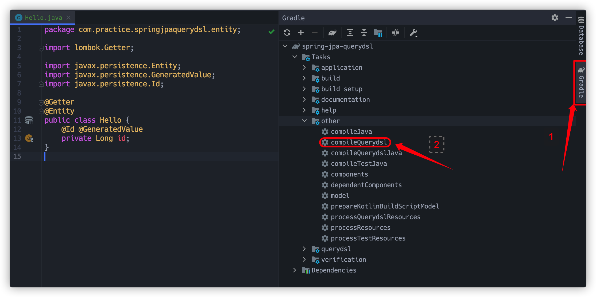
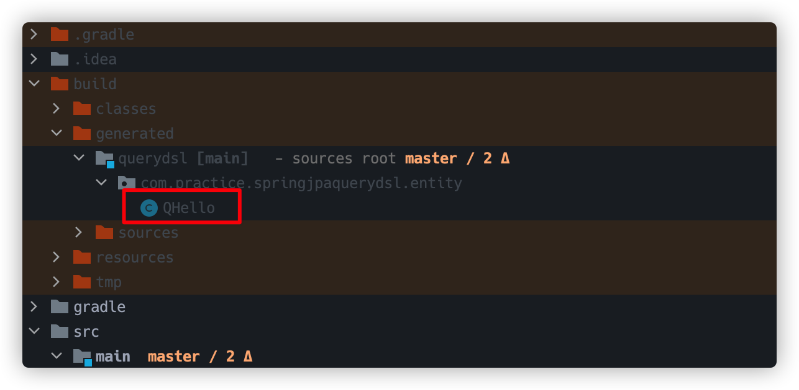
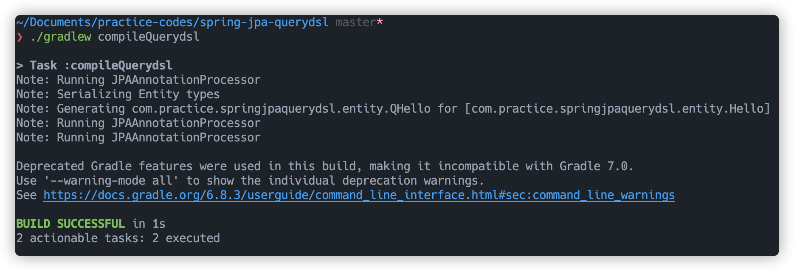

# QueryDSL

# 1. QueryDSL 설정 추가

## 1.1. build.gradle

```groovy
plugins {
    id 'org.springframework.boot' version '2.4.5'
    id 'io.spring.dependency-management' version '1.0.11.RELEASE'
    // 1. querydsl 추가
    id "com.ewerk.gradle.plugins.querydsl" version "1.0.10"
    id 'java'
}

group = 'com.practice'
version = '0.0.1-SNAPSHOT'
sourceCompatibility = '11'

configurations {
    compileOnly {
        extendsFrom annotationProcessor
    }
}

repositories {
    mavenCentral()
}

dependencies {
    implementation 'org.springframework.boot:spring-boot-starter-data-jpa'
    implementation 'org.springframework.boot:spring-boot-starter-web'

    // 2. querydsl 추가
    implementation 'com.querydsl:querydsl-jpa'

    compileOnly 'org.projectlombok:lombok'
    runtimeOnly 'com.h2database:h2'
    annotationProcessor 'org.projectlombok:lombok'
    testImplementation 'org.springframework.boot:spring-boot-starter-test'
}

test {
    useJUnitPlatform()
}

// 3. querydsl 추가 시작
def querydslDir = "$buildDir/generated/querydsl"
querydsl {
    jpa = true
    querydslSourcesDir = querydslDir
}
sourceSets {
    main.java.srcDir querydslDir
}
configurations {
    querydsl.extendsFrom compileClasspath
}
compileQuerydsl {
    options.annotationProcessorPath = configurations.querydsl
}
//querydsl 추가 끝
```

<br>

## 1.2. compieQuerydsl

QueryDSL 은 `build.gradle` 에 설정만 추가한다고 사용 가능하지 않습니다.

QueryDSL 컴파일을 해줘야합니다.

우선 컴파일하기 위한 Entity 를 하나 추가합니다.

```java
@Getter
@Entity
public class Hello {
    @Id @GeneratedValue
    private Long id;
}
```

<br>

그리고 인텔리제이 우측의 Gradle 탭을 클릭하여 `Tasks > other > compileQuerydsl` 을 더블 클릭해서 실행시킵니다.



<br>

그럼 프로젝트의 `build > generated > querydsl` 폴더 하위에 QueryDSL 에서 사용하는 Entity 를 생성됩니다.



<br>

명령어로도 컴파일 할 수 있는데 터미널에서 `./gradlew compileQuerydsl` 을 입력하면 동일하게 컴파일 됩니다.

만약 기존에 컴파일된 데이터를 지우고 싶다면 `./gradlew clean` 을 입력하면 됩니다.

